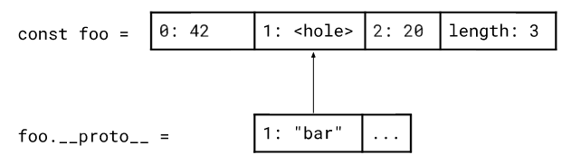
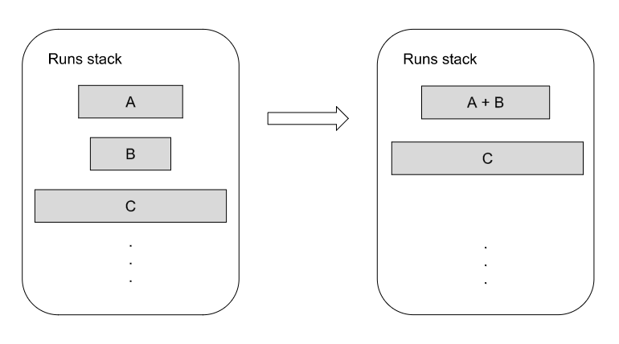
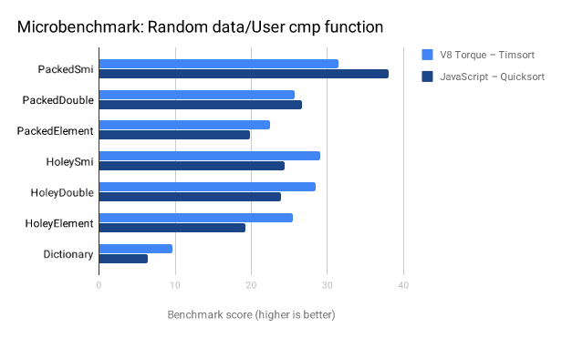
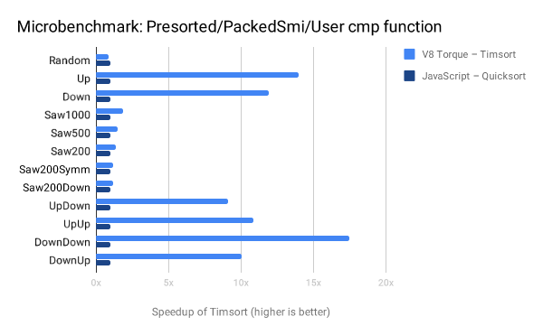
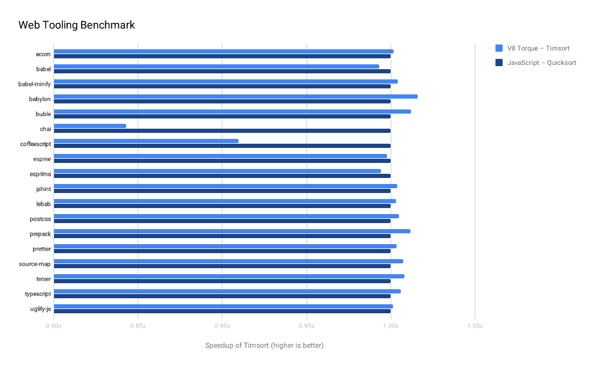

# V8引擎中的排序

发布于 2018年9月28日

Array.prototype.sort 是V8引擎中最后一批采用JavaScript自托管实现的内置函数之一。在移植它的过程中，我们进行了不同算法和实施策略的实验，最终在V8引擎的7.0（Chrome 70）中发布了排序稳定的版本。

## 背景

在JavaScript中排序并不简单。这篇博客介绍了排序算法和JavaScript语言特性结合中的一些问题，并记录了我们将V8转移到稳定算法并使性能更具可预测性的过程。

当比较不同的排序算法时，我们将它们的最差性能和平均性能，看作是对内存访问或比较次数的渐近增长（即“大O”符号）的约束。请注意，在动态语言（如JavaScript）中，比较操作通常比内存访问更昂贵。这是因为在排序时比较两个值通常涉及对用户代码的调用。

***译注：客户代码理解为排序中引擎外的代码，比如我们再用Array.prototype.sort一般会传入回调函数 [...].sort((a, b)=> a-b); 没有回调的情况也会有值处理，比如[1,'2']，在比较数字和字符串前，Javascript会做类型转换。***

让我们看一个简单的示例：基于用户提供的比较函数将一些数字按升序排序的。当a比b更小、相等、更大时，比较函数分别返回-1（或任何其他负值）、0、1（或任何其他正值）。不遵循此模式的比较函数则不兼容，并且可能具有任意副作用，例如修改要排序的数组。

```javascript
const array = [4, 2, 5, 3, 1];

function compare(a, b) {
  // 任意代码, 例如 `array.push(1);`
  return a - b;
}

// 一个“典型的”sort调用
array.sort(compare);
```

即使在下面这个不传入回调函数的示例中，也可能会发生对用户代码的调用。比较函数，“默认”地，会在两个要比较的值上调用toString，并对返回的两个字符串进行字典比较。

```javascript
const array = [4, 2, 5, 3, 1];

array.push({
  toString() {
    // 任意代码, 例如 `array.push(1);`
    return '42';
  }
});

// 没有比较函数的sort
array.sort();
```

## 更有趣的是，属性访问器和原型链的相互影响

在本节内容中，我们抛开规范，开始尝试“定义具体实现”的旅程。规范有一个完整的条件列表，当满足时，允许引擎用它认为合适的方式，对对象/数组进行排序 - 或者根本不对它进行排序。虽然排序的使用者必须遵循一些基本规则，但其他的一切几乎都在空气中（抛诸脑后，不管不顾的意思）。一方面，这使得引擎开发人员可以自由地尝试不同的实现。另一方面，用户期得到一些合理的表现，即使规范中并没有要求。由于“合理的表现”并不总是直接明确定义的，导致事情变得更加复杂。

本节说明，在不同的引擎中，Array#sort在一些方面仍然表现出很大的差别。这些大多是一些边缘的场景，如上所述，在这些场景中，并不总是明确“合理的表现”应该是什么。我们强烈建议不要编写这样的代码，引擎不会优化它。

第一个示例显示了，在不同JavaScript引擎中一个数组的排序过程，其中包含一些内存访问（即getter和setter）以及“日志打印”。访问器是第一个例子，展示“定义具体实现”对排序结果的影响：

```javascript
const array = [0, 1, 2];

Object.defineProperty(array, '0', {
  get() { console.log('get 0'); return 0; },
  set(v) { console.log('set 0'); }
});

Object.defineProperty(array, '1', {
  get() { console.log('get 1'); return 1; },
  set(v) { console.log('set 1'); }
});

array.sort();
```

下面是不同Javascript引擎中这段代码的输出。请注意，这里没有“正确”或“错误”的答案 -- 因为规范中并没有明确，而是将其留给不同引擎的实现！


```javascript
get 0
get 1
set 0
set 1

// JavaScriptCore
get 0
get 1
get 0
get 0
get 1
get 1
set 0
set 1

// V8
get 0
get 0
get 1
get 1
get 1
get 0

#### SpiderMonkey
get 0
get 1
set 0
set 1
```

下一个示例展示了原型链对排序结果的影响。为简洁起见，我们不进行日志打印。

```javascript
const object = {
 1: 'd1',
 2: 'c1',
 3: 'b1',
 4: undefined,
 __proto__: {
   length: 10000,
   1: 'e2',
   10: 'a2',
   100: 'b2',
   1000: 'c2',
   2000: undefined,
   8000: 'd2',
   12000: 'XX',
   __proto__: {
     0: 'e3',
     1: 'd3',
     2: 'c3',
     3: 'b3',
     4: 'f3',
     5: 'a3',
     6: undefined,
   },
 },
};
Array.prototype.sort.call(object);
```

下面是这个 对象 执行排序后的结果。同样，这里没有所谓的正确答案。此示例仅展示了索引属性与原型链之间的交互有多奇怪：

***译注：类似伪数组***

```javascript
// Chakra
['a2', 'a3', 'b1', 'b2', 'c1', 'c2', 'd1', 'd2', 'e3', undefined, undefined, undefined]

// JavaScriptCore
['a2', 'a2', 'a3', 'b1', 'b2', 'b2', 'c1', 'c2', 'd1', 'd2', 'e3', undefined]

// V8
['a2', 'a3', 'b1', 'b2', 'c1', 'c2', 'd1', 'd2', 'e3', undefined, undefined, undefined]

// SpiderMonkey
['a2', 'a3', 'b1', 'b2', 'c1', 'c2', 'd1', 'd2', 'e3', undefined, undefined, undefined]
```

## V8在实际排序之前做了什么

V8在实际排序之前有两个预处理步骤。

首先，如果要排序的对象在原型链上有孔和元素，会将它们从原型链复制到对象本身。这样在后续所有步骤中，我们都不需要再关注原型链。目前，V8只会对非标准的JSArrays进行这样的处理，而其它引擎对于标准的JSArrays也会进行这样的复制处理。



第二个预处理步骤是去孔（hole）。V8引擎会将排序范围中的所有元素都移动到对象的开头。之后移动 undefined。这在某种程度上其实是规范所要求的，因为规范要求引擎始终将undefined排序到最后。这样nbbbb，undefined永远都不会作为的参数去调用用户提供的比较函数。在第二个预处理步骤之后，排序算法只需要考虑 非undefined的，这可以减少实际排序的元素的数量。


## 历史

Array.prototype.sort 和 TypedArray.prototype.sort 都基于同一种用JavaScript编写的Quicksort实现。排序算法本身非常简单：基础是一个Quicksort（快速排序），对于较短的数组（长度<10）则降级为插入排序（Insertion Sort）。

当Quicksort在分治的处理中递归出长度小于10的子数组时，也使用插入排序处理。因为插入排序对于较短的数组更高效。这是因为Quicksort在分区后，需要递归调用两次。每个这样的递归调用都有创建（和丢弃）栈帧的开销。

所以选择合适的轴元素（pivot）对Quicksort的性能有着很大的影响。V8采用了两条策略：

+ 找到数组中的第一个，最后一个和“第三个”元素，然后选择这三个元素的中间值作为pivot。对于较短数组，“第三个”的的元素就是中间 元素。
+ 对于较长的数组，就从中抽出一个小数组进行排序，并将排序后中位数作为上述计算中的“第三个”元素。
  
Quicksort的优点之一是：它是就地排序，不需要太多的内存开销。只有在处理大型数组时，需要为选择的样本数组分配内存，以及log（n）栈空间。它的缺点是：它不是稳定的排序算法，并且在最坏情况下，时间复杂度会降级到O（n^2）。

## 介绍 V8 Torque

如果您是V8开发者博客的爱好者，可能听说过 [CodeStubAssembler](https://v8.dev/blog/csa)，或简称 CSA。CSA是V8的一个组件，它允许我们直接用C ++编写低级别的TurboFan IR（TurboFan 中间层，见译注），后来用TurboFan的后端（编译器后端）将其合理结构的机器码。

***译注：见CSA的链接，比较早了。TurboFan IR是V8自己搞的，相比于传统的基于图的中间层，特别做了些优化，想具体了解的话搜搜大牛的文章吧***

CSA被大量应用于为JavaScript内置函数编写所谓的“快速路径”。内置的“快速路径”版本通常检查某些特别的条件是否成立（例如原型链上没有元素，没有访问器等），然后使用更快，更特殊优化的操作来实现内置函数的功能。这可以使函数执行时间比通用版本快一个数量级。

CSA的缺点是它确实可以被认为是汇编语言。流程控制使用明确的 `label` 和 `goto`进行建模，这使得在CSA中实现复杂算法时，代码会难以阅读且容易出错。

然后是[V8 Torque](https://v8.dev/docs/torque)。Torque是一种领域专用语言，具有类似TypeScript的语法，目前使用CSA作为其唯一的编译目标。Torque允许开发者使用与CSA几乎相同层次的流程控制操作，同时提供更高级别的构造，例如while和for循环。此外，它是强类型的，并且将来还会包含类似自动越界这样的安全检查，为V8引擎的工程师提供更强大的保障。

用V8 Torque重写的第一个重要的内置函数是 [TypedArray＃sort](https://v8.dev/blog/v8-release-68) 和 [Dataview](https://v8.dev/blog/dataview)。这两者的重写都有另外的目的，即向Torque开发人员反馈所需要的语言功能，以及使用哪些模式会可以更高效地编写内置函数。在撰写本文时，多个JSArray的内置函数和对应的自托管的JavaScript后降级实现，已经迁移至Torque（例如，Array＃unshift），其余的则被完全重写（例如，Array＃splice和Array＃reverse）。

## 将 `Array # sort` 迁移到 Torque

最初的`Array＃sort` Torque版本或多或少可以说就是JavaScript实现的直接搬运。唯一的区别是，对较长的数组不进行小数组采样，而是随机选择数组中的某个元素作为轴元素选择中的“第三个”元素。

这种方式运行得相当不错，但由于它仍然使用Quicksort，因此 Array＃sort仍然是不稳定。请求[稳定版本的`Array＃sort`](https://bugs.chromium.org/p/v8/issues/detail?id=90) 是V8的bug记录器中最古老的工单之一。接下来尝试用Timsort替代，在这个尝试中我们得到了多种好处。首先，我们喜欢它是一个稳定的算法，并提供一些很好的算法保证（见下一节）。其次，Torque仍然是一个正在开发中的项目，在Torque中用Timsort实现复杂的内置函数，例如“Array＃sort”，可以给Torque语言的本身带来很多可操作性的建议。

## TimSort

最早由蒂姆·彼得斯（Tim Peters）于2002年开发的Timsort，可以被认为是自适应的稳定的归并排序（Mergesort）的变种。其实现细节相当复杂，最好去参阅[作者本人的说明](https://github.com/python/cpython/blob/master/Objects/listsort.txt)或 [维基百科](https://en.wikipedia.org/wiki/Timsort)，基础概念应该很容易理解。虽然Mergesort使用递归的方式，但Timsort是以迭代进行。Timsort从左到右迭代一个数组，并寻找所谓的_runs_。一个run可以认为是已经排序的小数组，也包括以逆向排序的，因为这些数组可以简单地翻转（reverse）就成为一个run。在排序过程开始时，算法会根据输入数组的长度，确定一个run的最小长度。如果Timsort无法在数组中找到满足这个最小长度的run，则使用插入排序（Insertion Sort）“人为地生成”一个run。

找到的 runs在一个栈中追踪，这个栈会记录起始的索引位置和每个run的长度。栈上的run会逐渐合并在一起，直到只剩下一个排序好的run。在确定合并哪些run时，Timsort会试图保持两方面的平衡。一方面，您希望尽早尝试合并，因为这些run的数据很可能已经在缓存中，另一方面，您希望尽可能晚地合并，以利用数据中可能出现的某些特征。为了实现这个平衡，Timsort遵循保两个原则。假设`A`，`B`和`C`是三个最顶级的runs：

+ |C| > |B| + |A|
+ |B| > |A|

***译注：这里的大于指长度大于***



在上图的例子中，因为| A |> | B |，所以B被合并到了它前后两个runs（A、C）中较小的一个。请注意，Timsort仅合并连续的run，这是维持算法稳定性所必需的，否则大小相等元素会在run中转移。此外，第一个原则确保了run的长度，最慢也会以斐波那契（Fibonacci）数列增长，这样当我们知道数组的最大边界时，runs栈大小的上下界也可以确定了。

现在可以看出，对于已经排序好的数组，会以O（n）的时间内完成排序，因为这样的数组将只产生单个run，不需要合并操作。最坏的情况是O（n log n）。这样的算法性能参数，以及Timsort天生的稳定性是我们最终选择Timsort而非Quicksort的几个原因。

## 在 Torque 中实现 Timsort

内置函数通常具有不同的代码版本，在运行时（runtime）会根据各种变量选择合适的代码版本。而通用的版本则可以处理任何类型的对象，无论它是一个`JSProxy`，有拦截器，还是在查找/设置属性时有原型链查询。

在大多数情况下，通用的路径版本相当慢，因为它需要考虑所有的可能性。但是如果我们事先知道要排序的对象是一个只包含Smis的简单`JSArray`，所有这些昂贵的`[[Get]]`和`[[Set]]`操作都可以被简单地替换为`FixedArray`的Loads和Stores。主要的区别在于[ElementsKind](https://v8.dev/blog/elements-kinds)。

***译注：ElemenKind简单来讲，就是一个数组的元素类型，比如[1, 2]是ElementKind是Int，[1, 2.1]则是Double***

现在问题变成了如何实现快速路径。除了基于ElementsKind的不同更改访问元素的方式之外，核心算法对所有场景保持相同。一种实现方案是：对每个操作都分配合适的“访问器（accessor）”。想象一下每个“加载”/“存储”（“load”/”store”）都有一个开关，我们通过开关来选择不同快速路径的分支。

另一个实现方案（这是最开始尝试的方式）是为对每个快速路径都复制整个内置函数并内联合适的加载/存储方法（load/store）。但这种方式对于Timsort来说是不可行的，因为它是一个很大的内置函数，复制每个快速路径总共需要106 KB的空间，这对于单个内置函数来说太过分了。

最终的方案略有不同。每个快速路径的每个加载/存储方法（load/store）都被放入其自己的“迷你内置函数”中。请参阅代码示例，其中展示了针对“FixedDoubleArray”的“加载”（load）操作。


```javascript
Load<FastDoubleElements>(
    context: Context, sortState: FixedArray, elements: HeapObject,
    index: Smi): Object {
  try {
    const elems: FixedDoubleArray = UnsafeCast<FixedDoubleArray>(elements);
    const value: float64 =
        LoadDoubleWithHoleCheck(elems, index) otherwise Bailout;
    return AllocateHeapNumberWithValue(value);
  }
  label Bailout {
    // 预处理步骤中，通过把所有元素移到数组最前的方式 已经移除了所有的孔
    // 这时如果找到了孔，说明 cmp 函数或 ToString 改变了数组
    return Failure(sortState);
  }
}
```

相比之下，最通用的“加载”操作（load）只是对GetProperty的调用。相比于上述版本生成了高效且快速的机器代码来加载和转换Number，GetProperty只是对另一个内置函数的调用，这之中可能涉及对原型链的查找或访问器函数的调用。

```javascript
builtin Load<ElementsAccessor : type>(
    context: Context, sortState: FixedArray, elements: HeapObject,
    index: Smi): Object {
  return GetProperty(context, elements, index);
}
```

这样一来，快速路径就变成一组函数指针。这意味着我们只需要核心算法的一个副本，同时预先设置所有相关函数的指针。虽然这大大减少了所需的代码空间（低至20k），但却以每个访问点的使用不同的间接分支做为减少的代价。这种情况在最近引入[嵌入式内置函数](https://v8.dev/blog/embedded-builtins)的变更后加剧了。

## 排序状态


上图显示了“排序状态”。它是一个FixedArray，展示了排序时涉及到的所有内容。每次调用Array＃sort时，都会分配这种排序状态。期中04到07是上面讨论的构成快速路径的一组函数指针。

每次在用户的JavaScript代码返回（return）时都会调用内置函数“check”，以检查我们是否可以继续使用当前的快速路径。它使用“initial receiver map”和“initial receiver length”来做检查。如果用户代码修改了当前对象，我们只需放弃排序运行，将所有指针重置为最通用的版本并重新启动排序的过程。08中的“救助状态”作为重置的信号。
“compare”可以指向两个不同的内置函数。一个调用用户提供的比较函数，另一个上面说的默认比较（对两个参数执行toString，然后进行字典比较）。

其余字段（14：Fast path ID除外）都是Timsort所特有的。运行时的run栈（如上所述）初始化长度为85，这足以对长度为264的数组进行排序。而用于合并运行临时数组的长度，会根据运行时的需要所增大，但绝不超过n / 2，其中n是输入数组的长度。

## 性能妥协

将 Array # sort 的自托管JavaScript实现转移到Torque需要进行一些性能权衡。由于`Array＃sort`是用Torque编写的，它现在是一段静态编译的代码，这意味着我们仍然可以为默认特定的 ElementsKind`s构建快速路径，但它永远不会比 TurboFan 高度优化的代码更快，因为TurboFan可以利用类型反馈进行优化。另一方面，如果代码没有足够热以保证JIT编译或者调用点是复态（megamorphic）的，我们就会被卡在解释器或慢速/通用的版本。自托管JavaScript实现版本中的解析，编译和可能的优化过程中所产生的开销，在Torque实现版本中也都不需要了。

虽然Torque的实现方案无法让排序达到相同峰值性能，但它确实避免了性能断崖。结果是排序的性能比以前更容易预测。请注意，Torque还在不停的迭代中，除了编译到CSA之外，它可能会在未来支持编译到TurboFan，允许JIT去编译用Torque编写的代码。

## 微基准测试

在我们着手开发Array＃sort之前，我们添加了一系列不同的微基准测试，以便更好地了解重写对性能的影响。第一个图显示了使用用户提供的比较函数对各种ElementsKinds进行排序的“正常”用例。

请注意，在这些情况下，JIT编译器会做很多工作，因为排序过程几乎就是我们（引擎）所处理的。虽然这样允许我们在编译器内联JavaScript版本中的比较函数，但在Torque中也会有内置函数到JavaScript的额外调用开销。不过，我们新的Timsort几乎在所有情况下都表现得更好。



下一个图表显示了：在处理已完全排序的数组，或者具有已单向排序的子序列的数组时，Timsort对性能的影响。下图中采用Quicksort作为基线，展示了Timsort的加速比（在“DownDown”的情况下高达17倍，这个场景中数组由两个反向排序的子序列组成）。可以看出，除了在随机数据的情况下，Timsort在其它所有情况下都表现得更好，即使我们排序的对象是`PACKED_SMI_ELEMENTS`（Quicksort在上图的微基准测试中对这种对象排序时，性能胜过了Timsort）。



## Web 工具基准测试

[Web Tooling Benchmark](https://github.com/v8/web-tooling-benchmark)是在Web开发人员常用工具的JS环境载体（如Babel和TypeScript）中进行的测试。下图采用JavaScript Quicksort作为基线，展示了Timsort的速度提升。除了 chai 我们在几乎所有测试中获得了相同的性能。

chai的基准测试中将三分之一的时间用于一个比较函数中（字符串长度计算）。基准测试用的是chai自身的测试套件。由于数据的原因，Timsort在这种情况下需要更多的比较，这对整体的运行有着很大的影响，因为大部分时间都花在了特定的比较函数中。



## 内存影响

在浏览大约50个站点（分别在移动设备和桌面设备上）分析V8堆的快照时，没有显示出任何内存消耗的增加或减少。一方面这很让人意外：从Quicksort到Timsort的转换引入了对合并run操作所需要的临时数组的空间，这应该会比Quicksort用于采样的临时数组大得多。另一方面，其实这些临时数组的存续时间非常短暂（仅在`sort`调用的持续时间内）并且可以在V8的新空间中非常快速地创建和删除。

## 结论

总的来说，对于在Torque中实现的Timsort的算法属性和可预测的性能，让我们感觉很好。Timsort从V8 v7.0和Chrome 70开始生效。快乐排序吧！

作者： Simon Zünd (@nimODota), consistent comparator.

