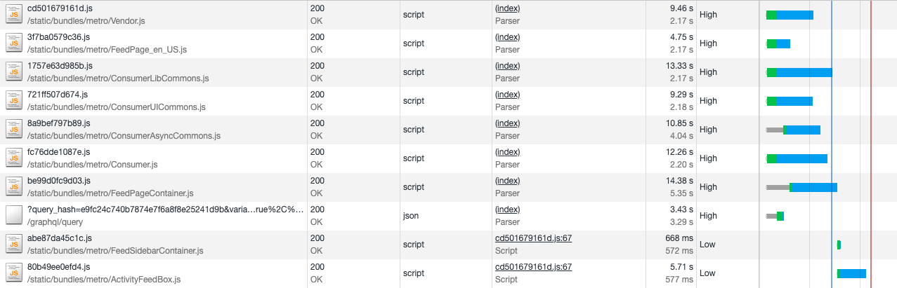
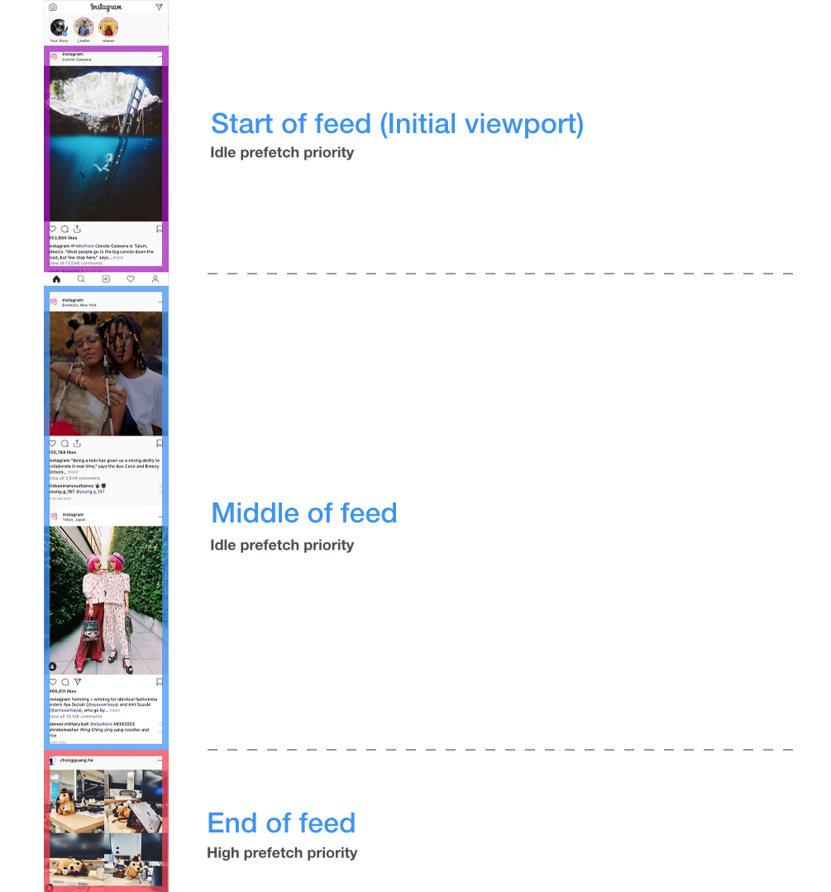

# 让 Instagram.com 变得更快: 第一章

In recent years, instagram.com has seen a lot of changes — we’ve launched stories, filters, creation tools, notifications, and direct messaging as well as myriad other features and enhancements. However, as the product grew, one unfortunate side effect was that our web performance began to suffer. Over the last year, we made a conscious effort to improve this. Our ongoing efforts have thus far resulted in almost 50% cumulative improvement to our feed page load time. This series of blog posts will outline some of the work we’ve done that led to these improvements.

最近这几年，instagram.com 改版了很多 - 我们在 INS 中加入了 Stories、滤镜、创作工具、系统通知和消息推送等新特性和功能增强。然而，伴随着产品的不断迭代成长，一个不幸的事情发生了：我们的 web 端性能开始下降了。为处理性能下降，在最近的一年中，我们有意识地开展一些工作来提升性能。截止目前，我们的不懈努力已经让 Feed 页面加载时间减少了将近 50%。这个系列的博客文章将会讲述我们为实现这些提升所做的一些工作。

> 译注：
> Stories 是 INS 推出的用到用户用 短视频 记录并分享生活的功能.
> Feed 是将用户主动订阅的若干消息源组合在一起形成内容聚合器. 类似无限滚动的帖子，比如小红书的首页 Feed 流


Correctly prioritizing resource download and execution and reducing browser downtime during the page load is one of the main levers for improving web application performance. In our case, many of these types of optimizations proved to be more immediately impactful than code size reductions, which tended to be individually small and only began to add up after many incremental improvements (though we will talk about these in future installments). They were also less disruptive to product development, requiring less code change and refactoring. So initially, we focused our efforts in this area, beginning with resource prefetching.

正确的资源下载/执行优先级，并减少页面加载期间浏览器的空闲时间，是提升 web 应用性能的最重要手段之一。在我们的 web 应用中，上述类型的优化方案被证明比减少代码大小更为直接有效，因为能够轻易减少代码量一般都比较小，需要多方面持续不断地进行代码量减小，才能看到比较明显的效果（这些将在后续的文章中进行讨论）。并且，上述类型的优化对产品开发节奏的影响比较小，它只需要少量的代码更改和重构。所以一开始，我们先关注在资源预加载方向上的性能提升。

## JavaScript, XHR, and image prefetching (and how you need to be careful)

## JavaScript, XHR, and 图片预加载 (和注意点)

As a general principle, we want to inform the browser as early as possible about what resources are required to load the page. As developers, we often know what resources we are going to need ahead of time, but the browser may not become aware of those until late in the page loading process. These resources mainly include those that are dynamically fetched by JavaScript (other scripts, images, XHR requests etc.) since the browser is unable to discover these dependent resources until it has parsed and executed some other JavaScript first.

一个总的原则是：我们希望尽可能早地让浏览器知道当前页面需要加载哪些资源。作为开发者，我们通常都能预想到页面要加载的所有资源，但是对于浏览器来说，有些资源要在页面加载过程中，它才知道需要加载。比如通过某个 JavaScript 脚本引入的动态依赖的资源（其它脚本、图片、XHR 请求等），浏览器要先等这个 JavaScript 脚本解析并执行完，才能发现这些动态依赖的资源。

Instead of waiting for the browser to discover these resources itself, we can provide a hint to the browser that it should start working on fetching those resources immediately. The way we do this is by using HTML preload tags. They look something like this:

比起等待浏览器自己去发现这些要动态加载资源，我们可以给浏览器 1 个提示：“别等了，立即开始预加载这些 XXX 资源”。为实现这个特性，我们用到了 HTML 的预加载标签。它们长这样：

```html
<link rel="preload" href="my-js-file.js" as="script" type="text/javascript" />
```

At Instagram, we use these preload hints for two types of resources on the critical page loading path: dynamically loaded JavaScript and preloading XHR GraphQL requests for data. Dynamically loaded scripts are those that are loaded via `import('...')` for a particular client-side route. We maintain a list of mappings between server-side entrypoints and client-side route scripts — so when we receive a page request on the server-side, we know which client-side route scripts will be required for a particular server-side entrypoint and we can add a preload for these route specific scripts as we render the initial page HTML.

在 Instagram 中，我们会在关键页面加载中给这两种资源增加「预加载提示」：动态加载的 Javascript、预加载的 XHR-GraphQL 数据请求。动态加载的 Javascript，通常是指那些通过`import('...')`为指定客户端路由加载的脚本。我们维护着 1 个服务端入口文件和客户端路由脚本映射列表 --- 因此，在服务端接收到请求时，我们可以知道这个特定的服务端入口文件将需要哪些客户端路由的动态脚本，并且在页面初始化渲染的 HTML 中，为这些脚本添加预加载逻辑。

For example, for the FeedPage entrypoint, we know that our client-side router will eventually make a request for FeedPageContainer.js, so we can add the following:

举个例子，在 Feed 页的入口文件中，我们知道客户端路由最终会请求 FeedPageContainer.js。所以可以在 HTML 中添加以下代码：

```html
<link
  rel="preload"
  href="/static/FeedPageContainer.js"
  as="script"
  type="text/javascript"
/>
```

Similarly, if we know that a particular GraphQL request is going to be made for a particular page entrypoint, then we should preload that XHR request. This is particularly important as these GraphQL queries can sometimes take a long time and the page can't render until this data is available. Because of this, we want to get the server working on generating the response as early as possible in the page lifecycle.

类似的，如果我们知道：在某个页面中入口文件中，必然会执行 1 个特定的 GraphQL 请求。那么我们就可以预加载这个 XHR 请求。这个点非常重要，因为在某些场景下 GraphQL 请求会消耗大量时间，页面必须要等到这些数据加载好才能开始渲染。

```html
<link
  rel="preload"
  href="/graphql/query?id=12345"
  as="fetch"
  type="application/json"
/>
```

The changes to the page load behavior are more obvious on slower connections. With a simulated fast 3G connection (the first waterfall below -without any preloading), we see that FeedPageContainer.js and its associated GraphQL query only begin once Consumer.js has finished loading. However, in the case of preloading, both FeedPageContainer.js and its GraphQL query can begin loading as soon as the page HTML is available. This also reduces the time to load any non-critical lazy loaded scripts, which can be seen in the second waterfall. Here FeedSidebarContainer.js and ActivityFeedBox.js (which depend upon FeedPageContainer.js) begin loading almost immediately after Consumer.js has completed.

在弱网络下，页面预加载的优化效果会更明显。在模拟的 fast 3G 网络环境下（下面第一张图中的的 Waterfall），可以看到需要等到 Consumer.js 加载完成后，FeedPageContainer.js 和关联的 GraphQL 请求才开始加载。而在有预加载的情况下，FeedPageContainer.js 和它的 GraphQL 请求可以在 HTML 生效时就开始加载。同样，对于那些不重要的懒加载脚本，预加载优化同样也能减少它们加载的时间（可以在第二张图中 Waterfall 看到）。 比如图二中，FeedSidebarContainer.js 和 ActivityFeedBox.js （被 FeedPageContainer.js 依赖）几乎在 Consumer.js 加载完成的同时就开始加载了。





## Benefits of preload prioritization

## 调整预加载优先级的好处

In addition to starting the download of resources sooner, link preloads also have the additional benefit of increasing the network priority of async script downloads. This becomes important for async scripts on the critical loading path because the default priority for these is Low. This means that XHR requests and images in the viewport will have higher network priority, and images outside the viewport will have the same network priority. This can cause situations where critical scripts required for rendering the page are blocked or have to share bandwidth with other resources (if you’re interested, see [here](https://medium.com/reloading/preload-prefetch-and-priorities-in-chrome-776165961bbf) for an in-depth discussion of resource priorities in Chrome). Careful use (more on that in a minute) of preloads gives an important level of control over how we want the browser to prioritize content during initial loads in cases where we know which resources should be prioritized.

除了更早地开始资源加载，预加载还有额外的好处：提升异步脚本加载的网络优先级。对于重要的「异步脚本」来说，这点非常重要，因为它们的网络优先级默认是 low。这意味着它们的优先级和屏幕之外的图片一样（low），而页面的 XHR 请求和屏幕内的图片网络优先级则比它们来得高（high）。这导致页面渲染所需的重要脚本的加载可能被阻塞，或和其它请求共享带宽（如果想了解更多，可以看[这篇关于 Chrome 中资源优先级的深入讨论的文章](https://medium.com/reloading/preload-prefetch-and-priorities-in-chrome-776165961bbf)）。当我们知道那些资源需要被优先加载时，在初始化时，我们可以使用预加载对浏览器的内容加载优先级进行更高层次的控制。但是，谨慎使用（这点将在接下来的一分钟内详细阐述）。

## Problems with preload prioritization

## 调整预加载优先级的问题

The problem with preloads is that with the extra control it provides, comes the extra responsibility of correctly setting the resource priorities. For example, when testing in regions with very slow overall mobile and wifi networks and significant packet loss, we noticed that `<link rel="preload" as="script">` network requests for scripts were being prioritized over the `<script />` tags of the JavaScript bundles on the critical page rendering path, resulting in an increase in overall page load time.

预加载的问题是：它提供的额外控制会带来额外的责任：即设置正确的资源优先级。举个例子，当在低速移动网络区域、慢 WIFI 网络或丢包率比较高的场景中测试时，我们发现 `<link rel="preload" as="script">` 的网络请求优先级会比 `<script />` 标签的 JavaScript 脚本来得高，而`<script />` 标签的脚本才是页面渲染首先需要的，这将增加整个页面加载时间。

This stemmed from how we were laying out the preload tags on our pages. We were only putting preload hints for bundles that were going to be downloaded asynchronously as part of the current page by the client-side router.

这个问题源于我们在页面中如何设置预加载的标签。因为我们只为以下条件的 JS 包添加预加载：通过客户端路由当前页面需要异步加载的。

- Preloading just async route JavaScript bundles

- 只预加载路由需要的异步 JavaScript 包

```html
<!-- preloaded async route bundles -->
<link rel="preload" href="SomeConsumerRoute.js" as="script" />
<link rel="preload" href="..." as="script" />
...
<!-- critical path scripts to load the initial page -->
<script src="Common.js" type="text/javascript"></script>
<script src="Consumer.js" type="text/javascript"></script>
```

In the example for the logged out page, we were prematurely downloading (preloading) SomeConsumerRoute.js before Common.js & Consumer.js and since preloaded resources are downloaded with the highest priority but are not parsed/compiled, they blocked Common & Consumer from being able to start parsing/compiling. The Chrome Data saver team also found similar issues with preloads and wrote about their solution [here](https://medium.com/reloading/a-link-rel-preload-analysis-from-the-chrome-data-saver-team-5edf54b08715). In their case, they opted to always put preloads for async resources after the script tag of the resource that requests them. In our case we opted for a slightly different approach. We decided to have a preload tag for **all** script resources and to place them in the order that they would be needed. This ensured that we were able to start preloading all script resources as early as possible in the page (including synchronous script tags that couldn’t be rendered into the HTML until after certain server side data was added to the page), and ensured that we could control the ordering of script resource loading.

在上述页面的例子中，我们总是在 Common.js 和 Consumer.js 之前先开始加载（预加载） SomeConsumerRoute.js。而预加载的资源有着高网络优先级却不解析和编译，这将阻塞启动 Common.js 和 Consumer.js 的解析和编译。Chrome 的数据分析团队也发现和这类似预加载问题，并给出了他们的[解决方案](https://medium.com/reloading/a-link-rel-preload-analysis-from-the-chrome-data-saver-team-5edf54b08715)。在他们的例子中，他们提出一个优化方案：总是把预加载异步资源的标签放到 script 标签之后。我们使用稍微不同的方案，我们决定对 **所有** JS 资源都使用预加载标签，并将他们按我们的想要的顺序放置。这将确保 1. 我们可以在页面中尽可能早地开始预加载所有资源（包括那些需要特定服务器数据才渲染 HTML 的同步脚本），2. 我们可以控制 JS 资源加载的顺序。

- Preloading all JavaScript bundles

- 预加载所有 JavaScript 包

```html
<!-- preloaded critical path scripts -->
<link rel="preload" href="Common.js" as="script" />
<link rel="preload" href="Consumer.js" as="script" />
<!-- preloaded async route bundles -->
<link rel="preload" href="SomeConsumerRoute.js" as="script" />
...
<!-- critical path scripts to load the initial page -->
<script src="Common.js" type="text/javascript"></script>
<script src="Consumer.js" type="text/javascript"></script>
<script src="SomeConsumerRoute.js" type="text/javascript" async></script>
```

## Image prefetching

## 图片预加载

One of the main surfaces on [instagram.com](instagram.com) is the Feed, consisting of an infinite scrolling feed of images and videos. We implement this by loading an initial batch of posts and then loading additional batches as the user scrolls down the feed. However, we don’t want the user to wait every time they get to the bottom of the feed (while we load a new batch of posts), so it’s very important for the user experience that we load in new batches before the user hits the end of their current feed.

Feed 页是[instagram.com](instagram.com)的一个重要门面，它由 1 个包含图片和视频的无限滚动的 feed 列表组成。实现方式是：初始化时加载一批 feed 展示给用户，并在用户滚动 Feed 页底部时加载额外 feed。然而，我们不希望用户在每次划到页面的底部都是等待（等待加载新一批的 feed 数据），这点对用户体验来说很重要，所以我们会在用户划到底部之前就加载新一批的数据。

This is quite tricky to do in practice for a few reasons:

然后这在实际实践中很难做到，原因如下：

- We don’t want off-screen batch loading to take CPU and bandwidth priority away from parts of the feed the user is currently viewing.
- We don’t want to waste user bandwidth by being over-eager with preloading posts the user might not ever bother scrolling down to see, but on the other hand if we don’t preload enough, the user will frequently hit the end of feed.
- [Instagram.com](instagram.com) is designed to work on a variety of screen sizes and devices, so we display feed images using the img `srcset` attribute (which lets the browser decide which image resolution to use based on the users screen size). This means it's not easy to determine which image resolution we should preload & risks preloading images the browser will never use.

- 我们不希望屏幕之外的 feed 占用过多 CPU 和带宽资源（屏幕内、用户正在浏览的 feed 更需要）。
- 我们不希望过多的预加载 feed 浪费用户带宽，这些预加载的 feed 可能用户并不会去浏览。但从另一方面看，如果不预加载足够多的 feed，用户会经常因划到底部而等待。
- [Instagram.com](instagram.com)网站需要适配各种屏幕尺寸和设备。因此我们用 img 的`srcset`属性来展示 feed 的图片（浏览器根据屏幕尺寸和像素密度加载不同资源）。这意味我们不好确定需要预加载的图片资源，并可能带来预加载一些浏览器不需要资源的风险。

The approach we used to solve the problem was to build a prioritized task abstraction that handles queueing of asynchronous work (in this case, a prefetch for the next batch of feed posts). This prefetch task is initially queued at an idle priority (using requestIdleCallback), so it won’t begin unless the browser is not doing any other important work. However if the user scrolls close enough to the end of the current feed, we increase the priority of this prefetch task to ‘high’ by cancelling the pending idle callback and thus firing off the prefetch immediately.

我们解决这个问题的方案是：构建一个优先任务的抽象来处理异步加载的队列（在上述例子中，异步加载的队列指下一批要预加载的 feed）。这个预加载任务在初始化时优先级是idle（利用 requestIdleCallback 函数），所以它会到浏览器不执行任何其它的重要任务时才开始。而当用户划动到距离页面底部足够近时，我们会提升这个预加载任务的优先级到‘high’。提升的方式是：通过取消所有待执行的空闲任务，这样预加载任务就能立即执行。



Once the JSON data for the next batch of posts arrives, we queue a sequential background prefetch of all the images in that preloaded batch of posts. We prefetch these sequentially in the order the posts are displayed in the feed rather than in parallel, so that we can prioritize the download and display of images in posts closest to the user’s viewport. In order to ensure we actually prefetch the correct size of the image, we use a hidden media prefetch component whose dimensions match the current feed. Inside this component is an `` that uses a `srcset` attribute, the same as for a real feed post. This means that we can leave the selection of the image to prefetch up to the browser, ensuring it will use the same logic for selecting the correct image to display on the media prefetch component as it does when rendering the real feed post. It also means that we can prefetch images on other surfaces on the site — such as profile pages — as long as we use a media prefetch component set to the same dimensions as the target display component.

当下一批feed的 JSON 数据到达时，我们在队列中的后面，按顺序添加新的图片预加载任务。我们按照帖子的顺序来加载而非并行加载，这样就优先加载和展示那些靠近用户‘视口’feed的图片。为了保证我们预加载正确尺寸的图片，我们利用一个隐藏的预加载组件，它的尺寸和当前 feed 相等。组件内部是一个带 `srcset` 属性 `` 标签，和实际 feed 中 img 保持一致。这意味着我们把不同尺寸大小的图片选择权留给了浏览器，这样在真实的 feed 中，它将执行同样的逻辑，确保选择加载的图片和已经被预加载的图片一致。这也意味着，利用媒体预读取组件，设置和目标资源相等的尺寸，我们可以预读取其它页面中图片 - 比如利用 feed 中的小头像图片，预读取个人简介页中的大头像。

The combined effect of this was a 25% reduction in time taken to load photos (i.e. the time between a feed post being added to the DOM and the image in that post actually loading and becoming visible) as well as a 56% reduction in the amount of time users spent waiting at the end of their feed for the next page.

上述优化一共减少了 25%的图片加载时间（这里的图片加载时间指：从 feed 标签被挂载到页面开始，到图片实际加载最终可见的时间），也减少了 65%等待时间（用户耗费在等待下一页内容的时间）。

## Stay tuned for part 2

## 请继续关注第二章

Stay tuned for part 2: Early flushing and progressive HTML (and why you don’t necessarily need HTTP/2 push for pushing resources to the browser). If you want to learn more about this work or are interested in joining one of our engineering teams, please visit our [careers page](https://www.facebook.com/careers/jobs/?q=instagram), follow us [on Facebook](https://www.facebook.com/instagramengineering/) or [on Twitter](https://twitter.com/instagrameng).

请继续关注第二章：尽早呈现和渐进式 HTML（以及 为什么不必在浏览器资源推送中使用 HTTP/2）。如果您想了解更多有关这项工作的信息，或者有兴趣加入我们的工程团队之一，请访问我们的[公司页面](https://www.facebook.com/careers/jobs/?q=instagram)，关注我们[on Facebook](https://www.facebook.com/instagramengineering/)或者[on Twitter](https://twitter.com/instagrameng).
