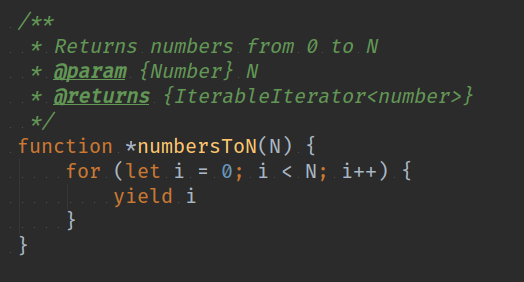
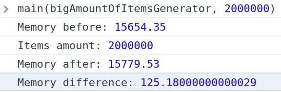

# Use JavaScript Generator Functions to Reduce Memory Utilization

> A comparison of memory management for ordinary JavaScript functions and generator functions

-- Evgeny Melnikov · 4 min read

In this article, I’m going to explain JavaScript Generators and how they utilize memory relative to ordinary JavaScript functions.

Almost every programmer has come across the problem of iterating over a large number of items (such as a collection of articles, images, database records, etc). And everything is fine until our server or browser says: “Hey, what are you doing? I’m trying to handle way too much, please, help me…”. =) And since we love our job, we put on gloves and start to dig deep into our code and profile everything.

First of all, I’d like to say that this is not a complete guide to JavaScript Generators. It’s just my experience explained here.

What is a JS generator? It is a function that can return a value and then continue the execution of the function at a later time. Whereas an ordinary JS function uses a return statement, the generator function uses a yield operator. This is an example (pay attention to the asterisk before function name):

If we call the function with any argument it will return an iterator, not a value as we would expect.

To get the value, we would call the next() method of the iterator object.

As you can see, the current result is kept in the value property of the returned object. Also, there is a done property that indicates whether the generator function has finished its job or not.

In the example function above, we specified 4 as the argument to our generator function, and that’s why the function will continue to return values from 0 to 4 (exclusively) on each call of next() method.

Now I want to show you a comparison of a generator function and an ordinary function in a for loop statement on a large number of items.

Let’s assume we need to iterate over a large amount of random numbers and do something with each one. In a normal JavaScript function, it would take the form as shown below:

To do the same thing with a JavaScript generator function, we would use the following code:

To test both functions I will create a main() function that will check how the memory usage changed after each iteration over the items.

I calculated the memory usage with a simple function that utilizes the performance property of the window object:

Now let’s call our main() method with the ordinary function and generator function to calculate the memory usage of each.
We first run our standard JS function main(bigAmountOfItems, 2000000).

Next will execute the generator function main(bigAmountOfItemsGenerator, 2000000).

As you can see, the standard JS function shows a memory increase of ~46.5 kilobytes whereas the generator increase was only ~0.125 kilobytes. This is because we didn’t need to keep all 2000000 items in our RAM with the generator function. The iterator allows us to keep track of the current iteration item and continue to return the next one until the end.

That’s the main thing that allows developers to save memory and to keep track of local variables or inner loops among the generator function without the necessity of outer code to know anything about the inner logic of the function.

Also, browsers work with async / await over generators and promises. But that’s a topic for another article :) I hope you got something useful from the story. Thanks for reading! Have a good life ;)
