# 使用JavaScript生成器函数来降低内存利用率

## 译文

> 关于普通JavaScript函数和生成器函数（generator）内存管理的比较

-- Evgeny Melnikov · 4 min 阅读

在本文中，我将解释什么是JavaScript生成器函数（generator），以及相对于普通JavaScript函数，它将如何进行内存管理。

几乎每个程序员都遇到过「遍历大量数据项」的问题(比如一组文章、图像、数据库记录等)。遍历本身很简单，一切都表现得很好，直到我们的服务器或浏览器说: “嘿，你在搞什么？数据量太大了，我快忙不过来了，请帮帮我”。=)既然我们都热爱自己的工作，那就戴上手套，开始深入研究我们的代码，分析这里面的问题。

首先，我想说，这篇文章不是一个完整的JavaScript生成器函数的指南。这只是一些个人的经验之谈。

什么是JS生成器（generator）？它是一个函数，可以返回一个值，然后在以后继续执行该函数。相较于普通的JS函数使用return语句，生成器函数使用yield操作符。下面一个例子（注意函数名前面的星号*）：

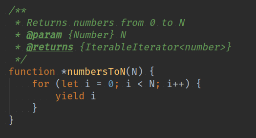

使用任意参数调用该函数，它将返回一个迭代器，而不是我们所期望的值。

*译注: 返回的是一个迭代器对象，suspended表示 「挂起状态」*

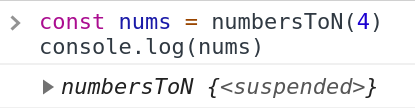

要获取期望的值，我们要调用迭代器对象的 `next()` 方法。

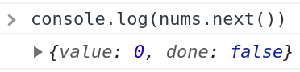

可以看到，当前结果被放在返回对象的 value 属性中。此外，还有一个 done 属性，标识生成器函数是否完成了其工作。

在上面的示例函数中，我们将 `4` 指定为生成器函数的参数。然后每次调用 next() 方法时，函数将依次返回从 0 到 4 (确定唯一)的值。

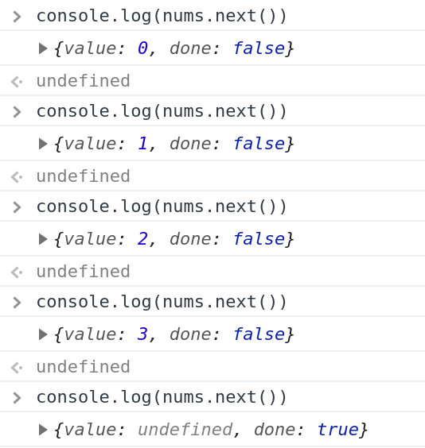

现在，我想向您展示一个生成器函数与普通函数在for循环语句中的对大量数据项处理的比较。

假设我们需要遍历大量随机数，并对每个随机数做一些处理。在一个普通的JavaScript函数中，它将采用如下所示的写法：

如果用JavaScript生成器函数（generator）执行相同的操作，我们将编写以下代码：

为了测试这两个函数，我将创建一个main()函数，该函数将检查每次迭代后内存使用情况的变化。

我使用一个利用 window 对象的 performance 属性的简单函数 memoryUsedKB 来计算内存使用量：

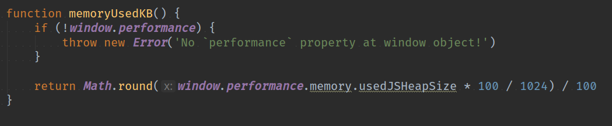

现在，让我们使用普通函数和生成器函数调用 main() 方法来计算各自的内存使用情况。首先用标准JS函数执行 main(bigAmountOfItems, 2000000)。

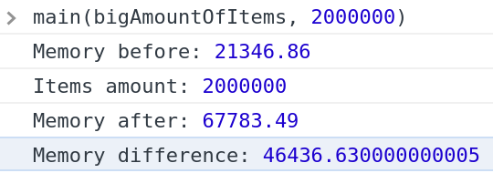

接下来用生成器函数执行 main(bigAmountOfItemsGenerator, 2000000)。

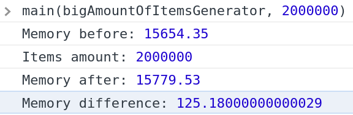

如您所见，标准JS函数显示内存增加了～46.5KB，而生成器函数仅增加了～0.125KB。 这是因为利用生成器函数特性，我们不需要将所有2000000项保留在RAM中。 迭代器使我们能够跟踪当前的迭代项，并继续返回下一个迭代项直至结束。

以上就是这篇文章的主要内容：利用生成器函数（generators），开发人员可以节省内存，并跟踪生成器函数之间的局部变量或内部循环，而无需外部代码了解任何有关函数内部逻辑。

此外，在浏览器中，基于 generators 和 promises，还可以使用 async / await 语法。 当然，这是另一篇文章的主题了：）。希望您能从这个故事中学到一些有用的东西。 谢谢阅读！ 美好生活～ ;）

## 译注

### 关于生成器函数 generators 的基础知识

可以阅读 [MDN Iterators and generators](https://developer.mozilla.org/en-US/docs/Web/JavaScript/Guide/Iterators_and_Generators)（中文版： [MDN 迭代器和生成器](https://developer.mozilla.org/zh-CN/docs/Web/JavaScript/Guide/Iterators_and_Generators)）

中文方面可以阅读 [阮一峰的ES6入门-Generator](http://es6.ruanyifeng.com/#docs/generator) 第17-19章节

### 上面的例子中使用生成器函数节省了内存，是否会增加耗时呢

以上面的例子包裹1个测速的函数，进行了相同的运算。详情见 [example](./example.js)。

测试结果，普通Javascript函数版本遍历2000000个数据项耗时～168ms，而生成器函数版本的耗时～119ms。

在数据项非常大的遍历中，生成器函数在执行效率上也优于普通Javascript函数。

+ 普通Javascript函数

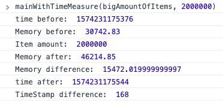

+ 生成器函数

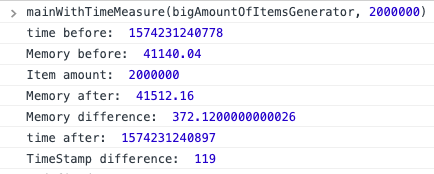

### 在Node环境的结果

在实际实践中在浏览器环境一般不会遇到这么大数据的场景，我们试试Node端的情况（实际上因为浏览器和Node对于Generator实现是一致，结果应该不会相差太多）

实际结果也符合我们的预测，生成器函数版本的内存使用大约是普通函数 1/40，耗时也略小于普通函数。

+ 普通Javascript函数

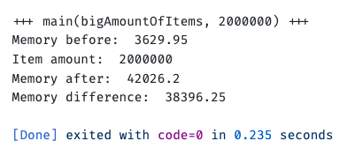

+ 生成器函数

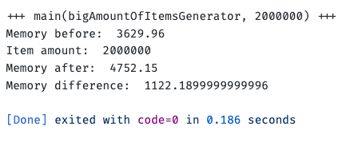

### 其它

1. 原文中 2 billion 修正为 2 million
