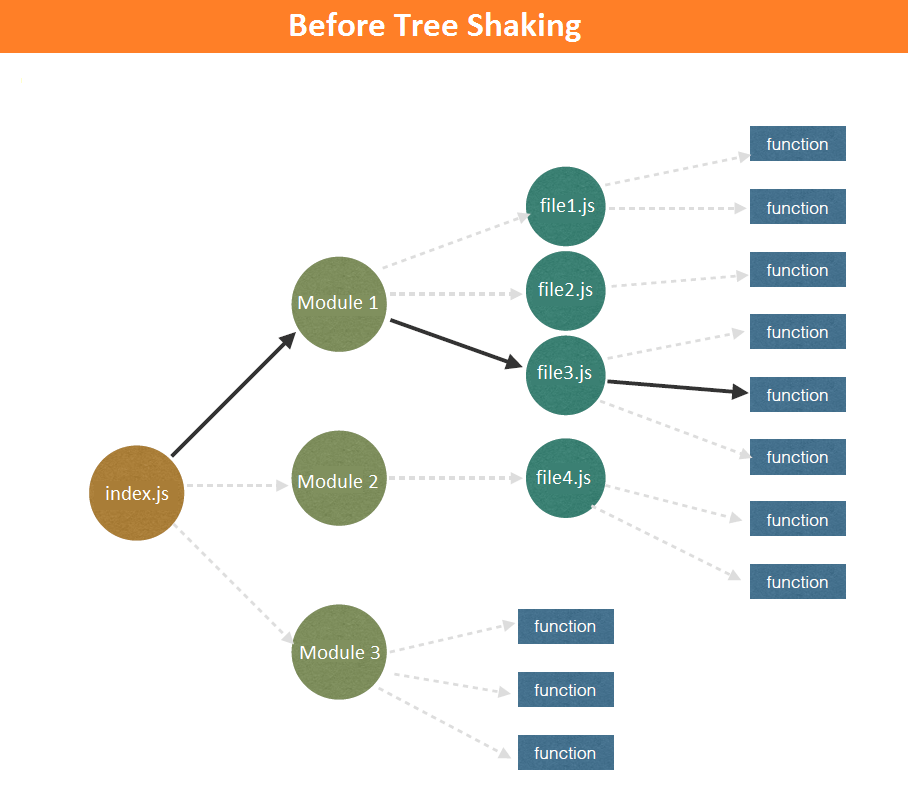
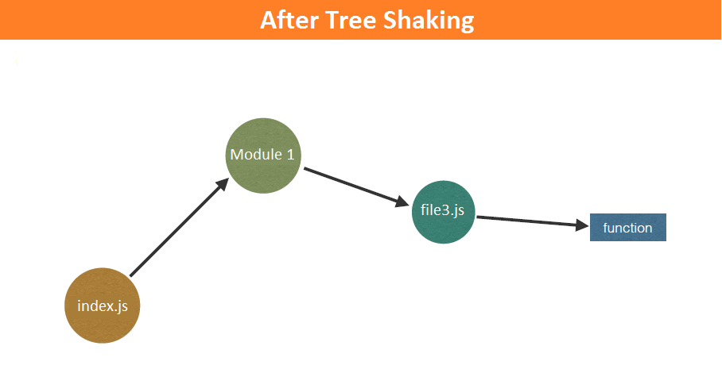
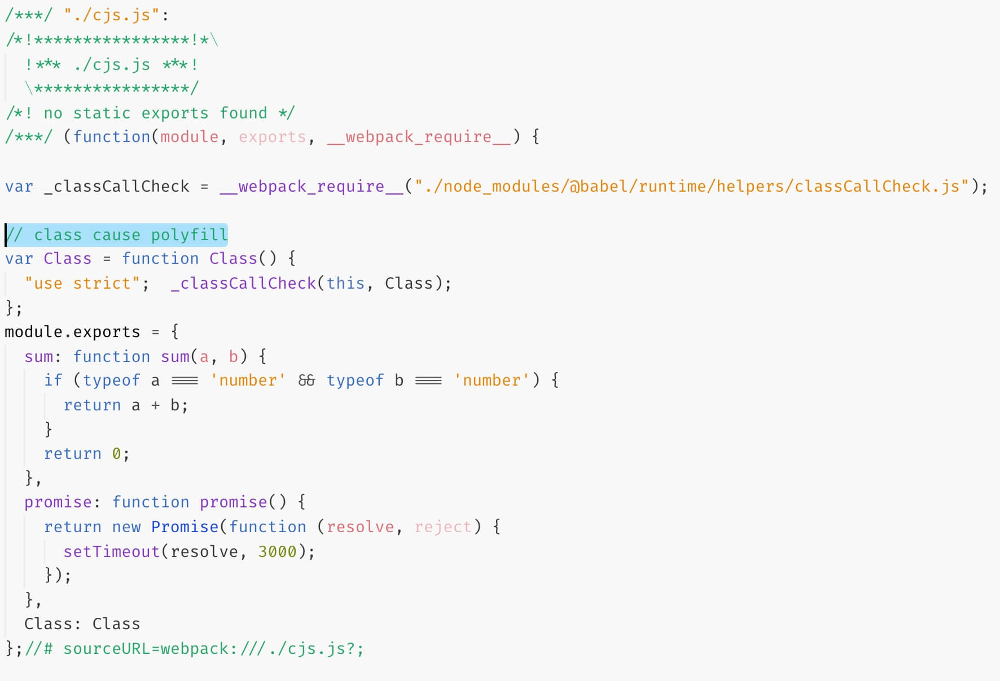
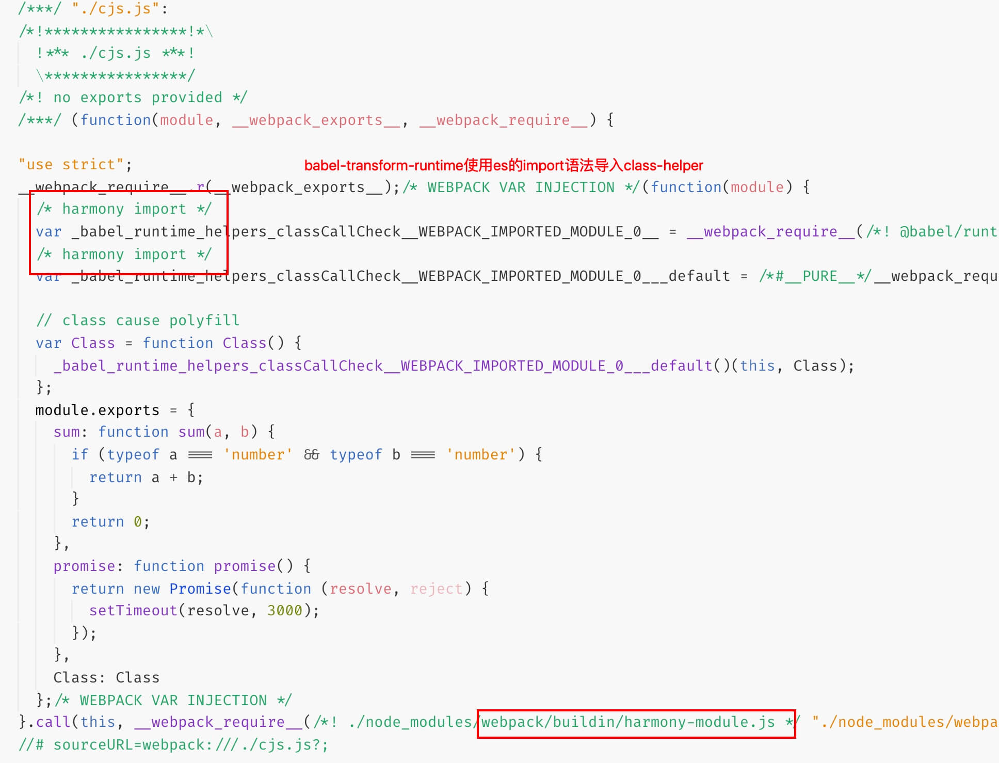
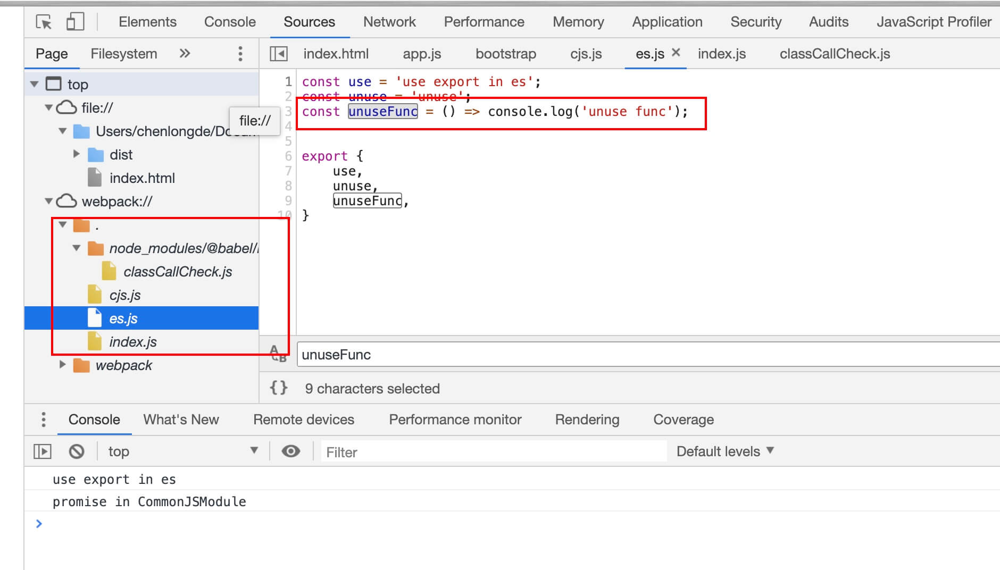

# Tree-Shaking进阶之路

## 一、什么是 Tree-Shaking？

在[webpack官方文档](https://webpack.js.org/guides/tree-shaking/)的定义是: Tree-Shaking 用于移除 JavaScript 上下文中的未引用代码「dead-code」。在 webpack 中，基于 ES2015 模块（也叫做 **harmony** 模块）的静态分析能力，确定模块之间的依赖关系，进而找出不需要的依赖，在构建阶段就删除不需要的依赖。

在实际业务开发中，我们往往会引入许多npm包，为了加快用户下载脚本的大小和时间，一般情况下我们都会利用 Tree-Shaking 的特性来减小打包后代码的体积。





## 二、如何使用 Tree-Shaking？

1. 代码中使用 ESModule，在导入时使用按需导入的语法 `import { foo, bar } from './ESModule';`
2. webpack中没有编译器把 ESModule 转换成 CommonJSModule
3. webpack默认会进行 Tree-Shaking，标记未被使用的导出内容为 **unused harmony export**
4. 配置uglifyJS等webpack代码压缩插件会删掉 被webpack标记为 **unused harmony export**的代码

*// webpack@4.x中已经弃用单独配置uglifyJSPlugin的方式，第4点修改为配置mode=production*

```javascript
// in index.js
import { foo } from './es';

// in webpack.config.js in webpack@2@3
    plugins: [
        new UglifyJsPlugin({sourceMap:true, compress: {warnings: false}})
    ],
// in webpack.config.js in webpack@4
    mode: 'production',
```

## 三、Tree-Shaking 和 CommonJSModule

在上面已经提到: Tree-Shaking 是基于静态模块分析的，因此对于 CommonJS 规范的JS模块，Tree-Shaking 不会生效，webpack 在打包时会全量打包至 chunk 里。

## 四、Tree-Shaking 和 Babel，鱼和熊掌可以兼得

这里 Babel 和 Tree-Shaking 又有什么关系呢？

在实际的web业务中，我们很难要求用户使用完整支持ES6的浏览器，我们一般会利用 babel-loader 将ES6源码转换成浏览器可解析的JS。

问题的答案是 babel-preset-env 中有一项默认配置： `module: 'cjs'`。这项配置的作用是：`babel对ESModule的转换方式`，默认的cjs会把源码中所有的ESModule转换成CommonJSModule！！！

### 4.1 Babel 对 ESModule 模块的处理

首先，是动态模块和静态模块的问题，静态模块可以转换成动态模块，反之则不能。

+ static(es) --> dynamic(cjs) ✅
+ dynamic(cjs) -/-> static(es) ❌

babel在设计时可能考虑到了这个因素: 既然代码中可能混杂cjs和es，并且cjs不能转换成es，那就默认把所有es转换成cjs，准没错。

此外，babel-preset-env提供了`module`的配置，我们可以配置`module: false`，让babel不转换 ESModule，这样webpack中Tree-Shaking就可以正常工作

```javascript
{
    loader: "babel-loader",
    options: {
        presets: [["env",{ modules: false }], "stage-2", ],
    },
}

```

### 4.2 cjs和es混用导致 babel-transform-runtime 异常

我们知道，Babel 在转换ES5以上的语法时会需要一些polyfill，比如es-class。

+ 如果不做特别处理，Babel 会把每个class都转换成完整的ES5-class实现，产生很多冗余代码
+ 如果用全局polyfill，会污染全局上下文，并且需要手动需要哪些polyfill，比较繁琐

babel-transform-runtime 可以解决上面提到问题：它会在用到 es-class 的模块中 `import` 一个公共的 class-helper 实现。这样就以最小的体积代价，只影响需要 polyfill 的JS模块。详情可阅读：[why babel-transfrom-runtime](https://babeljs.io/docs/en/babel-plugin-transform-runtime#why)

```javascript
{
    loader: "babel-loader",
    options: {
        presets: [["env",{ modules: false }], "stage-2", ],
        plugins: ["transform-runtime"],
    },
}
```



关于 Tree-Shaking 的问题在哪里？

当你的项目中有混用 ESModule 和 CommonJSModule 的时候，有可能触发一个配置冲突问题。在说明这个问题之间我们前置两个技术点：

1. 上面提到，babel-transfrom-runtime 会往需要 polyfill 的模块中 **导入** polyfill代码。
2. 现代JS编译器，对于JS模块的解析，如果代码中出现 import 或者 export，它就被当作 ESModule。在 ESModule 中 module 是保留字，不允许任何操作，比如`module.exports = xxx`会报如下错误：

```bash
// in terminal wepack error: js模块错误导致模块解析错误
WARNING in ./index.js
export 'promise' (imported as 'CommonJSModule') was not found in './cjs.js'

// in browser open js error: 具体js错误
Cannot assign to read only property 'exports' of object '#<Object>'
```

当满足以下条件时，transform-runtime**往CommonJS模块中import导入polyfill**，就会出现上面的错误：

1. 使用4.2中所示的Babel配置: `modules:false && babel-plugin-transform-runtime`
2. 在ESModule中导入CommonJSModule的行为
3. CommonJSModule中有需要polyfill的代码（如使用ES6 class语法）

分析结果是cjs和es混用的项目中，直接配置`modules:false`和`babel-plugin-transform-runtime`是有冲突的

+ 如果仅有`module:false`，transform-runtime往CommonJSModule中导入polyfill会使用reqire的方式，不会报错。但是会导致其它ESModule在webpack中的 Tree-Shaking 失效:cry:

+ 如果仅有transform-runtime，就不会有有polyfill导入，CommonJSModule 原样输出，被webpack当作 CommonJS 模块，不会报错。但是没有 transform-runtime，想使用新的语法就得用全局导入 babel-polyfill 的方式:cry:



解决之法是针对ESModule和CommonJS模块分别配置babel处理的方式，详情见[babel/issues/9238](https://github.com/babel/babel/issues/9238)

```javascript
rules: [{
    test: /cjs\.js$/,
    use: [{
        loader: "babel-loader",
        options: {
            presets: [["env", { modules: "commonjs" }], "stage-2"],
            plugins: ["transform-runtime"],
            cacheDirectory: true,
            // CommonJS规范的使用sourceType: "script"
            sourceType: "script"
        }
    }],
},
{
    test: /(es|index)\.js$/,
    use: [{
        loader: "babel-loader",
        options: {
            presets: [["env",{ modules: false }], "stage-2"],
            plugins: ["transform-runtime"],
            // ES规范的使用sourceType: "module"（默认值）
            sourceType: "module"
        },
    }],
}]

```

*// babel@7.x中可以合并配置*

```javascript
rules: [{
        test: /\.js$/,
        exclude: /node_modules/,
        use: [{
                loader: 'babel-loader',
                options: {
                    presets: [['@babel/preset-env', { modules: false }]],
                    plugins: ['@babel/plugin-transform-runtime'],
                    // babel@7新增unambiguous
                    // transform-runtime可以自动识别模块类型，根据模块类型使用不同的“导入”
                    sourceType: "unambiguous"
                },
            },
        ],
    },
],

```

## 五、Tree-Shaking 和 SideEffect，锦上添花

SideEffect 是 webpack@v4 的重要特性之一，是 Tree-Shaking 的重要补充，可以让 webpack 更好地进行无用代码的剥离。

即使依赖的npm包的 package.json 中没有标记 sideEffects，Tree-Shaking 过程中也会利用[terser](https://github.com/terser-js/terser)来分析模中的副作用来判断哪些代码可以优化掉。然而因为JS语言天生的动态性，terser对副作用的判断很难做到非常准确，多数情况下它的工作还是表保守。因此需要编写npm包的作者自己来定义自己包中的副作用。

*"副作用"定义是：导入时就执行的特定行为的代码，而不是默认导出或多个命名导出。一个典型例子是polyfills，它会影响全局，但通常不在模块中导出。*


比如我们编写了1个Button组件，并准备发布npm包。如果确认该包下没有任何副作用的代码，就可以在 packeage.json 标记 sideEffects 为false。webpack在处理该模块时，会忽略所有非导出的内容。

```json
{
    "name": "@my-ui/Button",
    "sideEffects": false,
}
```

再比如我们编写了1个Layout组件，并准备发布npm包。如果确认该包下某个未被引用的 reset.css 有全局作用（副作用），就可以在 packeage.json 设置 sideEffects 值为该css文件的相对路径。webpack 在处理该模块时，会忽略非导出的内容，而该 reset.css 还会被打包进来。

```json
{
    "name": "@my-ui/Button",
    "sideEffects": ["./reset.css"],
}
```

更多可参考官方文档：[clarifying-tree-shaking-and-sideeffects](https://webpack.js.org/guides/tree-shaking/#clarifying-tree-shaking-and-sideeffects)

## 六、Tree-Shaking 和 SourceMap，我全都要

有同学要问了：如果 Tree-Shaking 把无用代码删除后，还能在SourceMap 帮助下看到相关的源码吗？

答案是可以的：



## 七、web项目中使用Tree-Shaking的实践建议

### 1. 非Node体系的代码尽量使用ESModule

CommonJSModule 的动态性和 ESModule 的静态特是实际应用中平衡取舍的形成的，没绝对的好坏。当然，如果你的模块只在web端使用（无node的应用场景），且没有用到动态导入、条件导入的特性，建议使用 ESModule 规范来模块化你的代码。

### 2. 编写 ESModule 代码，有多个非强耦合的导出内容时，尽量使用命名导出/按需导入

### 3. Babel 配置中对 CommonJS 模块特殊配置，注意babel@6和bable@7的区别

### 4. webpack@4体系中，如果是公司内部的npm模块，明确无副作用的，标记 sideEffects
