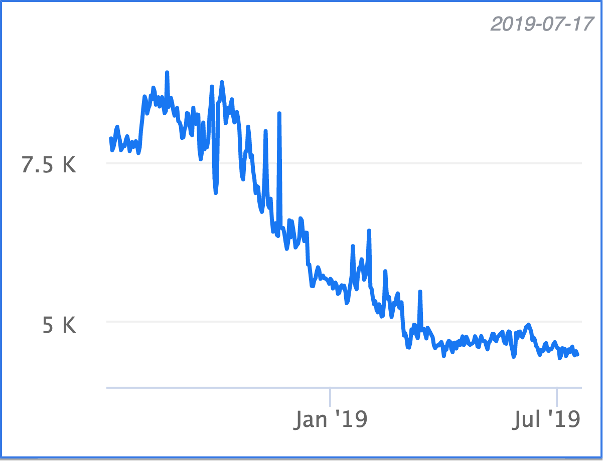
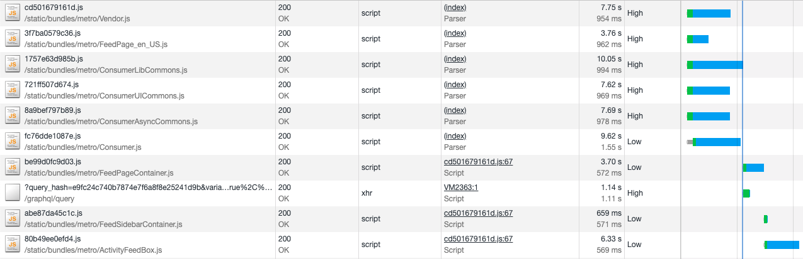

# Making Instagram.com faster: Part 1

In recent years, instagram.com has seen a lot of changes — we’ve launched stories, filters, creation tools, notifications, and direct messaging as well as myriad other features and enhancements. However, as the product grew, one unfortunate side effect was that our web performance began to suffer. Over the last year, we made a conscious effort to improve this. Our ongoing efforts have thus far resulted in almost 50% cumulative improvement to our feed page load time. This series of blog posts will outline some of the work we’ve done that led to these improvements.



Correctly prioritizing resource download and execution and reducing browser downtime during the page load is one of the main levers for improving web application performance. In our case, many of these types of optimizations proved to be more immediately impactful than code size reductions, which tended to be individually small and only began to add up after many incremental improvements (though we will talk about these in future installments). They were also less disruptive to product development, requiring less code change and refactoring. So initially, we focused our efforts in this area, beginning with resource prefetching.

## JavaScript, XHR, and image prefetching (and how you need to be careful)

As a general principle, we want to inform the browser as early as possible about what resources are required to load the page. As developers, we often know what resources we are going to need ahead of time, but the browser may not become aware of those until late in the page loading process. These resources mainly include those that are dynamically fetched by JavaScript (other scripts, images, XHR requests etc.) since the browser is unable to discover these dependent resources until it has parsed and executed some other JavaScript first.

Instead of waiting for the browser to discover these resources itself, we can provide a hint to the browser that it should start working on fetching those resources immediately. The way we do this is by using HTML preload tags. They look something like this:

```html
<link rel="preload" href="my-js-file.js" as="script" type="text/javascript" />
```

At Instagram, we use these preload hints for two types of resources on the critical page loading path: dynamically loaded JavaScript and preloading XHR GraphQL requests for data. Dynamically loaded scripts are those that are loaded via `import('...')` for a particular client-side route. We maintain a list of mappings between server-side entrypoints and client-side route scripts — so when we receive a page request on the server-side, we know which client-side route scripts will be required for a particular server-side entrypoint and we can add a preload for these route specific scripts as we render the initial page HTML.

For example, for the FeedPage entrypoint, we know that our client-side router will eventually make a request for FeedPageContainer.js, so we can add the following:

```html
<link
  rel="preload"
  href="/static/FeedPageContainer.js"
  as="script"
  type="text/javascript"
/>
```

Similarly, if we know that a particular GraphQL request is going to be made for a particular page entrypoint, then we should preload that XHR request. This is particularly important as these GraphQL queries can sometimes take a long time and the page can't render until this data is available. Because of this, we want to get the server working on generating the response as early as possible in the page lifecycle.

```html
<link
  rel="preload"
  href="/graphql/query?id=12345"
  as="fetch"
  type="application/json"
/>
```

The changes to the page load behavior are more obvious on slower connections. With a simulated fast 3G connection (the first waterfall below -without any preloading), we see that FeedPageContainer.js and its associated GraphQL query only begin once Consumer.js has finished loading. However, in the case of preloading, both FeedPageContainer.js and its GraphQL query can begin loading as soon as the page HTML is available. This also reduces the time to load any non-critical lazy loaded scripts, which can be seen in the second waterfall. Here FeedSidebarContainer.js and ActivityFeedBox.js (which depend upon FeedPageContainer.js) begin loading almost immediately after Consumer.js has completed.




## Benefits of preload prioritization

In addition to starting the download of resources sooner, link preloads also have the additional benefit of increasing the network priority of async script downloads. This becomes important for async scripts on the critical loading path because the default priority for these is Low. This means that XHR requests and images in the viewport will have higher network priority, and images outside the viewport will have the same network priority. This can cause situations where critical scripts required for rendering the page are blocked or have to share bandwidth with other resources (if you’re interested, see [here](https://medium.com/reloading/preload-prefetch-and-priorities-in-chrome-776165961bbf) for an in-depth discussion of resource priorities in Chrome). Careful use (more on that in a minute) of preloads gives an important level of control over how we want the browser to prioritize content during initial loads in cases where we know which resources should be prioritized.

## Problems with preload prioritization

The problem with preloads is that with the extra control it provides, comes the extra responsibility of correctly setting the resource priorities. For example, when testing in regions with very slow overall mobile and wifi networks and significant packet loss, we noticed that `<link rel="preload" as="script">` network requests for scripts were being prioritized over the `<script />` tags of the JavaScript bundles on the critical page rendering path, resulting in an increase in overall page load time.

This stemmed from how we were laying out the preload tags on our pages. We were only putting preload hints for bundles that were going to be downloaded asynchronously as part of the current page by the client-side router.

```html
<!-- preloaded async route bundles -->
<link rel="preload" href="SomeConsumerRoute.js" as="script" />
<link rel="preload" href="..." as="script" />
...
<!-- critical path scripts to load the initial page -->
<script src="Common.js" type="text/javascript"></script>
<script src="Consumer.js" type="text/javascript"></script>
```

- Preloading just async route JavaScript bundles

In the example for the logged out page, we were prematurely downloading (preloading) SomeConsumerRoute.js before Common.js & Consumer.js and since preloaded resources are downloaded with the highest priority but are not parsed/compiled, they blocked Common & Consumer from being able to start parsing/compiling. The Chrome Data saver team also found similar issues with preloads and wrote about their solution [here](https://medium.com/reloading/a-link-rel-preload-analysis-from-the-chrome-data-saver-team-5edf54b08715). In their case, they opted to always put preloads for async resources after the script tag of the resource that requests them. In our case we opted for a slightly different approach. We decided to have a preload tag for **all** script resources and to place them in the order that they would be needed. This ensured that we were able to start preloading all script resources as early as possible in the page (including synchronous script tags that couldn’t be rendered into the HTML until after certain server side data was added to the page), and ensured that we could control the ordering of script resource loading.

```html
<!-- preloaded critical path scripts -->
<link rel="preload" href="Common.js" as="script" />
<link rel="preload" href="Consumer.js" as="script" />
<!-- preloaded async route bundles -->
<link rel="preload" href="SomeConsumerRoute.js" as="script" />
...
<!-- critical path scripts to load the initial page -->
<script src="Common.js" type="text/javascript"></script>
<script src="Consumer.js" type="text/javascript"></script>
<script src="SomeConsumerRoute.js" type="text/javascript" async></script>
```

- Preloading all JavaScript bundles

## Image prefetching

One of the main surfaces on [instagram.com](instagram.com) is the Feed, consisting of an infinite scrolling feed of images and videos. We implement this by loading an initial batch of posts and then loading additional batches as the user scrolls down the feed. However, we don’t want the user to wait every time they get to the bottom of the feed (while we load a new batch of posts), so it’s very important for the user experience that we load in new batches before the user hits the end of their current feed.

This is quite tricky to do in practice for a few reasons:

- We don’t want off-screen batch loading to take CPU and bandwidth priority away from parts of the feed the user is currently viewing.
- We don’t want to waste user bandwidth by being over-eager with preloading posts the user might not ever bother scrolling down to see, but on the other hand if we don’t preload enough, the user will frequently hit the end of feed.
- [Instagram.com](instagram.com) is designed to work on a variety of screen sizes and devices, so we display feed images using the img `srcset` attribute (which lets the browser decide which image resolution to use based on the users screen size). This means it's not easy to determine which image resolution we should preload & risks preloading images the browser will never use.

The approach we used to solve the problem was to build a prioritized task abstraction that handles queueing of asynchronous work (in this case, a prefetch for the next batch of feed posts). This prefetch task is initially queued at an idle priority (using requestIdleCallback), so it won’t begin unless the browser is not doing any other important work. However if the user scrolls close enough to the end of the current feed, we increase the priority of this prefetch task to ‘high’ by cancelling the pending idle callback and thus firing off the prefetch immediately.


Once the JSON data for the next batch of posts arrives, we queue a sequential background prefetch of all the images in that preloaded batch of posts. We prefetch these sequentially in the order the posts are displayed in the feed rather than in parallel, so that we can prioritize the download and display of images in posts closest to the user’s viewport. In order to ensure we actually prefetch the correct size of the image, we use a hidden media prefetch component whose dimensions match the current feed. Inside this component is an `` that uses a `srcset` attribute, the same as for a real feed post. This means that we can leave the selection of the image to prefetch up to the browser, ensuring it will use the same logic for selecting the correct image to display on the media prefetch component as it does when rendering the real feed post. It also means that we can prefetch images on other surfaces on the site — such as profile pages — as long as we use a media prefetch component set to the same dimensions as the target display component.

The combined effect of this was a 25% reduction in time taken to load photos (i.e. the time between a feed post being added to the DOM and the image in that post actually loading and becoming visible) as well as a 56% reduction in the amount of time users spent waiting at the end of their feed for the next page.

## Stay tuned for part 2

Stay tuned for part 2: Early flushing and progressive HTML (and why you don’t necessarily need HTTP/2 push for pushing resources to the browser). If you want to learn more about this work or are interested in joining one of our engineering teams, please visit our [careers page](https://www.facebook.com/careers/jobs/?q=instagram), follow us [on Facebook](https://www.facebook.com/instagramengineering/) or [on Twitter](https://twitter.com/instagrameng).
