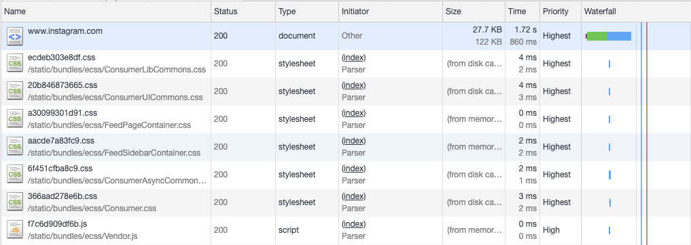
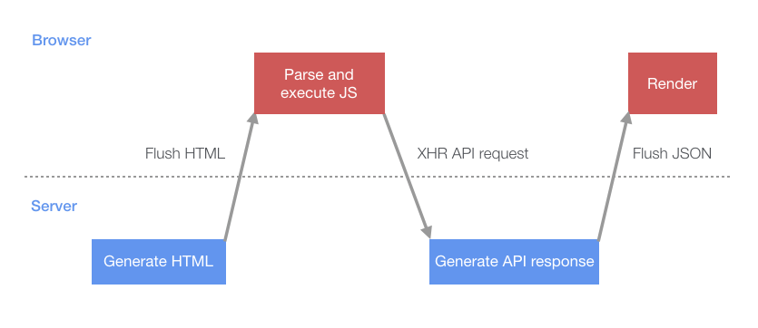

# Making Instagram.com faster: Part 2

In recent years, instagram.com has seen a lot of changes — we’ve launched stories, filters, creation tools, notifications, and direct messaging as well as myriad other features and enhancements. However, as the product grew, one unfortunate side effect was that our web performance began to suffer. Over the last year, we made a conscious effort to improve this. Our ongoing efforts have thus far resulted in almost 50% cumulative improvement to our feed page load time. This series of blog posts will outline some of the work we’ve done that led to these improvements.

## Pushing data using early flushing and progressive HTML

In [part 1](https://instagram-engineering.com/making-instagram-com-faster-part-1-62cc0c327538), we showed how using link preloads allows us to start dynamic queries earlier in the page load i.e. before the script that will initiate the request has even loaded. With that said, issuing these requests as a preload still means that the query will not begin until the HTML page has begun rendering on the client, which means the query cannot start until 2 network roundtrips have completed (plus however long it takes to generate the html response on the server). As we can see below for a preloaded GraphQL query, even though it’s one of the first things we preload in the HTML head, it can still be a significant amount of time before the query actually begins.


The theoretical ideal is that we would want a preloaded query to begin execution as soon as the request for the page hits the server. But how can you get the browser to request something before it has even received any HTML back from the server? The answer is to push the resource from the server to the browser, and while it might look like HTTP/2 push is the solution here, there is actually a very old (and often overlooked) technique for doing this that has universal browser support and doesn’t have any of the infrastructural complexities of implementing HTTP/2 push. Facebook has been using this successfully since 2010 (see [BigPipe](https://www.facebook.com/notes/facebook-engineering/bigpipe-pipelining-web-pages-for-high-performance/389414033919/)), as have other sites in various forms such as Ebay — but this technique seems to be largely ignored or unused by developers of JavaScript SPAs. It goes by a few names — early flush, head flushing, progressive HTML — and it works by combining two things:

+ HTTP chunked transfer encoding
+ Progressive HTML rendering in the browser

[Chunked transfer encoding](https://en.wikipedia.org/wiki/Chunked_transfer_encoding) was added as part of HTTP/1.1, and essentially it allows an HTTP network response to be broken up into multiple ‘chunks’ which can be streamed to the browser. The browser then stitches these chunks together as they arrive into a final completed response. While this does involve a fairly significant change to how pages are rendered on the server side, most languages and frameworks have support for rendering chunked responses (in the case of Instagram we use Django on our web frontends, so we use the [StreamingHttpResponse](https://docs.djangoproject.com/en/2.2/ref/request-response/#streaminghttpresponse-objects) object). The reason this is useful is that it allows us to stream the contents of an HTML page to the browser as each part of the page completes — rather than having to wait for the whole response. This means we can flush the HTML head to the browser almost immediately (hence the term ‘early flush’) as it doesn’t involve much server-side processing. This allows the browser to start downloading scripts and stylesheets while the server is busy generating the dynamic data in the rest of the page. You can see the effect of this below.




Additionally, we can use chunked encoding to send data to the client as it completes. In the case of server-side rendered applications this could be in the form of HTML, but we can push JSON data to the browser in the case of single page apps like instagram.com. To see how this works, let’s look at the naive case of a single page app starting up. First the initial HTML containing the JavaScript required to render the page is flushed to the browser. Once that script parses and executes, it will then execute an XHR query which fetches the initial data needed to bootstrap the page.




This process involves multiple roundtrips between the server and client and introduces periods where both the server and client are sitting idle. Rather than have the server wait for the client to request the API response, a more efficient approach would be for the server to start working on generating the API response immediately after the HTML has been generated and to push it to the client. This would mean that by the time the client has started up the data would likely be ready without having to wait for another round trip. The first step in making this change was to create a JSON cache to store the server responses. We implemented this by using a small inline script block in the page HTML that acts as a cache & lists the queries that will be added to this cache by the server (this is shown in a simplified form below).

```html
<script type="text/javascript">
  // the server will write out the paths of any API calls it plans to 
  // run server-side so the client knows to wait for the server, rather
  // than doing its own XHR request for the data
  window.__data = {
    '/my/api/path': {
        waiting: [],
    }
  };

  window.__dataLoaded = function(path, data) {
    const cacheEntry = window.__data[path];
    if (cacheEntry) {
      cacheEntry.data = data;
      for (var i = 0;i < cacheEntry.waiting.length; ++i) {
        cacheEntry.waiting[i].resolve(cacheEntry.data);
      }
      cacheEntry.waiting = [];
    }
  };
</script>
```

After flushing the HTML to the browser the server can execute the API query itself and when it completes, flush the JSON data to the page as a script tag containing the data. When this HTML response chunk is received and parsed by the browser, it will result in the data being inserted into the JSON cache. A key thing to note with this approach is that the browser will render progressively as it receives response chunks (i.e. they will execute complete script blocks as they are streamed in). So you could potentially generate lots of data in parallel on the server and flush each response in its own script block as it becomes ready for immediate execution on the client. This is the basic idea behind Facebooks BigPipe system where multiple independent Pagelets are loaded in parallel on the server and pushed to the client in the order they complete.

```html
<script type="text/javascript">
  window.__dataLoaded('/my/api/path', {
    // API json response, wrapped in the function call to 
    // add it to the JSON cache...
  });
</script>
```

When the client script is ready to request its data, instead of issuing an XHR request, it first checks the JSON cache. If a response is present (or pending) it either responds immediately, or waits for the pending response.

```html
function queryAPI(path) {
  const cacheEntry = window.__data[path];
  if (!cacheEntry) {
    // issue a normal XHR API request
    return fetch(path);
  } else if (cacheEntry.data) {
    // the server has pushed us the data already
    return Promise.resolve(cacheEntry.data);
  } else {
    // the server is still pushing the data
    // so we'll put ourselves in the queue to 
    // be notified when its ready
    const waiting = {};
    cacheEntry.waiting.push(waiting);
    return new Promise((resolve) => {
      waiting.resolve = resolve;
    });
  }
}
```

This has the effect of changing the page load behavior to this:


Compared to the naive loading approach, the server and client can now do more work in parallel — reducing idle periods where the server and client are waiting on each other. The impact of this was significant: desktop users experienced a 14% improvement in page display completion time, while mobile users (with higher network latencies) experienced a more pronounced 23% improvement.

## Stay tuned for part 3

In part 3 we’ll cover how we further improved performance by taking a cache first approach to rendering data. If you want to learn more about this work or are interested joining one of our engineering teams, please visit our careers page, follow us on Facebook or on Twitter.