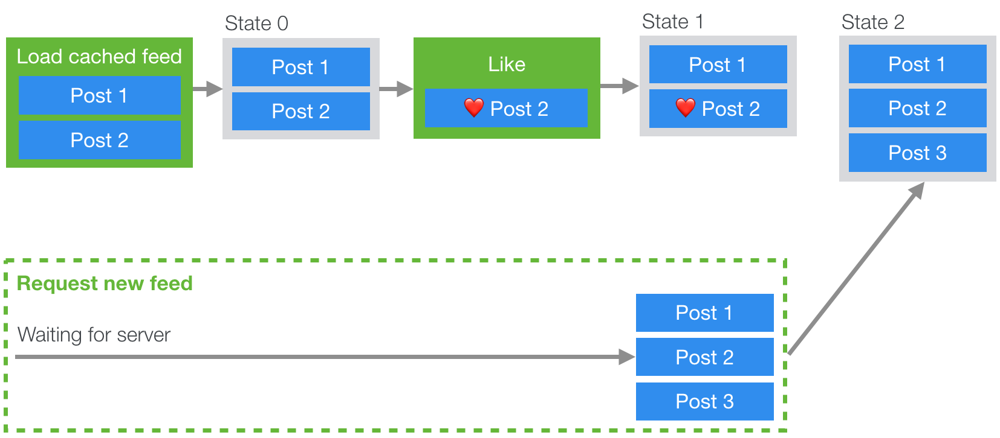

# Making Instagram.com faster: Part 3 — cache first

In recent years instagram.com has seen a lot of changes — we’ve launched stories, filters, creation tools, notifications, and direct messaging as well as a myriad of other features and enhancements. However, as the product grew, a side effect was that our web performance began to slow. Over the last year we made a conscious effort to improve this. This ongoing effort has thus far resulted in almost 50% cumulative improvement to our feed page load time. This series of blog posts will outline some of the work we’ve done that led to these improvements. In [part 1](https://instagram-engineering.com/making-instagram-com-faster-part-1-62cc0c327538) we talked about prefetching data and in [part 2](https://instagram-engineering.com/making-instagram-com-faster-part-2-f350c8fba0d4) we talked about improving performance by pushing data directly to the client rather than waiting for the client to request the data.

## Cache first

Since we’re already pushing data to the client at the earliest possible time in the page load — the only faster way to get data to the client would be to not have to fetch or push any data at all. We can do this using a cache-first rendering approach, though this does mean that we have to display stale feed data to users for a short period of time. With this approach, when the page is loaded, we immediately present users with a cached copy of their previous feed and stories tray, and then replace it with fresh data once it’s available.

`We use Redux to manage state on instagram.com, so at a high level the way we implemented this was to store a subset of our Redux store on the client in an indexedDB table, and then rehydrate the store when the page first loads.` However, because of the asynchronous nature of indexedDB access, server data fetching, and user interactions, we can run into problems where the user interacts with the cached state, but then we want to ensure that those interactions are still applied to the new state when it arrives from the server.

For example, if we were to handle caching in a naive way we could run into the following problem: We begin loading from cache and from the network concurrently and since the cached feed is ready first, we display it to the user. The user then proceeds to like a post, but once the network response for the latest feed comes back it overwrites that post with a copy that doesn’t include the like action that the user applied to the cached copy (see the diagram below).



To solve this issue, we needed a way to apply interactions to the cached state, but also store those interactions so they can be replayed later over the new state from the server. If you’ve ever used Git or similar source control systems before, this problem might seem familiar. If we think of the cached feed state as a branch, and the server feed response as master, what we effectively want to do is to do a rebase operation, applying the commits (likes, comments etc.) from our local branch onto the head of master.

This brings us to the following design:

- On page load, we send a request for the new data (or wait for it to be pushed)
- Create a staged subset of the Redux state
- While the request/push is pending, we store any dispatched actions
- Once the request resolves, we apply the action with the new data and any actions that have been pending to the staged state
- When the staged state is committed, we simply replace the current state with the staged one.


By having a staging state, all the existing reducer behavior can be reused. It also keeps the staged state (which has the most recent data) separate from the current state. Also, since staging is implemented using Redux, we just need to dispatch actions to use it!

```js
function stagingAction(
    key: string,
    promise: Promise<Action>,
): AsyncAction<State, Action>

function stagingCommit(key: string): AsyncAction<State, Action>
```

The staging API consists of two main functions: `stagingAction` & `stagingCommit` (as well as a couple of others for handling reverts and edge cases that we won't cover here).

`stagingAction` accepts a promise that resolves an action to be dispatched to the staged state. It initializes the staging state and keeps track of any actions that have been dispatched since it was initialized. In the source control analogy we can think of this as creating a local branch as any actions that take place will now be queued and applied over the staged state when the new data arrives.

`stagingCommit` commits the staging state to the current state. If any async actions on the staging state are pending, it will wait before committing. This is similar to a rebase in source control terms, in that we apply all our local changes (from the cache branch) on top of master (the new data from the server), leaving our local branch up to date.

To enable staging, we wrap the root reducer with a reducer enhancer that handles the stagingCommit action and applies the staged actions to the new state. To use all this, we just need to dispatch the relevant actions and everything is handled for us. For example, if we want to fetch a new feed and apply it to a staged state, we can do something similar to the following:

```js
function fetchAndStageFeed() {
    return stagingAction(
        'feed',
        (async () => {
            const { data } = await fetchFeedTimeline();
            return {
                type: FEED_LOADED,
                ...data,
            };
        })()
    );
}

// Fetches the new feed and stages it
store.dispatch(fetchAndStageFeed());

// any other actions dispatched until the stagingCommit action
// will be applied to the 'feed' staged state

// Commits staging to the current state
store.dispatch(stagingCommit('feed'));
```

Using cache-first rendering for both feed posts and the stories tray led to a 2.5% and 11% improvement in respective display done times and bought the user experience more in-line with what is available on the native iOS and android Instagram apps.

## Stay tuned for part 4

In part 4 we’ll cover how we reduced the size of our codebase and improved its performance through code size and execution optimizations. If you want to learn more about this work or are interested joining one of our engineering teams, please visit our careers page, follow us on Facebook or on Twitter.
