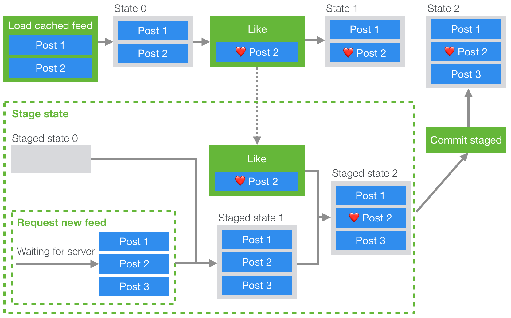

# Making Instagram.com faster: Part 3 — cache first

# 让 Instagram.com 变得更快: 第三章 — 缓存优先

In recent years instagram.com has seen a lot of changes — we’ve launched stories, filters, creation tools, notifications, and direct messaging as well as a myriad of other features and enhancements. However, as the product grew, a side effect was that our web performance began to slow. Over the last year we made a conscious effort to improve this. This ongoing effort has thus far resulted in almost 50% cumulative improvement to our feed page load time. This series of blog posts will outline some of the work we’ve done that led to these improvements. In [part 1](https://instagram-engineering.com/making-instagram-com-faster-part-1-62cc0c327538) we talked about prefetching data and in [part 2](https://instagram-engineering.com/making-instagram-com-faster-part-2-f350c8fba0d4) we talked about improving performance by pushing data directly to the client rather than waiting for the client to request the data.

最近这几年，instagram.com 变了很多 - 我们在 INS 中加入了 Stories、滤镜、创作工具、系统通知和消息推送等新特性和功能增强。然而，伴随着产品的不断迭代成长，一个不幸的事情发生了：我们的 web 端性能开始下降了。为处理性能下降，在最近的一年中，我们有意识地开展一些工作来提升性能。截止目前，我们的不懈努力已经让 Feed 页面加载时间减少了将近 50%。这个系列的博客文章将会讲述我们为实现这些提升所做的一些工作。在[第一章](./[对照版]让Instagram.com变得更快（1）.md)中我们主要讨论预加载数据，在[第二章](./[对照版]让Instagram.com变得更快（2）.md)中我们主要讨论通过服务端主动推送数据来提升性能。

## Cache first

Since we’re already pushing data to the client at the earliest possible time in the page load — the only faster way to get data to the client would be to not have to fetch or push any data at all. We can do this using a cache-first rendering approach, though this does mean that we have to display stale feed data to users for a short period of time. With this approach, when the page is loaded, we immediately present users with a cached copy of their previous feed and stories tray, and then replace it with fresh data once it’s available.

在前面的文章中，向客户端推送数据的时间已经被提前到极致了。如果还想让页面更快得到数据，那么唯一的思路就是不去请求和推送数据。我们可以用缓存优先的渲染机制来实现这个思路，当然这也意味着在一定时间内用户会看到不变的 Feed 流数据。在这种做法中，当页面加载完成，我们会立即给用户展示之前 Feed 和 Story 的副本缓存，并且在新数据可用时覆盖旧的缓存。

`We use Redux to manage state on instagram.com, so at a high level the way we implemented this was to store a subset of our Redux store on the client in an indexedDB table, and then rehydrate the store when the page first loads.` However, because of the asynchronous nature of indexedDB access, server data fetching, and user interactions, we can run into problems where the user interacts with the cached state, but then we want to ensure that those interactions are still applied to the new state when it arrives from the server.

`instagram.com使用Redux来管理前端状态，因此我们的实现方式是，在更高层次上将一个Redux Store的子集存储到indexedDB的表中，然后在页面初始化渲染时用缓存的数据状态 rehydrate 回store中`。然而因为 indexedDB 操作、请求服务端数据、用户交互都是异步的，当用户和缓存中的数据做交互时我们会遇到一个问题：我们希望这些改动在服务端数据到达时仍热有效。

> 译注: rehydrate 的直译是「注水」，感觉不是很准确，这里不做翻译。更多可以参考: [react 中出现的"hydrate"这个单词到底是什么意思?](https://www.zhihu.com/question/66068748)

For example, if we were to handle caching in a naive way we could run into the following problem: We begin loading from cache and from the network concurrently and since the cached feed is ready first, we display it to the user. The user then proceeds to like a post, but once the network response for the latest feed comes back it overwrites that post with a copy that doesn’t include the like action that the user applied to the cached copy (see the diagram below).

举个例子，如果就这么直接处理缓存的状态数据，我们会遇到这个问题：首先，我们同时从缓存和网络加载数据，由于缓存优先的策略，因此缓存数据先渲染给用户。然后，用户对某个 feed 操作了「喜欢」。这之后一旦这个 feed 最新的网络请求返回时，它就会覆盖该 feed 的状态，而该 feed 状态不包含用户刚刚对缓存副本 feed 操作的状态（请参见下图）。


To solve this issue, we needed a way to apply interactions to the cached state, but also store those interactions so they can be replayed later over the new state from the server. If you’ve ever used Git or similar source control systems before, this problem might seem familiar. If we think of the cached feed state as a branch, and the server feed response as master, what we effectively want to do is to do a rebase operation, applying the commits (likes, comments etc.) from our local branch onto the head of master.

为解决这个问题，我们需要一个新的方法，它在处理缓存状态的同时，还要缓存这些改动，这样它们就可以在服务端返回的数据中重新执行一遍。如果你有用 Git 或其它版本控制工具的经验，这个问题是不是看上去很熟悉？如果我们把缓存的 feed 当作一个特性分支，把服务端的放回的 feed 当作 master 分支，那么我们在做的其实就是在 master 分支上执行 rebase 操作，把特性分支上的 commit（喜欢、评论等操作）应用到 master 分支中

This brings us to the following design:

这样就有如下的设计:

-   On page load, we send a request for the new data (or wait for it to be pushed)
-   Create a staged subset of the Redux state
-   While the request/push is pending, we store any dispatched actions
-   Once the request resolves, we apply the action with the new data and any actions that have been pending to the staged state
-   When the staged state is committed, we simply replace the current state with the staged one.

-   当页面加载，我们发送请求获取新数据（或等待服务端主动 push 新数据，参考第二章）
-   创建 1 个暂存的 Redux State 子集
-   当请求/推送未完成时，我们把所有已经 dispatch 的 actions 存储起来
-   当请求/推送求完成，我们会把这些存储的 action 和其它待执行的 action 都应用到刚才暂存的 State 中
-   当暂存的 State 提交的时候，我们直接把当前的 State 替换成暂存的 State



By having a staging state, all the existing reducer behavior can be reused. It also keeps the staged state (which has the most recent data) separate from the current state. Also, since staging is implemented using Redux, we just need to dispatch actions to use it!

通过保持一个暂存中的 State，所有已经存在的 reducer 行为都可以重复使用。它还将暂存 State 和最新 State 分开。另外，我们是使用 Redux 来实现暂存，因此可以直接用 dispatch action 的 API 来使用，非常方便。

```typescript
function stagingAction(key: string, promise: Promise<Action>): AsyncAction<State, Action>;

function stagingCommit(key: string): AsyncAction<State, Action>;
```

The staging API consists of two main functions: `stagingAction` & `stagingCommit` (as well as a couple of others for handling reverts and edge cases that we won't cover here).

暂存 API 包含两个主要方法: `stagingAction` & `stagingCommit` （当然还有一些还原 State 的方法和处理边界问题的情况，这里就不展开了）

`stagingAction` accepts a promise that resolves an action to be dispatched to the staged state. It initializes the staging state and keeps track of any actions that have been dispatched since it was initialized. In the source control analogy we can think of this as creating a local branch as any actions that take place will now be queued and applied over the staged state when the new data arrives.

`stagingAction` 函数接收 1 个 Promise，这个 Promise 会 resolve 1 个要 dispatch 到暂存 State 的 action。它初始化暂存 State，并且保存所有已经 dispatch 的 actions。在 Git 概念里，我们可以把这个操作当作创建 1 个本地分支，并在服务端数据达到时，所有 actions 都会按顺序执行到缓存 State 中。

`stagingCommit` commits the staging state to the current state. If any async actions on the staging state are pending, it will wait before committing. This is similar to a rebase in source control terms, in that we apply all our local changes (from the cache branch) on top of master (the new data from the server), leaving our local branch up to date.

`stagingCommit` 函数把暂存的 State 提交到当前 State 中。如果暂存的 State 还有其它的异步 actions 未执行完，它会等待它们完成前一直等待。这非常想 Git 中 rebase 操作: 我们将所有的本地改变（从缓存分支中）应用到 master 的 head 前面（服务端返回的新数据），让我们本地分支更新到最新。

To enable staging, we wrap the root reducer with a reducer enhancer that handles the stagingCommit action and applies the staged actions to the new state. To use all this, we just need to dispatch the relevant actions and everything is handled for us. For example, if we want to fetch a new feed and apply it to a staged state, we can do something similar to the following:

为了使用暂存，我们在根级的 reducer 上封装了一个 reducer 增强器，它处理所有 stagingCommit 的 action，并将所有已暂存的 actions 应用到新的 State 中。要上述特性生效，我们只需要 dispatch 相关 actions 就行，其它的事情它们都封装好了。举个例子，如果我们要请求 1 个新的 feed，并应用到已暂存的状态中，我们就执行类似下面的逻辑:

```js
function fetchAndStageFeed() {
    return stagingAction(
        'feed',
        (async () => {
            const { data } = await fetchFeedTimeline();
            return {
                type: FEED_LOADED,
                ...data,
            };
        })()
    );
}

// Fetches the new feed and stages it
// 请求最新的 feed 并开始暂存
store.dispatch(fetchAndStageFeed());

// any other actions dispatched until the stagingCommit action
// will be applied to the 'feed' staged state
// 任何其它actions都会被应用到 暂存State中 feed
// 直到 stagingCommit 的 action 提交

// Commits staging to the current state
// 将暂存的State提交到当前的State中
store.dispatch(stagingCommit('feed'));
```

Using cache-first rendering for both feed posts and the stories tray led to a 2.5% and 11% improvement in respective display done times and bought the user experience more in-line with what is available on the native iOS and android Instagram apps.

对 Feed 和 Story 同时使用缓存优先渲染功能，使得渲染完成时间缩短了 2.5％和 11％，并且让用户感觉更像是原生 iOS 和 android 的用户体验。

## Stay tuned for part 4

## 请继续关注第四章

In part 4 we’ll cover how we reduced the size of our codebase and improved its performance through code size and execution optimizations. If you want to learn more about this work or are interested joining one of our engineering teams, please visit our careers page, follow us on Facebook or on Twitter.

在第4章中，我们将介绍如何减少代码大小，通过代码大小和执行优化来进一步提升性能。 如果您想了解更多有关这项工作的信息，或者有兴趣加入我们的团队，请访问我们的[公司岗位页面](https://www.facebook.com/careers/jobs/?q=instagram)，也可以关注我们[on Facebook](https://www.facebook.com/instagramengineering/)或者[on Twitter](https://twitter.com/instagrameng)。