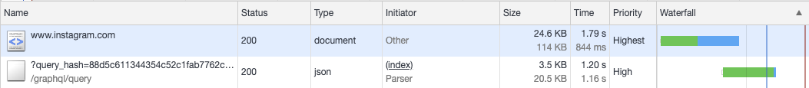
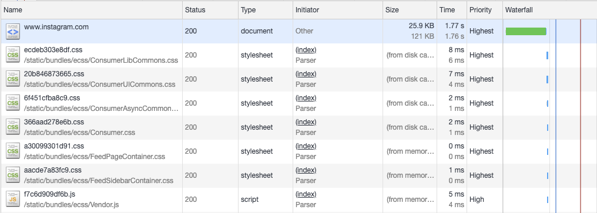
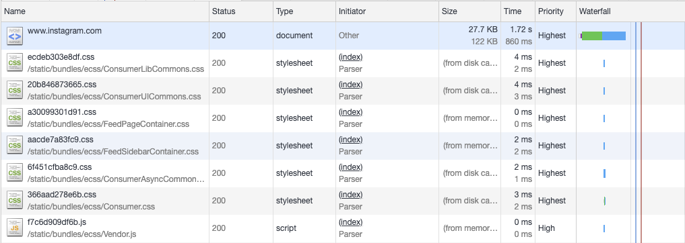
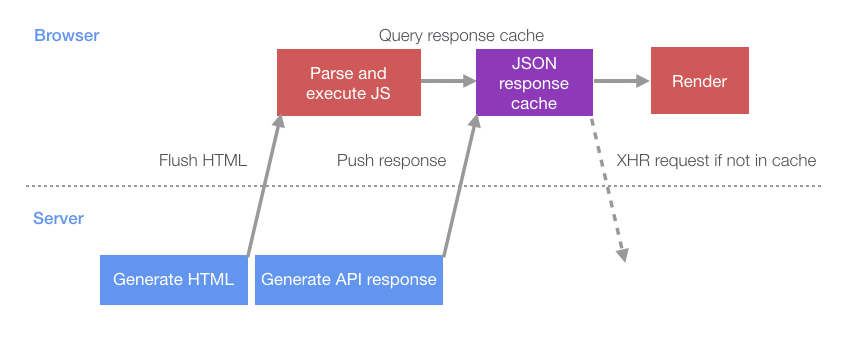

# 让 Instagram.com 变得更快: 第二章

最近这几年，instagram.com 改版了很多 - 我们在 INS 中加入了 Stories、滤镜、创作工具、系统通知和消息推送等新特性和功能增强。然而，伴随着产品的不断迭代成长，一个不幸的事情发生了：我们的 web 端性能开始下降了。为处理性能下降，在最近的一年中，我们有意识地开展一些工作来提升性能。截止目前，我们的不懈努力已经让 Feed 页面加载时间减少了将近 50%。这个系列的博客文章将会讲述我们为实现这些提升所做的一些工作。

> 译注：和第一章的摘要一样，看过的可以忽略

## 使用early flush（提前刷新）和progressive HTML（渐进式HTML）来推送数据

在第一章中，我们展示了如何使用link预加载，它使得页面能够在更早阶段，就开始动态查询（在逻辑JS加载之前）。然而，即便为这些动态查询加上了预加载处理，仍然需要等到HTML页面在客户端开始渲染后，这些动态查询才开始（预）加载。这意味着：需要等2个网络往返完成，查询才能开始（还要加上服务器响应请求生成html所需的时间）。正如在下图中我们看到的预加载GraphQL请求一样：尽管这是在 HTML head 中标记预加载的第一批内容，但实际上要等上很长时间，查询才能真正开始。

> 译注：这里2个网络往返，指html的请求和响应，服务器生成html的时间可能会很长



我们希望的理想效果是，预加载查询在页面请求到达服务端时就开始执行。但问题是如何让浏览器还没有任何服务端的html返回，就发起请求呢？答案是服务器主动向浏览器推送资源，这看上去有点像利用HTTP/2的push特性，但实际上用的是一种非常古老的技术（也通常被忽视的），它具有非常好的浏览器兼容性，并且不需要为实现HTTP/2的push特性而增加服务端基础架构的复杂性。Facebook在2010年就成功应用这项技术（详情见 [BigPipe](https://www.facebook.com/notes/facebook-engineering/bigpipe-pipelining-web-pages-for-high-performance/389414033919/)），还有其它各种网站的实践案例（比如Ebay）- 但是很多JavaScript开发人员似乎忽略了该技术或未使用该技术，特别是在SPA架构的网站中。那么这项技术到底叫什么呢？它有着好几个名称 - early flush（提前刷新）、head flushing（头部刷新）、progressive HTML（渐进式渲染HTML）。它的主要实现包含两点：

+ HTTP 分块传输编码
+ 浏览器渐进式渲染HTML

> 译注：flush，这个单词思来想去，从前端的角度都不是很好翻译，如果有大佬知道请指教。
>
> 查询相关文章，flush最早是后端开发中的概念，比如jsp或者php生成html的时候，可以分段生成，调用类似flush命名的api，生成一小段先返回客户端。所以个人理解flush大致的意思是：将内容刷到某个载体上，在这里指将代码刷到html中？
>
> Facebook在BigPipe的实现中，核心思路也就是分步 flush 内容到浏览器，中文方面可以阅读这篇文章：[高性能WEB开发(11) - flush让页面分块,逐步呈现](https://www.cnblogs.com/BearsTaR/archive/2010/05/19/flush_chunk_encoding.html)

[Chunked transfer encoding（分块传输编码）](https://zh.wikipedia.org/wiki/%E5%88%86%E5%9D%97%E4%BC%A0%E8%BE%93%E7%BC%96%E7%A0%81)是HTTP/1.1协议中的一部分，从本质上来看，它允许服务端将HTTP的返回切碎成多个chunk（块），然后以分流的形式传输给浏览器。浏览器不断接收这些块，然后在最后一个块到达后将它们聚合在一起。这种做法看上去需要对 服务端生成HTML 做很大的改造，但实际上大部分的语言和框架都已经支持分块生成返回(在INS中，web框架是Django，因此采用 [StreamingHttpResponse](https://docs.djangoproject.com/en/2.2/ref/request-response/#streaminghttpresponse-objects) 对象来实现)。

那么回到正题，这种做法是如何让预加载的更早地开始呢？因为它允许服务器在完成每个chunk时，就将此时的HTML页面的内容流式传输到浏览器，而不必等待整个HTML完成。这意味服务器一收到请求，就可以将HTML的头部flush给浏览器（所以被称为 early flush），减少了处理HTML剩余内容（比如Body内DOM）的时间。而对于浏览器来说，浏览器在收到HTML的头部时，就可以开始预加载静态资源和动态数据，此时服务器还在忙于剩余HTML内容的生成。可以查看下面两张图来比较优化效果：

- 默认: 等到HTML下载完成，资源才开始加载



- 有early flush: 当HTML第一次fulshed到浏览器时，资源就开始加载

> 译注：试了下这个应该是在Fast 3G下的测试结果，减少了一半的时间（约800ms）



另外，我们可以利用 「分块传输编码」 在传输完成的同时将其它数据推送到客户端。对于服务端渲染的Web应用，一般采用HTML格式返回；对于诸如instagram.com的SPA，可以用JSON格式数据推送到浏览器。为了解其工作原理，让我们看一下SPA一般的启动过程。首先，服务端将包含首次渲染页面所需的JS的HTML刷新（flush）到浏览器。这个JS解析并执行后，再执行XHR查询，然后XHR查询返回引导页面所需的初始数据（如下图所示）。


服务端和客户端在这个过程中进行了多次数据往返，并且都有大量空闲时间，这显然可以进行优化。从效率上看，比起让服务端等待客户端发起某个API请求，不如让服务端在生成初始化HTML推送给客户端后，就开始生成某个API要返回的数据。这意味着，客户端启动查询的时候，服务端的数据可能已经准备好并推送到客户端了，这样就不需要额外的网络请求开销。这个改动的第一步是：创建1个JSON缓存对象来存储服务端返回的数据。代码写在HTML中一小段内联脚本中，它充当缓存的角色，并且会列出所有服务端将要推数据缓存的请求（下面是简化的代码示例）。

```html
<script type="text/javascript">
  // 服务端将会写下所有它已经在准备的请求的路径
  // 这样客户端就知道等待服务端返回数据就行，而不需要自己发起XHR请求
  window.__data = {
    '/my/api/path': {
        // 客户端发起请求后的回调都存在waiting数组中
        waiting: [],
    }
  };

  window.__dataLoaded = function(path, data) {
    const cacheEntry = window.__data[path];
    if (cacheEntry) {
      cacheEntry.data = data;
      for (var i = 0;i < cacheEntry.waiting.length; ++i) {
        cacheEntry.waiting[i].resolve(cacheEntry.data);
      }
      cacheEntry.waiting = [];
    }
  };
</script>
```

在把HTML刷新到浏览器之后，服务端就可以自己执行API请求的查询，完成后将JSON数据以「包含script标签的HTML片段」的形式刷新到页面中。当这个HTML片段被浏览器接收并解析后，它会将数据写入JSON缓存对象中。这里有个关键技术点是：浏览器会在接收到chunks的时候就立即开始渲染（类似的，也会立即执行script标签中的JS代码块）。所以，你甚至可以在服务端并行生成一系列API数据，并在每个API数据准备好时，就立即将其刷新到JS块中。这是Facebook BigPipe系统背后的基本思想，在这个系统中，多个独立的「Pagelet」 并行到服务器上加载，并按它们完成的顺序依次推送到客户端。

> 译注：Pagelet是BigPipe技术中的词汇，HTML片段的意思，一个基本的 pagelet 包含了 id 、 HTML片段 、 依赖的CSS 、JavaScript 资源。Github地址：[https://github.com/bigpipe](https://github.com/bigpipe)，中文方面的文章可以参考[Pagelet的前世今生](https://www.zybuluo.com/mircode/note/426336)

```html
<script type="text/javascript">
  window.__dataLoaded('/my/api/path', {
    // API返回的JSON，包在 window.__dataLoaded 的函数参数中，将插入上面例子中的JSON缓存对象 window.__data
  });
</script>
```

当客户端JS准备好请求某个特定数据的时候，它将先检查JSON缓存对象中有没有数据，而不是发起一个XHR请求。如果JSON缓存对象中已经有数据，它将立即得到返回；如果JSON缓存对象是经标记了pending，它将把请求的resolve回调注册到对应的waiting数组中，请求完成后，执行对应的resolve回调。

```html
function queryAPI(path) {
  const cacheEntry = window.__data[path];
  if (!cacheEntry) {
    // 兜底，没有缓存对象，直接发起一个普通的XHR请求
    return fetch(path);
  } else if (cacheEntry.data) {
    // 服务端已经推送好数据了
    return Promise.resolve(cacheEntry.data);
  } else {
    // 服务端正在生成数据或推送中
    // 我们把请求成功的resolve回调放到cacheEntry.waiting队列中
    // 当接收到数据后，回调会按顺序执行
    const waiting = {};
    cacheEntry.waiting.push(waiting);
    return new Promise((resolve) => {
      waiting.resolve = resolve;
    });
  }
}
```

这就把浏览器的页面加载行为改成下面的模式了：



相比于最初的加载流程，优化后的服务端和客户端可以并行地进行更多的工作 - 减少因为相互等待返回造成的空间时长。此项优化的效果非常明显：桌面端用户访问页面的渲染完成的时间减少了14%，移动端用户（有更高的网络的延迟）更是减少了23%。

> 译注：并行的更多工作可以这么理解：对于服务端来说，是边生成数据边返回，对于浏览器来说，是边接收数据边渲染页面

## 请继续关注第三章

在第3部分中，我们将介绍如何采用缓存优先的方式来渲染数据，从而进一步提高性能。 如果您想了解更多有关这项工作的信息，或者有兴趣加入我们的团队，请访问我们的[公司岗位页面](https://www.facebook.com/careers/jobs/?q=instagram)，也可以关注我们[on Facebook](https://www.facebook.com/instagramengineering/)或者[on Twitter](https://twitter.com/instagrameng)。
