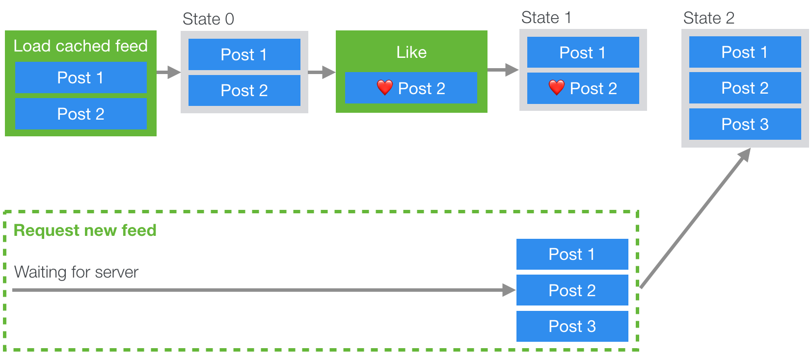
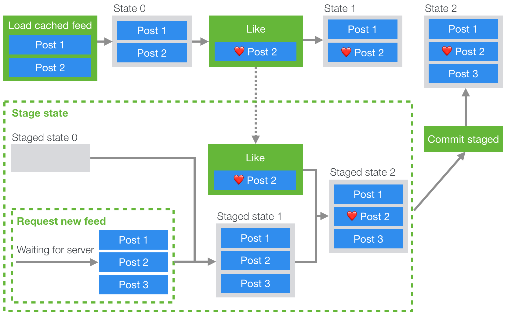

# 让 Instagram.com 变得更快: 第三章 — 缓存优先

最近这几年，instagram.com 变了很多 - 我们在 INS 中加入了 Stories、滤镜、创作工具、系统通知和消息推送等新特性和功能增强。然而，伴随着产品的不断迭代成长，一个不幸的事情发生了：我们的 web 端性能开始下降了。为处理性能下降，在最近的一年中，我们有意识地开展一些工作来提升性能。截止目前，我们的不懈努力已经让 Feed 页面加载时间减少了将近 50%。这个系列的博客文章将会讲述我们为实现这些提升所做的一些工作。在[第一章](./[对照版]让Instagram.com变得更快（1）.md)中我们主要讨论异步接口和异步资源的预加载，在[第二章](./[对照版]让Instagram.com变得更快（2）.md)中我们主要讨论通过服务端主动推送数据来提升性能。

## 缓存优先

经过前面文章中所说的优化，向客户端推送数据的时间已经被尽可能地提前了。怎么才能让页面更快地获取到数据呢？ 唯一的思路就是不经由网络的请求和推送数据。我们可以采用缓存优先的渲染机制来实现，当然「缓存」也意味着在一定时间内用户会看到之前的页面数据。在这种实现中，一旦页面加载完成，我们会立即给用户展示之前 Feed 和 Story 的副本缓存，并且在新数据可用时覆盖旧的缓存。

`instagram.com 是使用Redux来管理前端状态，因此我们的实现方式是，在更高层次上将一个Redux Store的子集存储到indexedDB的表中，然后在页面初始化渲染时将indexedDB缓存的数据状态 rehydrate 回store中`。然而，由于 indexedDB 操作、请求服务端数据、用户交互都是异步的，无法判断它们的先后顺序。因此，当用户操作影响到缓存数据时，会遇到一个问题: 我们希望能确保这些对缓存数据的改动，也同样应用在服务端返回的数据。

> 译注: rehydrate 的直译是「注水」，感觉不是很准确，这里不做翻译。更多可以参考: [react 中出现的"hydrate"这个单词到底是什么意思?](https://www.zhihu.com/question/66068748)

举个例子，如果就按原来的方式直接处理缓存的状态数据，我们会遇到这样的问题：首先，我们同时从缓存和网络加载数据，由于缓存优先的策略，因此缓存数据先渲染给用户。然后，用户对某个 feed 操作了「喜欢」。这之后一旦这个 feed 最新的网络请求返回时，它就会覆盖该 feed 的状态，被覆盖后该 feed 就不包含用户刚刚对 feed 操作的「喜欢」（请参见下图）。



为解决这个问题，我们需要一个新的方法，它在处理缓存状态的同时，还要缓存这些对状态的处理操作，然后在服务端返回的数据中重新执行一遍这些操作。如果你有 Git 或其它版本控制工具的经验，这看上去是不是很熟悉？如果把缓存的 feed 当作一个特性分支，把服务端的放回的 feed 当作 master 分支，那么我们要做的其实就是在 master 分支上执行 rebase 操作，把特性分支上的 commit（喜欢、评论等操作）应用到 master 分支中。

这样就有如下的设计:

- 当页面加载，我们发送请求获取新数据（或等待服务端主动 push 新数据，参考第二章）
- 创建 1 个暂存的 Redux State 子集
- 当请求/推送未完成时，把所有已经 dispatch 的 action 存储起来
- 当请求/推送求完成，新的数据把暂存的State中的数据覆盖，此时把这些存储的 action 和其它等在在暂存的State中待执行的 action 都应用到最新的数据中
- 当暂存的 State 提交的时候，我们直接把当前的 State 替换成暂存的 State



通过维持一个暂存状态的 State，所有已经存在的 reducer 行为都可以重复使用，并将暂存 State 和最新 State 分开。另外，我们是使用 Redux 来实现暂存的，因此可以直接使用 dispatch action，非常方便。

```typescript
function stagingAction(key: string, promise: Promise<Action>): AsyncAction<State, Action>;

function stagingCommit(key: string): AsyncAction<State, Action>;
```

暂存 API 主要包含两个方法: `stagingAction` & `stagingCommit` （当然还有一些还原 State 的方法和处理边界情况的代码，这里就不展开了）

`stagingAction` 函数接收 1 个 Promise，这个 Promise 会 resolve 1 个要 dispatch 到暂存 State 的 action。它会初始化时暂存 State，然后保存所有已经 dispatch 的 actions。在 Git 概念里，我们可以把这个操作当作创建 1 个本地分支，因为在新数据到达前，发生的任何操作都将按顺序应用到暂存的State中。

`stagingCommit` 函数的作用是暂存的 State 提交到当前 State 中。如果暂存的 State 中还有其它的异步 actions 未执行完，它会一直等待。这非常像 Git 中 rebase 操作: 将所有的本地改动（从缓存的特性分支中来的改动）应用到 master 的 head 前面（服务端返回的新数据），让本地的 master 分支同时应用远程改动和本地改动，从而更新到最新。

为了更方便地使用暂存State，我们在根级的 reducer 上封装了一个 reducer 增强器，它处理所有要暂存的 action，并将所有已暂存的 actions 应用到新的 State 中。这样我们只需要 dispatch 相关 actions 就行，其它的事情这个增强器都处理好了。举个例子，如果我们要请求 1 个新的 feed，并应用到已暂存的 State 中，我们就执行类似下面的逻辑:

```js
function fetchAndStageFeed() {
    return stagingAction(
        'feed',
        (async () => {
            const { data } = await fetchFeedTimeline();
            return {
                type: FEED_LOADED,
                ...data,
            };
        })()
    );
}

// 请求最新的 feed 并开始暂存
store.dispatch(fetchAndStageFeed());

// 在此期间，任何已经 dispatched 的actions都会被应用到暂存的State中的 feed
// 直到 stagingCommit 提交暂存的State

// 将暂存的State提交到当前的State中
store.dispatch(stagingCommit('feed'));
```

我们对 Feed 和 Story 同时使用缓存优先渲染功能，使得页面渲染完成时间缩短了 2.5％和 11％，并且让页面更贴近原生 iOS 和 android的浏览体验。

## 请继续关注第四章

在第4章中，我们将介绍如何减少代码大小，通过代码大小和执行优化来进一步提升性能。 如果您想了解更多有关这项工作的信息，或者有兴趣加入我们的团队，请访问我们的[公司岗位页面](https://www.facebook.com/careers/jobs/?q=instagram)，也可以关注我们[on Facebook](https://www.facebook.com/instagramengineering/)或者[on Twitter](https://twitter.com/instagrameng)。

## 译注

这边文章核心思路比较简单，比较有意思的地方是用Git版本控制的概念来处冲突问题。其实软件工程中的需要思想都可以互相借鉴，比如前端MVC最早可能参考了Spring，微前端服务参考了后端的微服务

文章中有很多Redux和Git方面的专业词汇，可以参考:

1. [Redux中文文档](https://www.redux.org.cn/)
2. [Git Rebase简介](https://www.codercto.com/a/45325.html)
