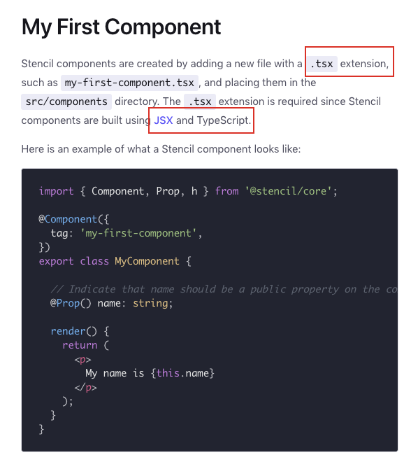
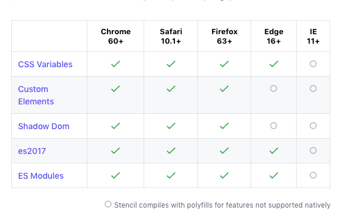
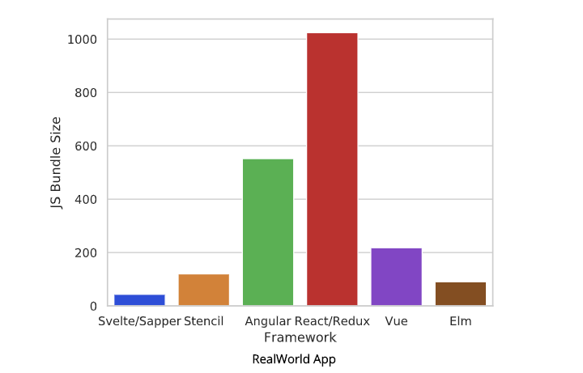
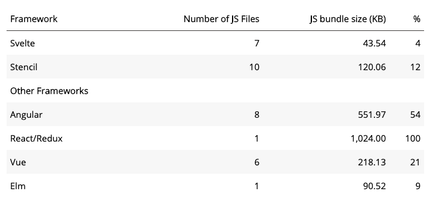
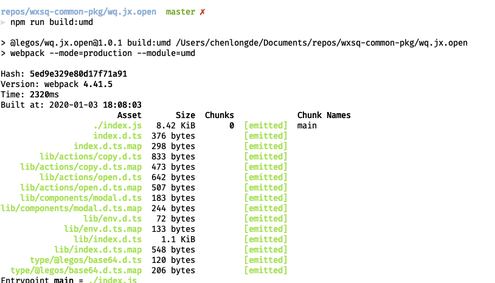
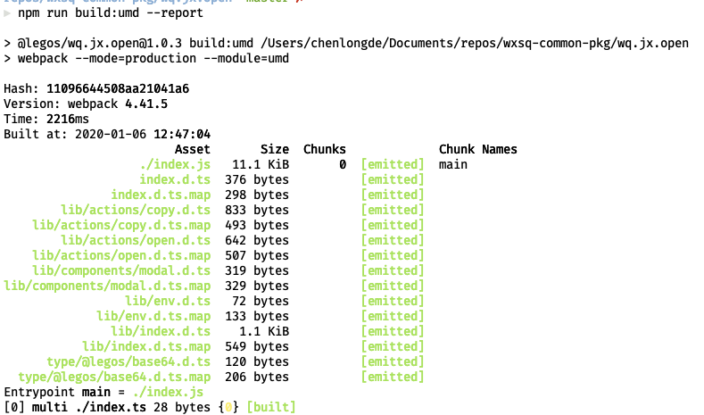
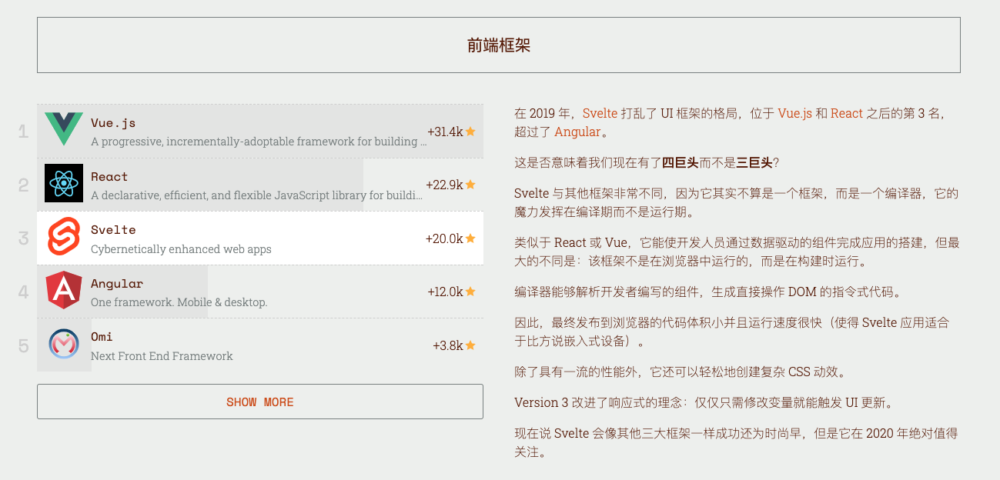

# 再谈前端组件化和“开箱即用”

都说前端组件在设计时要尽量做到“可复用”，“可插拔”。然而在实际公司项目开发中，“开箱即用”也是 1 个绕不开的问题。为什么？

原因是在大型研发体系中，不同部门不同前端团队使用的技术栈可能千差万别，比如 Vue、React、JQuery。它们的 UI 层和运行时都不一样，如果要设计 1 个组件，可以在各个环境中运行，那该怎么办呢？

笔者分享 1 次近日在开发 1 个“开箱即用”组件的经历。

## 背景

这次思考来源于一次业务需求：业务方要在 商品详情页 和 拼购详情页 都增加弹窗，引导和提示用户去下载 App 或跳转 App，涉及到 复制口令、协议唤起、下载 APP、弹窗引导 UI，希望开发一个「引导至 APP 的弹窗」。在双方前端开发同学进行友好 🉐️ 进行技术讨论后，对组件的诉求总结有 2 点：

1. 不希望 2 个页面自行维护，维护 1 个统一组件收敛业务需求
2. 组件核心代码尽量小
3. 后续其它页面也可以复用的

## 痛点

这里的痛点正是文章开篇说到的：页面使用不同的前端 UI 框架，商详由于历史包袱，依然是 JQuery，拼详是 Vue，那我们开发组件要选用哪种框架呢？

1. 用 Vue 开发组件？这意味着 JQuery 的商详页面中要引入 Vue 运行时（Vue-runtime 也有 30kb 左右）
2. 用 JQuery 开发组件？这都 0202 年了，亲们真的不想写 JQuery 了

综合考虑团队的情况（Vue、JQuery，隔壁部门还有 Taro），我们决定做 1 个 `不依赖框架，至少不依赖框架运行时的组件`，这样才能做到“开箱即用”。

### 不依赖具体框的“开箱即用”

笔者在 Google、Github、StackOverflow 等网站遨游了大半天，最终敲定 2 个方案给老板，下面会详细说明选型的过程和结果：

1. `Svelte.js`
2. `Stencil.js`

## Svelte.js

Svelte.js 官网是这么介绍自己的：Svelte is a radical new approach to building user interfaces。它是一种是构建 UI 的新方法。为什么说是方法？ 相比于传统的 UI 框架（AVR），它没有运行时 --- 确切的说利用类似 Tree-Shaking 的方式把不需要的运行时或 polyfill 在编译期给干掉。每个组件只需要依赖自己组件内少量的 polyfill，就可以在任何浏览器中运行，做到开箱即用。

### Svelte 语法

下面是一个标准的 Svelte 组件，可以看到它分为 3 部分 JS、HTML、CSS，很类似.vue 的 SFC 组件的做法，类似的，Svelte 组件的都是单文件组件.svelte。

实际上 Svelte.js 的作者在博客中也说到借鉴了 Ractive，所以和同样借鉴 Ractive 的 Vue 类似也就不足为奇了。

另外 Svelte.js 作者同时也是 Rollup 的作者，所以用 Tree-Shaking 来解决运行时的问题也很容易理解了 : )

```html
<script>
    // `current` is updated whenever the prop value changes...
    export let current;

    // ...but `initial` is fixed upon initialisation
    const initial = current;
</script>

<p>
    <span style="background-color: {initial}">initial</span>
    <span style="background-color: {current}">current</span>
</p>

<style>
    span {
        display: inline-block;
        padding: 0.2em 0.5em;
        margin: 0 0.2em 0.2em 0;
        width: 4em;
        text-align: center;
        border-radius: 0.2em;
        color: white;
    }
</style>
```

### Svelte 兼容性

## Stencil.js

Stencil.js 官网是这么介绍的：A Compiler for Web Components。它的本质是编译代码到标准的 Web Component 的工具。将最流行的前端框架的最佳概念组合到编译时工具中，而不是运行时工具中。这里多次提到的，它想做的是工具，这体现在两方面，一个是只提供少量 API，并且尽量靠近 Web Component 标准的 API，另一个是在编译时处理好各种构建和优化，不做运行时，做到开箱即用。

### Stencil 语法

可以看到，基本上支持了现在化前端组件的特性：数据绑定、JSX 语法、Typescript 支持等。DSL 上更贴近 React 生态，这点也可以从官网提供@stencil/redux 来做状态管理看出来。



### Stencil 兼容性

由于是 Web Component 标准，浏览器兼容性方面比较劣势：



### 可集成进其它框架

官网有很多例子，可以集成到 Angular、React、Vue 中使用，以 Vue 为例，现在 js 中指定不处理某些 Stencil.js 组件，然后就可以在 template 中使用编译好的 Stencil.js 组件了。

```js
// 入口index.js
import { applyPolyfills, defineCustomElements } from 'test-components/dist/loader';

// 告知Vue，忽略test-开头的组件（不去识别编译）
Vue.config.ignoredElements = [/test-\w*/];

// 把自定义组件绑定到window对象中
applyPolyfills().then(() => {
    defineCustomElements(window);
});

new Vue({
    render: h => h(App),
}).$mount('#app');
```

```html
<!-- 组件中可直接使用 -->
<template>
    <div>
        <test-stencil-component></test-stencil-component>
    </div>
</template>
```

### 各框架打包后比较




## 我的选择

### 组件打包

增加UI层代码后，组件打包的最终代码大小仅增加不到 3kb




## 更多关于 Svelte

[是否考虑参考Svelte那样编译组件？](https://github.com/vuejs/vue/issues/9011)



> 数据来源: [2019 年 JavaScript 明星项目](https://risingstars.js.org/2019/zh/#section-framework)

## 微前端？
