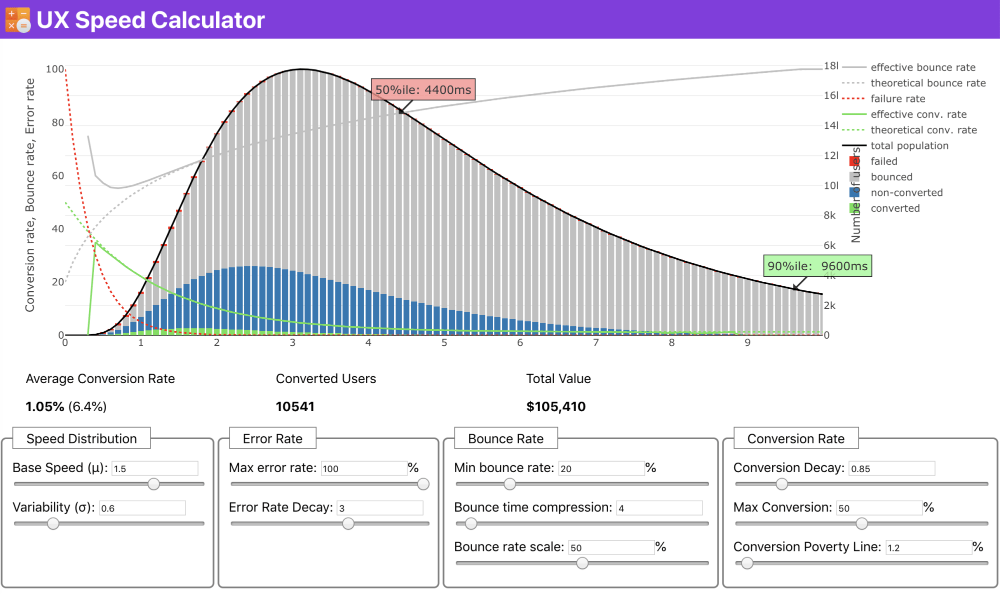

# Front-End Performance Checklist 2020 [PDF, Apple Pages, MS Word]

>`QUICK SUMMARY` Let’s make 2020… fast! An annual front-end performance checklist (PDF/Apple Pages/MS Word), with everything you need to know to create fast experiences on the web today. Updated since 2016. Kindly supported by our dear friends at LogRocket, a frontend performance monitoring solution that helps reproduce bugs and fix issues faster.

>`简介` 让2020年变得更...快些吧！ 这是一份年度前端性能优化清单，包含了当下创建web快速体验所需的一切。这份清单自2016年开始已经持续更新了5年。这份清单得到了LogRocket的大力支持，LogRocket是一个前端性能监视解决方案，可帮助重现错误并更快地解决问题。

`Web performance is a tricky beast, isn’t it? How do we actually know` where we stand in terms of performance, and what our performance bottlenecks exactly are? Is it expensive JavaScript, slow web font delivery, heavy images, or sluggish rendering? Is it worth exploring tree-shaking, scope hoisting, code-splitting, and all the fancy loading patterns with intersection observer, server push, clients hints, HTTP/2, service workers and — oh my — edge workers? And, most importantly, **where do we even start improving performance** and how do we establish a performance culture long-term?

`网络性能是一头狡猾的野兽，不是吗？` 我们如何才能真正知道我们在性能方面所处的水平，以及我们的性能瓶颈到底是什么呢？ 它是昂贵的JavaScript、缓慢的Web字体传输、繁重的图像、还是缓慢的渲染？ 是否值得去研究 摇树优化、作用域提升、代码拆分，以及所有奇特的加载模式，包括交叉点观察器做懒加载、服务器推送、客户端提示、HTTP/2、service workers和 边缘计算？ 而且，最重要的是，**我们该从哪里开始做性能化**，以及我们如何建立长期的关注性能氛围？

Back in the day, performance was often a mere afterthought. Often deferred till the very end of the project, it would boil down to minification, concatenation, asset optimization and potentially a few fine adjustments on the server’s `config` file. Looking back now, things seem to have changed quite significantly.

在过去，性能往往在事后才会被考虑。通常会推迟到项目快结束时候，最终归结为压缩，串联，静态资源化，或许还有一些对服务器的`config`文件的微调。现在看来，性能优化这项工作已经发生了很大的变化。

Performance isn’t just a technical concern: it affects everything from accessibility to usability to search engine optimization, and when baking it into the workflow, design decisions have to be informed by their performance implications. **Performance has to be measured, monitored and refined continually**, and the growing complexity of the web poses new challenges that make it hard to keep track of metrics, because metrics will vary significantly depending on the device, browser, protocol, network type and latency (CDNs, ISPs, caches, proxies, firewalls, load balancers and servers all play a role in performance).

性能不仅仅是一个技术上的问题：它会影响从 可访问性、可用性到搜索引擎优化的方方面面，当我们把性能优化引入工作流程中时，在设计上进行决策时考虑对性能影响。**性能必须不断地进行测量，监视和完善**，但是网络的日益复杂性带来了新的挑战，那就是性能指标的跟踪，因为性能指标会因设备，浏览器，协议，网络类型和网络延迟不同而有很大差异（CDN，ISP，缓存，代理，防火墙，负载均衡和服务器都对性能有着影响）。

So, if we created an overview of all the things we have to keep in mind when improving performance — from the very start of the process until the final release of the website — what would that list look like? Below you’ll find a (hopefully unbiased and objective) **front-end performance checklist for 2020** — an updated overview of the issues you might need to consider to ensure that your response times are fast, user interaction is smooth and your sites don’t drain user’s bandwidth.

因此，如果我们要建立了一个包含性能优化所有要点的清单（从研发开始到网站的最终上线），该清单会是什么样的呢？ 您会在下面找到一份（希望它没有偏见和客观的）** 2020年前端性能优化清单** — 您可能需要考虑性能的场景和优化手段的简介，以达到快速的响应时间，流畅的用户互动，以及网站不会浪费用户的带宽。

## TABLE OF CONTENTS

## 内容目录

+ Getting Ready: Planning And Metrics
+ Setting Realistic Goals
+ Defining The Environment
+ Assets Optimizations
+ Build Optimizations
+ Delivery Optimizations
+ HTTP/2
+ Testing And Monitoring
+ Quick Wins
+ Download The Checklist (PDF, Apple Pages, MS Word)
Off We Go!

## Getting Ready: Planning And Metrics

## 准备工作：计划和指标

Micro-optimizations are great for keeping performance on track, but it’s critical to have clearly defined targets in mind — measurable goals that would influence any decisions made throughout the process. There are a couple of different models, and the ones discussed below are quite opinionated — just make sure to set your own priorities early on.

不时的小优化对于保持良好性能很有效果，但更重要的是：在头脑中明确性能目标-需要是可衡量的目标，因为这将影响整个开发过程中我们所做的任何决策。下面有几种不同的性能指标模型，下面关于这些模型的讨论会比较主观--您只要确保在工作开始时设置自己的优先级即可。

### 01 Establish a performance culture.

### 01 建立性能优化的文化

In many organizations, front-end developers know exactly what common underlying problems are and what loading patterns should be used to fix them. However, as long as there is no established endorsement of the performance culture, each decision will turn into a battlefield of departments, breaking up the organization into silos. You need a business stakeholder buy-in, and to get it, you need to establish a case study, or [a proof of concept](https://medium.com/@armelpingault/how-to-convince-your-client-to-focus-on-web-performance-a-case-study-35f12385689) using the [Performance API](https://developer.mozilla.org/en-US/docs/Web/API/Performance) on how speed benefits metrics and Key Performance Indicators (KPIs) they care about.

在许多团队中，前端开发工程师都明确地知道那些常见的性能问题，以及使用何种加载方式能够解决这些问题。但是因为缺乏对性能优化的文化，每一项关于性能的决策都演变成了部门之间的战场，把组织分裂成1一个个孤岛。您需要业务方的支持，如何获取支持呢？首先需要进行一个案例研究，或使用[Performance API](https://developer.mozilla.org/en-US/docs/Web/API/Performance)来[证明](https://medium.com/@armelpingault/how-to-convince-your-client-to-focus-on-web-performance-a-case-study-35f12385689)性能如何提升他们关心的工作指标和关键绩效指标（KPI）。

Without a strong alignment between dev/design and business/marketing teams, performance isn’t going to sustain long-term. Study common complaints coming into customer service and sales team, study analytics for high bounce rates and conversion drops. Explore how improving performance can help relieve some of these common problems. [Adjust the argument](https://youtu.be/SE0HhF4TO0Q?t=1052) depending on the group of stakeholders you are speaking to.

如果开发/设计团队与业务/营销团队之间无法对性能优化的目标保持一致，那性能优化将无法长期维持。因此性能优化的工作需要关注客户服务和销售团队的常见投诉，研究高退货率和低转化率的原因。探索性能优化如何帮助缓解这些常见问题，并根据与你交谈的利益方[调整你的论点](https://youtu.be/SE0HhF4TO0Q?t=1052)。

Run performance experiments and measure outcomes — both on mobile and on desktop (for example, with Google Analytics). It will help you build up a company-tailored case study with real data. Furthermore, using data from case studies and experiments published on WPO Stats will help increase sensitivity for business about why performance matters, and what impact it has on user experience and business metrics. Stating that performance matters alone isn’t enough though — you also need to establish some measurable and trackable goals and observe them over time.

How to get there? In her talk on Building Performance for the Long Term, Allison McKnight shares a comprehensive case-study of how she helped establish a performance culture at Etsy (slides). More recently, Tammy Everts has spoken about habits of highly effective performance teams in both small and large organizations.

> Performance budget builder by Brad Frost and Jonathan Fielding’s Performance Budget Calculator can help you set up your performance budget and visualize it. (Large preview)

### 02 Goal: Be at least 20% faster than your fastest competitor.

According to [psychological research](https://www.smashingmagazine.com/2015/09/why-performance-matters-the-perception-of-time/#the-need-for-performance-optimization-the-20-rule), if you want users to feel that your website is faster than your competitor’s website, you need to be at least 20% faster. Study your main competitors, collect metrics on how they perform on mobile and desktop and set thresholds that would help you outpace them. To get accurate results and goals though, make sure to first get a thorough picture of your users' experience by studying your analytics. You can then mimic the 90th percentile’s experience for testing.

To get a good first impression of how your competitors perform, you can use [Chrome UX Report](https://web.dev/fast/chrome-ux-report) (CrUX, a ready-made RUM data set, [video introduction](https://vimeo.com/254834890) by Ilya Grigorik and [detailed guide](https://dev.to/rick_viscomi/a-step-by-step-guide-to-monitoring-the-competition-with-the-chrome-ux-report-4k1o) by Rick Viscomi) or [Treo Sites](https://treo.sh/sites), a RUM monitoring tool that is powered by Chrome UX Report. Alternatively, you can also use [Speed Scorecard](https://www.thinkwithgoogle.com/feature/mobile/) (also provides a revenue impact estimator), [Real User Experience Test Comparison](https://ruxt.dexecure.com/compare) or [SiteSpeed CI](https://www.sitespeed.io/) (based on synthetic testing).

>Treo Sites provides competitive analysis based on real-world data. (Large preview)

**Note**: If you use [Page Speed](https://developers.google.com/speed/pagespeed/insights/) Insights or [Page Speed Insights API](https://dev.to/addyosmani/monitoring-performance-with-the-pagespeed-insights-api-33k7) (no, it isn’t deprecated), you can get CrUX performance data for specific pages instead of just the aggregates. This data can be much more useful for setting performance targets for assets like “landing page” or “product listing”. And if you are using CI to test the budgets, you need to make sure your tested environment matches CrUX if you used CrUX for setting the target (thanks Patrick Meenan!).

If you need some help to show the reasoning behind prioritization of speed, or you'd like to visualize conversion rate decay or increase in bounce rate with slower performance, or perhaps you'd need to advocate for a RUM solution in your organization, Sergey Chernyshev [has built](https://calendar.perfplanet.com/2019/visualizing-speed-without-real-data/) a [UX Speed Calculator](https://ux-speed-calculator.netlify.com/), an open-source tool that helps you simulate data and visualize it to drive your point across.

>Just when you need to make a case for performance to drive your point across: UX Speed Calculator visualizes an impact of performanc on bounce rates, conversion and total revenue — based on real data. (Large preview)

