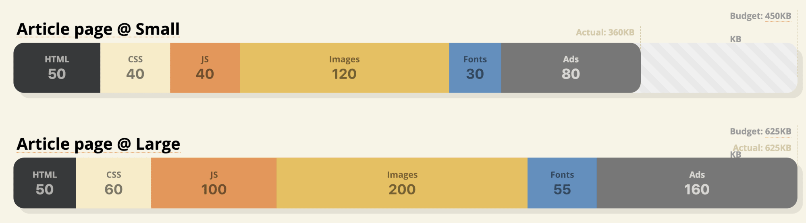
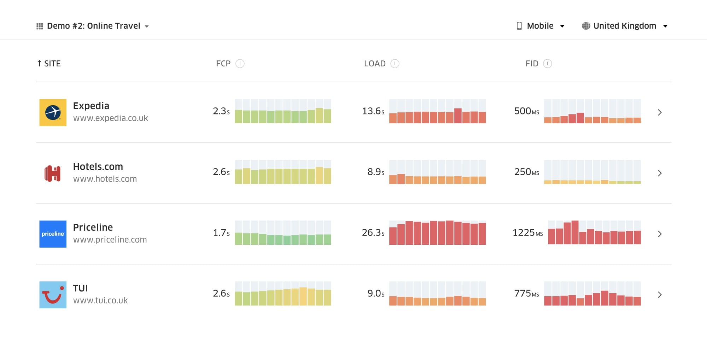
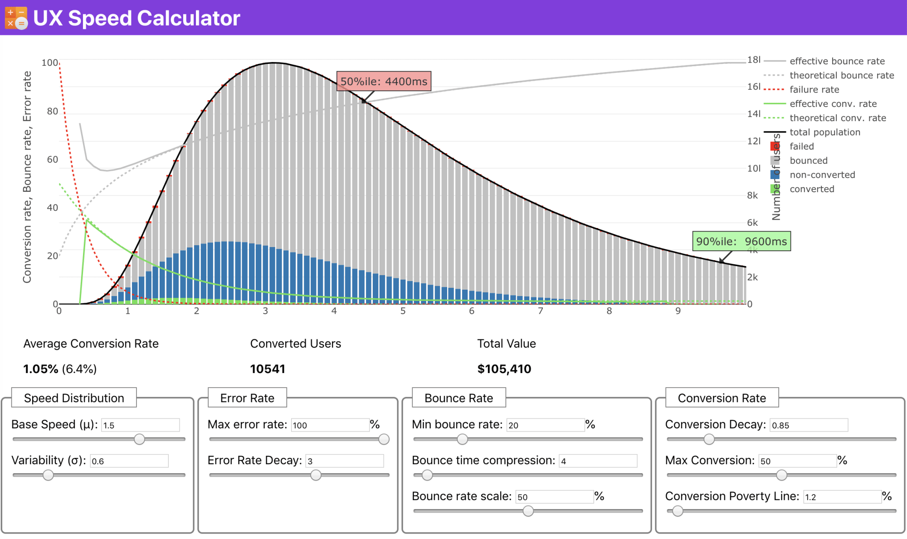
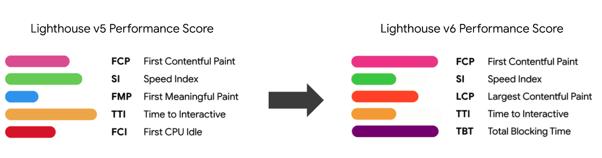
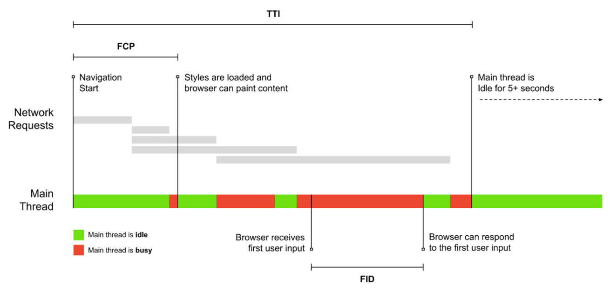

# Front-End Performance Checklist 2020 [PDF, Apple Pages, MS Word]

>`简介` 让2020年变得更...快些吧！ 这是一份年度前端性能优化清单，包含了当下创建web快速体验所需的一切。这份清单自2016年开始已经持续更新了5年。这份清单得到了LogRocket的大力支持，LogRocket是一个前端性能监视解决方案，可帮助重现错误并更快地解决问题。

`网络性能是一头狡猾的野兽，不是吗？` 我们如何才能真正知道我们在性能方面所处的水平，以及我们的性能瓶颈到底是什么呢？ 它是昂贵的JavaScript、缓慢的Web字体传输、繁重的图像、还是缓慢的渲染？ 是否值得去研究 摇树优化、作用域提升、代码拆分，以及所有奇特的加载模式，包括交叉点观察器做懒加载、服务器推送、客户端提示、HTTP/2、service workers和 边缘计算？ 而且，最重要的是，**我们该从哪里开始做性能化**，以及我们如何建立长期的关注性能氛围？

在过去，性能往往在事后才会被考虑。通常会推迟到项目快结束时候，最终归结为压缩，串联，静态资源化，或许还有一些对服务器的`config`文件的微调。现在看来，性能优化这项工作已经发生了很大的变化。

性能不仅仅是一个技术上的问题：它会影响从 可访问性、可用性到搜索引擎优化的方方面面，当我们把性能优化引入工作流程中时，在设计上进行决策时考虑对性能影响。**性能必须不断地进行测量，监视和完善**，但是网络的日益复杂性带来了新的挑战，那就是性能指标的跟踪，因为性能指标会因设备，浏览器，协议，网络类型和网络延迟不同而有很大差异（CDN，ISP，缓存，代理，防火墙，负载均衡和服务器都对性能有着影响）。

因此，如果我们要建立了一个包含性能优化所有要点的清单（从研发开始到网站的最终上线），该清单会是什么样的呢？ 您会在下面找到一份（希望它没有偏见和客观的）** 2020年前端性能优化清单** — 您可能需要考虑性能的场景和优化手段的简介，以达到快速的响应时间，流畅的用户互动，以及网站不会浪费用户的带宽。

## 内容目录

+ Getting Ready: Planning And Metrics
+ Setting Realistic Goals
+ Defining The Environment
+ Assets Optimizations
+ Build Optimizations
+ Delivery Optimizations
+ HTTP/2
+ Testing And Monitoring
+ Quick Wins
+ Download The Checklist (PDF, Apple Pages, MS Word)
Off We Go!

## 准备工作：计划和指标

不时的小优化对于保持良好性能很有效果，但更重要的是：在头脑中明确性能目标-需要是可衡量的目标，因为这将影响整个开发过程中我们所做的任何决策。下面有几种不同的性能指标模型，下面关于这些模型的讨论会比较主观--您只要确保在工作开始时设置自己的优先级即可。

### 01 建立性能优化的文化

在许多团队中，前端开发工程师都明确地知道那些常见的性能问题，以及使用何种加载方式能够解决这些问题。但是因为缺乏对性能优化的文化，每一项关于性能的决策都演变成了部门之间的战场，把组织分裂成1一个个孤岛。您需要业务方的支持，如何获取支持呢？首先需要进行一个案例研究，或使用[Performance API](https://developer.mozilla.org/en-US/docs/Web/API/Performance)来[证明](https://medium.com/@armelpingault/how-to-convince-your-client-to-focus-on-web-performance-a-case-study-35f12385689)性能如何提升他们关心的工作指标和关键绩效指标（KPI）。

如果开发/设计团队与业务/营销团队之间无法对性能优化的目标保持一致，那性能优化将无法长期维持。因此性能优化的工作需要关注客户服务和销售团队的常见投诉，研究高退货率和低转化率的原因。探索性能优化如何帮助缓解这些常见问题，并根据与你交谈的利益方[调整你的论点](https://youtu.be/SE0HhF4TO0Q?t=1052)。

运行性能实验并测量结果 - 无论是在移动设备上还是在桌面上(例如，使用Google Analytics) 将帮助你用真实的数据为公司进行定制性的分析。 此外，使用发布在WPO Stats上的研究案例和实验数据，也可以帮助我们明确性能对业务提升的重要性，以及它对用户体验和业务指标的影响。 然而，仅仅说明性能很重要是不够的 - 您还需要建立一些可衡量和可跟踪的目标，并随着持续跟踪相关指标。

怎么去那里？ 艾莉森·麦克奈特(Allison McKnight)在她关于长期建筑绩效的演讲中，分享了一个全面的案例研究-如何帮助Etsy建立了一种重视性能的文化(幻灯片)。 最近，塔米·埃弗茨(Tammy Everts)也谈到了在小型和大型组织中，如何培养高效性能团队的习惯。

> 由布拉德·弗罗斯特（Brad Frost）的性能预算生成器和乔纳森·菲尔丁（Jonathan Fielding）的性能预算极端起可以帮助您设置性能预期并对其进行可视化。

### 02 目标:比你最快的竞争对手至少快20%。

根据[用户心理学研究](https://www.smashingmagazine.com/2015/09/why-performance-matters-the-perception-of-time/#the-need-for-performance-optimization-the-20-rule)，如果想让用户感觉你的web网站比其它竞品快，那你必须比它们快20%以上。研究您的主要竞争对手，收集它们在移动设备和台式机上的性能指标，并设置阈值以帮助您超越竞争对手。 但是，要获取准确的性能指标并制定目标，请务必先通过研究分析来全面了解用户体验。 然后，你可以根据90％用户反馈和经验来模拟测试。

你可以使用[Chrome UX Report](https://web.dev/fast/chrome-ux-report) (也叫CrUX, 一个现成的实际用户体验监控报告, 参考Ilya Grigorik的[视频介绍](https://vimeo.com/254834890) 和 Rick Viscomi的[详情使用指南](https://dev.to/rick_viscomi/a-step-by-step-guide-to-monitoring-the-competition-with-the-chrome-ux-report-4k1o))或者[Treo网站](https://treo.sh/sites)，一个由Chrome UX报告提供支持的实际用户分析监视工具。作为替代品，你也可以使用[Speed Scorecard](https://www.thinkwithgoogle.com/feature/mobile/) (也提供对网站收入影响的评估)[Real User Experience Test Comparison](https://ruxt.dexecure.com/compare) 或者[SiteSpeed CI](https://www.sitespeed.io/) (基于综合测试)。

>Treo Sites 根据实际数据提供网站竞争性分析（点击放大预览）

**注意**: 如果你使用[Page Speed](https://developers.google.com/speed/pagespeed/insights/) Insights或者[Page Speed Insights API](https://dev.to/addyosmani/monitoring-performance-with-the-pagespeed-insights-api-33k7) (不，它没有被弃用)。除了汇总数据，您也可以获取特定页面的CrUX性能数据。这些数据对于为 "落地页" 或 "产品列表" 之类的页面单独设置性能目标可能更有用。 补充说明，如果您使用CI来测试预期，则需要确保您的测试环境与CrUX匹配，然后再使用CrUX设置目标（感谢Patrick Meenan反馈！）。

如果您想知道显示速度优先级排序背后的原因，或者您想要可视化来展示页面转换率下降、跳出率增加后者性能降低，或者您可能需要在组织中倡导基于真实用户体验的解决方案，Sergey Chernyshev [已经开发](https://calendar.perfplanet.com/2019/visualizing-speed-without-real-data/) a [UX 速度计算器](https://ux-speed-calculator.netlify.com/), 一个开源工具，可以帮助你拟合数据并将其可视化，验证你的观点。

>在需要提高性能来说明您的观点时：UX 速度计算器基于真实数据，可以把性能对页面转化率、跳出率和总收入的影响用可视化的图标展示。（点击放大预览）

收集数据，建立表格，以提升20%的性能思路设定你的目标(性能预算)。现在你有了可以衡量的东西来测试了。如果你把预算记在心里，试着把最小的有效载荷降下来，以获得一个快速的交互时间，这样就是一个正确的性能优化方式。

需要一些资源来开始？

+ 阿迪·奥斯马尼(Addy Osmani)写了一篇非常详细的文章，内容包括[如何开始做性能预算](https://medium.com/@addyosmani/start-performance-budgeting-dabde04cf6a3)，如何量化新功能的影响，以及当你超出预算时从哪里开始优化。

+ 劳拉·霍根(Lara Hogan)[关于如何在性能预算下进行设计的指南](http://designingforperformance.com/weighing-aesthetics-and-performance/#approach-new-designs-with-a-performance-budget)可以为设计师提供有用的指导。

+ 哈利·罗伯特(Harry Roberts)发布了一份[指南](https://csswizardry.com/2018/05/identifying-auditing-discussing-third-parties/)，介绍如何使用[请求地图](http://requestmap.webperf.tools/)设置Google工作表，以显示第三方脚本对性能的影响。

乔纳森·菲尔丁(Jonathan Fiding)的[性能预算计算器](http://www.performancebudget.io/)、凯蒂·亨佩纽斯(Katie Hempenius)的[性能预算计算器](https://perf-budget-calculator.firebaseapp.com/)和[浏览器卡路](https://browserdiet.com/calories/)里可以帮助创建预算(感觉卡罗琳娜·斯库尔([Karolina Szczur](https://medium.com/@fox/talk-the-state-of-the-web-3e12f8e413b3))的反馈)。

此外，可以设置带有报告构建大小的图形的仪表板，使性能预算和当前性能变得可视化。 有许多工具可以实现：[SiteSpeed.io仪表板](https://www.sitespeed.io/)(开源)、[SpeedCurve](http://speedcurve.com/)和[Calibre](https://calibreapp.com/)只是其中的一小部分，您可以在[Perform.rocks](http://perf.rocks/tools/)上找到更多工具。

一旦有了性能预算，就可以将它们与[Webpack性能提示和Bundlesize](https://web.dev/fast/incorporate-performance-budgets-into-your-build-tools)、[Lighthouse CI](Lighthouse CI)、[PWMetrics](https://github.com/paulirish/pwmetrics)或[Sitespeed CI](https://www.sitespeed.io/)结合到构建过程中，这样就可以在合并请求(pull requests)时考虑性能预算，并在PR评论中提供评分历史。

要向整个团队公开性能预算，可以[通过Lightwallet在Lighthouse中集成性能预算](https://web.dev/use-lighthouse-for-performance-budgets/)，或者[使用LHCI动作来快速集成到 Github Actions](https://github.com/treosh/lighthouse-ci-action)。如果需要自定义，可以使用[WebPagetest -chart-API](webpagetest-charts-api)，这是一种端点API，用于根据WebPagetest结果构建图表。

不过，性能意识不应该仅仅来自性能预算。就像[Pinterest](Pinterest)一样，您可以创建一个[自定义eslint规则](https://medium.com/pinterest-engineering/a-one-year-pwa-retrospective-f4a2f4129e05#d6bc)，比如不允许导入依赖关系较重且会使构建产物膨胀的文件或目录。设置一个在整个团队中共享的"放心使用"包列表。

此外，还要考虑对您的业务最有利的关键客户任务。研究、讨论和定义**关键操作的可接受时间阈值**，并建立整个组织认可的“UX Ready”用户计时标记。在许多情况下，用户浏览和行为路径将涉及许多不同部门的工作，因此，根据可接受的时间进行调整将有助于支持或阻止以后的性能讨论。 确保增加资源和功能的额外成本是可见的和理解的。

将性能优化与其他技术活动结合起来，从构建产品的新特性到重构，再到面向新的全球受众。因此，每次关于开发的讨论发生时，性能也需要纳入其中。一般来说，当项目代码库是全新的或者重构时，更容易达到性能目标。在你的组织中建立了一个强大的性能文化，目标是比你以前的自己快20%，随着时间的流逝保持优先级。(谢谢,小伙子Podjarny !)

另外，就像 Patrick Meenan 所建议的，在UX设计过程中就权衡加载顺序是很有用的方式。如果您及早确定页面中哪些组件比较关键，并定义它们应该出现的顺序，那就会确定哪些组件可以延迟。理想情况下，该顺序还将反映CSS和JavaScript导入的顺序，因此在构建过程中处理它们的顺序会变得更加容易。此外，在加载页面时(例如，当网页字体尚未加载时)，请考虑在“中间”状态下的视觉体验应该是什么。

规划、计划、规划。在早期进行快速的“容易够得着的水果”似的性能优化可能很诱人，也是一个能快速取得成功的好策略，但是如果没有规划，没有切合实际的、为公司量身定制的性能目标，在长期的开发过程中就很难一直把性能放在首位。

[第一次绘制、第一次有内容绘制、第一次有意义的绘制、视觉完成和可交互时间之间的区别](https://docs.google.com/presentation/d/1D4foHkE0VQdhcA5_hiesl8JhEGeTDRrQR4gipfJ8z7Y/present?slide=id.g1d1bfb0329_0_542)@denar90

>2020年初，新的性能指标将在Lighthouse v6中发布。不再推荐使用“第一次有意义的涂料（FMP）”，并且再下个Lighthouse版本中引入最大内容绘制时间（LCP）和总阻塞时间（TBT）这两个指标。

## 03 选择正确的指标

[并不是所有的指标都同样重要](https://speedcurve.com/blog/rendering-metrics/)。研究哪些指标对您的应用程序最重要：通常，它将由开始呈现界面中最重要的像素的速度以及为这些呈现的像素提供输入响应的速度来定义。这些知识将为您提供最佳的优化目标，以进行不断的正确方向的努力。再强调一点，定义体验的指标不是加载事件或服务器响应时间，而是用户感觉界面有多快。

什么意思？ 与其关注整个页面加载时间(例如，通过onLoad和DOMContentLoaded计时)，不如按照用户的看法确定页面加载的优先级。这意味着你会着关注一组略有不同的指标。事实上，选择正确的指标是一个没有明确结束点的过程。

根据Tim Kadlec的研究和Marcos Iglesias在他的[演讲](https://docs.google.com/presentation/d/e/2PACX-1vTk8geAszRTDisSIplT02CacJybNtrr6kIYUCjW3-Y_7U9kYSjn_6TbabEQDnk9Ao8DX9IttL-RD_p7/pub?start=false&loop=false&delayms=10000&slide=id.g3ccc19d32d_0_98)中的笔记，传统的度量指标可以分成几组。通常，我们需要所有这些度量指标才能全面了解性能，但是根据您的特定情况，其中一些指标可能比其他更重要。

+ 基于数量的指标: 测量请求的数量、权重和性能分数。这对于随时间做监控和警报很有帮助，但对于理解用户体验来说不够完美。

+ 里程碑式的指标：在加载过程的生命周期中使用状态来度量，例如，到第一个字节的时间、可交互的时间。这些指标很适合描述用户体验和监控，但不太适合了解各个里程碑之间发生的事情。

+ 渲染的指标: 提供对内容渲染速度的估计(例如，开始渲染时间，速度指数)。对于度量和调整渲染性能很好，但是在度量重要内容的出现时间和可交互时间方面，这些指标就不太好用了。

+ 自定义的指标: 对用户的特定自定义事件的度量，例如Twitter中[首次Tweet渲染时间](https://blog.alexmaccaw.com/time-to-first-tweet)和Pinterest的[PinnerWaitTime](PinnerWaitTime)。对于精确地描述用户体验来说很好，但是对于度量标准和与竞争对手的比较来说就不那么好了。

为了使性能指标这块拼图更完整，我们会在所有这些组中寻找有用的指标。通常，最具体和最相关的是：

+ [Time to Interactive](https://calibreapp.com/blog/time-to-interactive/) (TTI)
  
    布局已经稳定、关键的Web字体可见、并且主线程已经空闲下来可以处理用户输入的时间点-基本上就是用户可以与UI交互的时间标记。这是了解用户必须经历多少等待才能毫无延迟地使用网站的关键指标。

+ [First Input Delay](https://developers.google.com/web/updates/2018/05/first-input-delay) (FID), *or Input responsiveness*

    从用户首次与网站进行交互到浏览器实际上能够响应该交互的时间。它很好地补充了TTI指标缺少的那部分：当用户实际与站点进行交互时会发生什么。 一般仅用作RUM度量标准。有一个[标准的JavaScript库](https://github.com/GoogleChromeLabs/first-input-delay)，用于在浏览器中测量FID。

+ [Largest Contentful Paint](https://web.dev/lcp/) (LCP)

    这是在页面加载时间线中，标记已加载页面重要内容的时间点。假设页面中最重要的元素是在用户的视区中可见的最大元素。如果元素同时在可视区域的上方和下方渲染，只有可见部分被认为是相关的。目前在Lighthouse中，它是一个隐藏的指标，如果证明是有价值的，后续会推广。

+ [Total Blocking Time](https://web.dev/tbt/) (TBT)

    这是一种新的度量标准，有助于量化页面在变为可靠交互之前处于非交互状态的严重程度（也就是说，主线程至少在5s内没有运行超过50ms的任务（长任务））。度量的是从第一次绘画（FP）到交互时间（TTI）之间的时间长短（在这段时间内，主线程被阻塞足够长的时间而无法响应用户输入）。所以说，低的TBT是良好性能的体现。（感谢 [Boris](https://twitter.com/borisschapira) Artem）

+ CPU time spent

    这是显示主线程被阻塞的频率和时间的度量指标，受到浏览器绘制、渲染、加载和执行JS等动作的影响。高CPU时间是不稳定体验的明显指标，也就是说，这时候用户会体验到他们的操作和响应之间存在明显的滞后。使用WebPagetest，您可以[在“Chrome”选项卡上选择“Capture Dev Tools Timeline”](https://deanhume.com/ten-things-you-didnt-know-about-webpagetest-org/)，以显示在使用WebPagetest的任何设备上运行时，主线程的被阻塞的具体细节。

+ [Component-Level CPU Costs](https://calendar.perfplanet.com/2019/javascript-component-level-cpu-costs/)

    类似上面的 CPU time spent，这个由Stoyan Stefanov提出的指标主要用于度量JavaScript对CPU的影响。这个指标的想法是使用每个组件的CPU指令计数来独立地了解每个组件中Javascript其对整体体验的影响。可以[使用Puppeteer和Chrome来测量]((https://calendar.perfplanet.com/2019/javascript-component-level-cpu-costs/))。

+ [FrustrationIndex](https://www.frustrationindex.com/)（沮丧指数）

    上面介绍的许多指标解释了特定事件发生的时间，而Tim Vereecket提出的FrustrationIndex指标则着眼于各个里程碑之间的间隔，而不是独立地衡量它们。它衡量最终用户感知到的关键里程碑，例如 标题可见、第一个内容可见、视觉上准备就绪、页面准备就绪，并计算一个分数，指示加载页面时的沮丧程度。间隔时间越大，用户感到沮丧的可能性就越大。对于用户体验而言，这可能是一个很好的KPI。Tim发表了一篇[FrustrationIndex介绍及其工作原理的详细帖子](https://calendar.perfplanet.com/2019/frustrationindex-mind-the-gap/)。

+ [Ad Weight Impact](https://calendar.perfplanet.com/2017/measuring-adweight/)

    如果您的站点依赖于广告产生的收入，那么跟踪与广告相关的代码大小是很有用的。Paddy Ganti写了1个[脚本](https://calendar.perfplanet.com/2017/measuring-adweight/)，可以构建了两个URL(一个正常，一个阻止广告)，通过WebPagetest提示可以生成比较视频，并报告广告的增量。

+ Deviation metrics（偏差指标）

    正如Wikipedia工程师指出的那样，结果中存在多少差异的数据可以侧面反映您测量仪器的可靠性，以及应该对偏差和异常值给予多大的关注。较大的差异表明测试仪器的设置中需要进行调整。它还有助于了解某些页面是否更难以可靠地衡量，例如 “由于第三方脚本会导致重大变化”。跟踪浏览器版本也是一个好主意，这样可以方便地了解新版本的浏览器对性能的提高。

+ [Custom metrics](https://speedcurve.com/blog/user-timing-and-custom-metrics/)

    自定义指标的定义来源于您的业务需求和客户体验。它要求您明确页面中重要的像素、关键脚本、必要的CSS和相关资源，并衡量它们对用户感知速度的影响。对于这一点，您可以监控[Hero Rendering Times](https://speedcurve.com/blog/web-performance-monitoring-hero-times/)，或者使用[Performance API](https://css-tricks.com/breaking-performance-api/)，为对您的业务非常重要的事件标记特定的时间戳。 此外，您还可以通过在测试结束时执行任意JavaScript来[使用WebPagetest收集自定义指标](collect custom metrics with WebPagetest)。

史蒂夫·苏德斯(Steve Souders)对每个指标都进行了[详细的解释](https://speedcurve.com/blog/rendering-metrics/)。 需要注意的是，可交互时间(TTI)是通过在实验室环境中运行自动审核来测试的，而首次输入延迟(FID)这种需要实际的用户体验的指标，实际用户在体验时会明显感觉比测试中的慢。总体而言，始终测量和跟踪这两个参数应该是个不错的主意。

根据您的应用环境，首选指标可能会有所不同，举两个例子：对于Netflix TV UI，按键输入响应性，内存使用率和TTI更为关键，而对于Wikipedia而言，最先/最后的视觉变化时间点和CPU时间消耗指标则更为重要。

**注意**:FID和TTI都没有考虑用户滚动行为；滚动可以独立进行，因为它是非主线程的，所以对于许多内容消费站点来说，这些滚动相关指标可能不那么重要(谢谢Patrick提醒!)

>以用户为中心的性能指标可以更好地反映实际的用户体验。首次输入延迟(FID)是一个新的度量标准，它试图实现这一点。

## 04 收集典型用户的设备上的数据

为了收集准确的数据，我们需要彻底全面地选择要测试的设备。在一个[开放的设备实验室](https://www.smashingmagazine.com/2016/11/worlds-best-open-device-labs/)里，[选择Moto G4](https://twitter.com/katiehempenius/statuses/1067969800205422593)，中档的三星移动设备，Nexus 5X这样中档偏上的移动设备，以及Alcatel 1X这样的慢速设备，这样的组合是个不错的选择。对于较慢的热门设备的测试，你也可以买一台Nexus2，价格只有100美元左右。

