# Front-End Performance Checklist 2020 [PDF, Apple Pages, MS Word]

>`简介` 让2020年变得更...快些吧！ 这是一份年度前端性能优化清单，包含了当下创建web快速体验所需的一切。这份清单自2016年开始已经持续更新了5年。这份清单得到了LogRocket的大力支持，LogRocket是一个前端性能监视解决方案，可帮助重现错误并更快地解决问题。

`web性能是一头狡猾的野兽让人难以琢磨和处理，不是吗？` 我们如何才能知道我们在性能方面所处的真正水平，以及我们的性能瓶颈到底是什么呢？ 它是巨大的JavaScript文件、缓慢的Web字体传输、繁重的图像、还是缓慢的渲染？ 是否值得去研究 Tree-Shaking、作用域提升、代码拆分，以及所有奇特的加载模式，包括交叉点观察器做懒加载、服务器推送、客户端提示、HTTP/2、service workers 或者说 edge workers？ 而且，最重要的是，**我们该从哪里开始做性能优化**，以及我们应该如何建立长期的关注性能的团队文化？

在过去，性能往往在开发初期时被忽略。性能优化通常会推迟到项目快结束时候，并最终简单归结为代码压缩，并行请求，静态资源化，或许还有一些对服务器`config`文件的微调。现在看来，性能优化这项工作已经发生了很大的变化。

性能不仅仅是一个技术上的问题：它会影响从 可访问性、可用性到搜索引擎优化的方方面面，并且如果我们把性能优化引入工作流程中，那么在设计和决策时就需要考虑对性能影响。**性能必须不断地进行测量，监视和完善**，但是网络的日益复杂性带来了新的挑战：那就是性能指标的跟踪，因为性能指标会因设备，浏览器，协议，网络类型和网络延迟不同而有很大差异（CDN，ISP，缓存，代理，防火墙，负载均衡和服务器配置都对web性能有着明显的影响）。

因此，如果我们要建立了一个包含性能优化所有要点的清单（从研发开始到网站最终上线），该清单会是什么样的呢？ 您会在下面找到一份（希望它是没有偏见的和客观的）** 2020年前端性能优化清单** — 它包含您可能需要考虑性能的场景和优化手段的简介，以达到快速的响应时间，流畅的用户互动，以及网站不会浪费用户的带宽。

## 内容目录

+ 准备工作：计划和指标
+ 选择正确的指标
+ 定义环境
+ 静态资源优化
+ 构建优化
+ 传输优化
+ 网络与HTTP/2
+ 测试和监控
+ 速成方案
+ 下载清单（PDF，Apple Pages，MS Word）
+ 出发吧！

## 准备工作：计划和指标

时不时的小优化对于保持良好性能很有效果，但更重要的是：在头脑中明确性能目标（可衡量的目标），因为这将影响整个开发过程中我们所做的任何决策。下面有几种不同的性能指标模型，关于这些模型的讨论会比较主观--您只要确保在工作开始时设置自己的优先级即可。

### 01 建立性能优化的文化

在许多团队中，前端开发工程师都明确地知道那些常见的性能问题，以及使用何种加载方式能够解决这些问题。但是因为缺乏对性能优化关注的文化，每一项关于性能的决策都演变成了部门之间的PK，把组织分裂成1一个个孤岛。随着时候您就需要业务方的支持，如何获取支持呢？首先需要进行一个案例研究，或使用[Performance API](https://developer.mozilla.org/en-US/docs/Web/API/Performance)来[证明](https://medium.com/@armelpingault/how-to-convince-your-client-to-focus-on-web-performance-a-case-study-35f12385689)性能如何提升他们关心的工作指标和关键绩效指标（KPI）。

如果开发/设计团队与业务/营销团队之间无法对性能优化的目标保持一致，那性能优化将无法长期维持。因此性能优化的工作需要关注客户服务和销售团队的常见投诉，研究高跳出率和低转化率的原因。探索性能优化如何帮助缓解这些常见问题，并根据与你交谈的利益方[调整你的论点](https://youtu.be/SE0HhF4TO0Q?t=1052)。

运行性能实验并测量结果 - 无论是在移动设备上还是在桌面上(例如，使用Google Analytics) 将帮助你用真实的数据为公司进行定制性的分析。此外，使用发布在[WPO Stats](https://wpostats.com/)上的研究案例和实验数据，也可以帮助我们明确性能对业务提升的重要性，以及它对用户体验和业务指标的影响。 然而，仅仅说明性能很重要是不够的 - 您还需要建立一些可衡量和可跟踪的目标，并随着持续跟踪相关指标。

怎么达到目标呢？ Allison McKnight在她关于[建立长期的性能优化文化](https://vimeo.com/album/4970467/video/254947097)的演讲中，分享了一个全面的案例研究-如何帮助Etsy建立重视性能的公司文化([幻灯片](https://speakerdeck.com/aemcknig/building-performance-for-the-long-term))。 最近，Tammy Everts也谈到了在小型和大型组织中[如何在团队中培养关注性能的氛围](https://www.youtube.com/watch?v=SE0HhF4TO0)。


> 由Brad Frost的性能预算生成器和Jonathan Fielding的性能预算计算器可以帮助您设置性能预期并对其进行可视化。

### 02 目标:比你最快的竞争对手至少快20%

根据[用户心理学研究](https://www.smashingmagazine.com/2015/09/why-performance-matters-the-perception-of-time/#the-need-for-performance-optimization-the-20-rule)，如果想让用户感觉你的web网站比其它竞品快，那您必须比它们快20%以上。研究您的主要竞争对手，收集它们在移动设备和台式机上的性能指标，并设置阈值以帮助您超越竞争对手。但是，要获取准确的性能指标并制定目标，请务必先通过研究分析来全面了解用户体验。然后，你可以根据90％的主要用户的反馈和经验来模拟测试。

你可以使用[Chrome UX Report](https://web.dev/fast/chrome-ux-report) (也叫CrUX, 一个现成的实际用户体验监控报告, 参考Ilya Grigorik的[视频介绍](https://vimeo.com/254834890) 和 Rick Viscomi的[详情使用指南](https://dev.to/rick_viscomi/a-step-by-step-guide-to-monitoring-the-competition-with-the-chrome-ux-report-4k1o))或者[Treo网站](https://treo.sh/sites)，一个由Chrome UX报告提供支持的实际用户分析监视工具。作为替代品，你也可以使用[Speed Scorecard](https://www.thinkwithgoogle.com/feature/mobile/) (也提供对网站收入影响的评估)[Real User Experience Test Comparison](https://ruxt.dexecure.com/compare) 或者[SiteSpeed CI](https://www.sitespeed.io/) (基于综合测试)。


>Treo Sites 根据实际数据提供网站竞争性分析

**注**: 如果你使用[Page Speed](https://developers.google.com/speed/pagespeed/insights/) Insights或者[Page Speed Insights API](https://dev.to/addyosmani/monitoring-performance-with-the-pagespeed-insights-api-33k7)。除了汇总数据，您也可以获取特定页面的CrUX性能数据。这些数据对于为 "落地页" 或 "产品列表" 之类的页面单独设置性能目标可能更有用。 补充说明，如果您使用CI来测试性能预期，则需要确保您的测试环境与CrUX匹配，然后再使用CrUX设置性能目标（感谢Patrick Meenan反馈！）。

如果您想知道显示速度优先级排序背后的原因，或者您想要可视化来展示页面转换率下降、跳出率增加后者性能降低，或者您可能需要在组织中倡导基于真实用户体验的解决方案，Sergey Chernyshev[已经开发](https://calendar.perfplanet.com/2019/visualizing-speed-without-real-data/)了[（UX Speed Calculator）UX 速度计算器](https://ux-speed-calculator.netlify.com/)（一个开源工具），可以帮助你拟合数据并将其可视化，验证你的观点。


>在需要提高性能来说明您的观点时：UX 速度计算器基于真实数据，可以把性能对页面转化率、跳出率和总收入的影响用可视化的图标展示

收集数据，建立表格，以提升20%的性能设定你的目标(性能预算)。现在你有了可以衡量的目标来测试了。如果你把预算记在心里，试着把最小的有效载荷降下来，以获得一个快速的可交互时间，这样就是一个正确的性能优化方式。

需要一些资源来开始？

+ Addy Osmani写了一篇非常详细的文章，内容包括[如何开始做性能预算](https://medium.com/@addyosmani/start-performance-budgeting-dabde04cf6a3)，如何量化新功能的影响，以及当你超出预算时从哪里开始优化

+ Lara Hogan[关于如何在性能预算下进行设计的指南](http://designingforperformance.com/weighing-aesthetics-and-performance/#approach-new-designs-with-a-performance-budget)可以为设计师提供有用的指导

+ Harry Roberts发布了一份[指南](https://csswizardry.com/2018/05/identifying-auditing-discussing-third-parties/)，介绍如何使用[Request Map（请求地图）](http://requestmap.webperf.tools/)设置Google工作表，以显示第三方脚本对性能的影响

Jonathan Fiding的[Performance Budget Calculator（性能预算计算器）](http://www.performancebudget.io/)、Katie Hempenius的[Performance Budget Calculator（性能预算计算器）](https://perf-budget-calculator.firebaseapp.com/)和[Browser Calories(“浏览器卡路里计算”)](https://browserdiet.com/calories/)可以帮助创建性能预算(感谢[Karolina Szczur](https://medium.com/@fox/talk-the-state-of-the-web-3e12f8e413b3)反馈)。

此外，可以设置带有报告构建大小的图形的仪表板，使性能预算和当前性能变得可视化。有许多工具可以实现：[SiteSpeed.io仪表板](https://www.sitespeed.io/)(开源)、[SpeedCurve](http://speedcurve.com/)和[Calibre](https://calibreapp.com/)只是其中的一小部分，您可以在[Perform.rocks](http://perf.rocks/tools/)上找到更多工具。

一旦有了性能预算，就可以将它们与[Webpack性能提示和Bundlesize](https://web.dev/fast/incorporate-performance-budgets-into-your-build-tools)、Lighthouse CI、[PWMetrics](https://github.com/paulirish/pwmetrics)或[Sitespeed CI](https://www.sitespeed.io/)结合到构建过程中，这样就可以在git合并请求(pull requests)时考虑性能预算，并在PR评论中提供评分历史。

要向整个团队公开性能预算，可以[通过Lightwallet在Lighthouse中集成性能预算](https://web.dev/use-lighthouse-for-performance-budgets/)，或者[使用LHCI动作来快速集成到 Github Actions](https://github.com/treosh/lighthouse-ci-action)。如果需要自定义，可以使用[WebPagetest -chart-API](webpagetest-charts-api)，这是一个接口API，用于根据WebPagetest结果构建图表。

不过，性能意识不应该仅仅来自性能预算。就像Pinterest(世界上最大的图片社交分享网站)一样，您可以创建一个[自定义eslint规则](https://medium.com/pinterest-engineering/a-one-year-pwa-retrospective-f4a2f4129e05#d6bc)，比如不允许导入依赖关系较重且会使构建产物明显膨胀的文件或目录。设置一个在整个团队中共享的"放心使用"包列表。

此外，还要考虑对您的业务最关键的用户操作。研究、讨论和定义**关键操作的可接受时间阈值**，并建立整个组织认可的“UX Ready”用户计时标记。在许多情况下，用户浏览和行为路径将涉及许多不同部门的工作，因此，根据可接受的时间进行调整将有助于支持或减少以后团队和部门间关于性能的讨论。确保增加资源和功能的额外性能成本是可见的和理解的。

另外，就像 Patrick Meenan 所建议的，在UX设计过程中就权衡加载顺序非常有用。如果您一早就确定页面中哪些组件比较关键，并定义它们应该出现的顺序，那就可以确定哪些组件可以延迟加载的。理想情况下，该顺序还将影响CSS和JavaScript导入的顺序，因此在构建过程中处理它们的顺序会变得更加容易。此外，在加载页面时(例如，当网页字体尚未加载时)，请考虑在“中间”状态下的视觉体验应该是什么。

规划、规划、规划。在早期进行快速的“容易够得着的水果”似的性能优化可能很诱人，也是一个能快速取得成功的好策略，但是如果没有规划，没有切合实际的、为公司量身定制的性能目标，在长期的开发维护过程中就很难一直把性能放在首位。

[首次渲染、首次有内容渲染、首次有效渲染、渲染完成时间和可交互时间之间的区别](https://docs.google.com/presentation/d/1D4foHkE0VQdhcA5_hiesl8JhEGeTDRrQR4gipfJ8z7Y/present?slide=id.g1d1bfb0329_0_542)@denar90


>2020年初，新的性能指标将在Lighthouse v6中发布。不再推荐使用“首次有效渲染（FMP）”，并且再下个Lighthouse版本中引入最大内容渲染时间（LCP）和总阻塞时间（TBT）这两个指标。

### 03 选择正确的指标

[并不是所有的指标都同样重要](https://speedcurve.com/blog/rendering-metrics/)。研究哪些指标对您的应用程序最重要：通常，它将由开始呈现界面中最重要的像素的速度以及为这些呈现的像素提供输入响应的速度来定义。下面这些知识将为您提供最佳的优化目标，以进行不断的正确方向的努力。再强调一点，定义体验的指标不是客户端加载时间，也不是服务器响应时间，而是实际用户感觉界面有多快。

什么意思？ 与其关注整个页面加载时间(例如，通过onLoad和DOMContentLoaded计时)，不如按照用户的看法确定页面加载的优先级。这意味着你会着关注一组略有不同的指标。事实上，选择正确的指标是持续不断的过程。

根据Tim Kadlec的研究和Marcos Iglesias在他的[演讲](https://docs.google.com/presentation/d/e/2PACX-1vTk8geAszRTDisSIplT02CacJybNtrr6kIYUCjW3-Y_7U9kYSjn_6TbabEQDnk9Ao8DX9IttL-RD_p7/pub?start=false&loop=false&delayms=10000&slide=id.g3ccc19d32d_0_98)中的笔记，传统的度量指标可以分成几组。通常，我们需要所有这些度量指标才能全面了解性能，但是根据您的特定情况，其中一些指标可能比其他更重要。

+ 基于数量的指标: 测量请求的数量、权重和性能分数。这对于随时间做监控和警报很有帮助，但对于理解用户体验来说不够完美。

+ 里程碑式的指标：在加载过程的生命周期中使用状态来度量，例如，第一个字节到达浏览器的时间、可交互的时间。这些指标很适合描述用户体验和监控，但不太适合了解各个里程碑之间发生的事情。

+ 渲染的指标: 提供对内容渲染速度的估计(例如，开始渲染时间，速度指数)。对于度量和调整渲染性能很好，但是在度量重要内容的出现时间和可交互时间方面，这些指标就不太好用了。

+ 自定义的指标: 对用户的特定自定义事件的度量，例如Twitter中[首次Tweet渲染时间](https://blog.alexmaccaw.com/time-to-first-tweet)和Pinterest的[PinnerWaitTime](PinnerWaitTime)。对于精确地描述用户体验来说很好，但是对于度量标准和与竞争对手的比较来说就不那么好了。

为了使性能指标这块拼图更完整，我们会在所有这些组中寻找有用的指标。通常，最具体和最相关的是：

+ [Time to Interactive](https://calibreapp.com/blog/time-to-interactive/) (TTI)
  
    布局已经稳定、关键的Web字体可见、并且主线程已经空闲下来可以处理用户输入的时间点-基本上就是用户可以与UI交互的时间标记。这是了解用户必须经历多少等待才能毫无延迟地使用网站的关键指标。

+ [First Input Delay](https://developers.google.com/web/updates/2018/05/first-input-delay) (FID), *或者 Input responsiveness*

    从用户首次与网站进行交互到浏览器实际上能够响应该交互的时间。它很好地补充了TTI指标缺少的那部分：当用户实际与站点进行交互时会发生什么。 一般仅用作RUM度量标准。有一个[标准的JavaScript库](https://github.com/GoogleChromeLabs/first-input-delay)，用于在浏览器中测量FID。

+ [Largest Contentful Paint](https://web.dev/lcp/) (LCP)

    这是在页面加载时间线中，标记已加载页面重要内容的时间点。假设页面中最重要的元素是在用户的视区中可见的最大元素。如果元素同时在可视区域的上方和下方渲染，只有可见部分被认为是相关的。目前在Lighthouse中，它是一个隐藏的指标，如果证明是有价值的，后续会推广。

+ [Total Blocking Time](https://web.dev/tbt/) (TBT)

    这是一种新的度量标准，有助于量化页面在变为可靠交互之前处于非交互状态的严重程度（也就是说，主线程至少在5s内没有运行超过50ms的任务（长任务））。度量的是从第一次绘画（FP）到交互时间（TTI）之间的时间长短（在这段时间内，主线程被阻塞足够长的时间而无法响应用户输入）。所以说，低的TBT是良好性能的体现。（感谢 [Boris](https://twitter.com/borisschapira) Artem）

+ [Cumulative Layout Shift](https://web.dev/cls)（CLS）
    该指标突出显示了用户访问网站时多久遇到一次意外的版式变化（重排）。它研究了不稳定因素及其对整体体验的影响。分数越低越好。

+ [Speed Index](https://dev.to/borisschapira/web-performance-fundamentals-what-is-the-speed-index-2m5i)
    度量页面内容可视化填充的速度，分数越低越好。速度指数分数是根据视觉填充的速度计算的，但它只是一个计算值。它对视口大小也很敏感，所以您需要定义一系列与您的目标用户是被相匹配的测试配置。请注意，随着LCP作为一种新度量标准的出现，它变得不那么重要了(谢谢，Boris, Artem!)。

+ CPU time spent

    这是显示主线程被阻塞的频率和时间的度量指标，受到浏览器绘制、渲染、加载和执行JS等动作的影响。高CPU响应时间是不稳定体验的明显指标，也就是说，这时候用户会体验到他们的操作和响应之间存在明显的滞后。使用WebPagetest，您可以[在“Chrome”选项卡上选择“Capture Dev Tools Timeline”](https://deanhume.com/ten-things-you-didnt-know-about-webpagetest-org/)，以显示在使用WebPagetest的任何设备上运行时，主线程的被阻塞的具体细节。

+ [Component-Level CPU Costs](https://calendar.perfplanet.com/2019/javascript-component-level-cpu-costs/)

    类似上面的 CPU time spent，这个由Stoyan Stefanov提出的指标主要用于度量JavaScript对CPU的影响。这个指标的想法是使用每个组件的CPU指令计数来独立地了解每个组件中Javascript其对整体体验的影响。可以[使用Puppeteer和Chrome来测量]((https://calendar.perfplanet.com/2019/javascript-component-level-cpu-costs/))。

+ [FrustrationIndex](https://www.frustrationindex.com/)（沮丧指数）

    上面介绍的许多指标解释了特定事件发生的时间，而Tim Vereecket提出的FrustrationIndex指标则着眼于各个里程碑之间的间隔，而不是独立地衡量它们。它衡量最终用户感知到的关键里程碑，例如 标题可见、第一个内容可见、视觉上准备就绪、页面准备就绪，并计算一个分数，指示加载页面时的沮丧程度。间隔时间越大，用户感到沮丧的可能性就越大。对于用户体验而言，这可能是一个很好的KPI。Tim发表了一篇[FrustrationIndex介绍及其工作原理的详细帖子](https://calendar.perfplanet.com/2019/frustrationindex-mind-the-gap/)。

+ [Ad Weight Impact](https://calendar.perfplanet.com/2017/measuring-adweight/)

    如果您的站点依赖于广告产生的收入，那么跟踪与广告相关的代码大小是很有用的。Paddy Ganti写了1个[脚本](https://calendar.perfplanet.com/2017/measuring-adweight/)，可以构建了两个URL(一个正常，一个阻止广告)，通过WebPagetest提示可以生成比较视频，并报告广告的增量。

+ Deviation metrics（偏差指标）

    正如Wikipedia工程师指出的那样，结果中存在多少差异的数据可以侧面反映您测量仪器的可靠性，以及应该对偏差和异常值给予多大的关注。较大的差异表明测试仪器的设置中需要进行调整。它还有助于了解某些页面是否更难以可靠地衡量，例如 “由于第三方脚本会导致重大变化”。跟踪浏览器版本也是一个好主意，这样可以方便地了解新版本的浏览器对性能的提高。

+ [Custom metrics](https://speedcurve.com/blog/user-timing-and-custom-metrics/)

    自定义指标的定义来源于您的业务需求和客户体验。它要求您明确页面中重要的像素、关键脚本、必要的CSS和相关资源，并衡量它们对用户感知速度的影响。对于这一点，您可以监控[Hero Rendering Times](https://speedcurve.com/blog/web-performance-monitoring-hero-times/)，或者使用[Performance API](https://css-tricks.com/breaking-performance-api/)，为对您的业务非常重要的事件标记特定的时间戳。 此外，您还可以通过在测试结束时执行任意JavaScript来[使用WebPagetest收集自定义指标](collect custom metrics with WebPagetest)。

请注意，“[首次有效渲染时间（FMP）](https://developers.google.com/web/tools/lighthouse/audits/first-meaningful-paint)”并未出现在上面。FMP用于深入了解服务器首次输出任何有意义数据的速度。较大的FMP通常反映JavaScript阻塞了主线程，也可能是后端/服务器出现了其他问题。但是，该度量标准最近已被[弃用](https://calendar.perfplanet.com/2019/developing-the-largest-contentful-paint-metric/)，因为在大约20％的情况下它似乎并不准确。Lighthouse也将在下一版本[不再支持FMP](https://www.youtube.com/watch?v=iaWLXf1FgI0&feature=youtu.be&t=505) 仔细检查[最新的以用户为中心的性能指标和建议](https://web.dev/metrics/)，以确保您对页面性能时监测是可靠的。

Steve Souders对每个指标都进行了[详细的解释](https://speedcurve.com/blog/rendering-metrics/)。需要注意的是，可交互时间(TTI)是通过在实验室环境中运行自动审核来测试的，而首次输入延迟(FID)这种需要实际的用户体验的指标，因此实际用户在体验时会明显感觉比测试中的慢。总体而言，始终测量和跟踪这两个参数应该是个不错的主意。

根据您的应用环境，首选指标可能会有所不同，举两个例子：对于Netflix TV UI，输入响应性，内存使用率和TTI更为关键，而对于Wikipedia而言，最先/最后的视觉变化时间点和CPU响应时间指标则更为重要。

**注**:FID和TTI都没有考虑用户滚动行为；滚动可以独立进行，因为它是非主线程的，所以对于许多内容消费站点来说，这些滚动相关指标可能不那么重要(谢谢Patrick提醒!)


>以用户为中心的性能指标可以更好地反映实际的用户体验。首次输入延迟(FID)是一个新的度量标准，它试图实现这一点。

### 04 收集典型用户的设备上的数据

为了收集准确的数据，我们需要彻底全面地选择要测试的设备。在大多数公司中，这意味着需要调查分析并根据最常见的设备类型来创建用户画像。但是一般情况下，仅凭用户画像分析并不能提供完整的信息。因为有些用户可能因为他们的设备体验太慢或者显示不完美而离开网站，导致用户画像分析时忽略了这部分用户。因此，另外对目标客户群体中的通用设备进行研究可能是一个更好的主意。

根据国际数据公司(IDC)的数据显示，2018年至2019年期间，[全球87%的移动电话都是Android设备](https://www.idc.com/promo/smartphone-market-share/os)。[消费者平均每两年升级一次手机](https://www.cnbc.com/2019/05/17/smartphone-users-are-waiting-longer-before-upgrading-heres-why.html)，而在美国，[手机更换周期为33个月](https://www.mobileworldlive.com/devices/news-devices/us-phone-upgrade-cycle-stretches-to-33-months/)。全球最畅销手机的平均售价将低于200美元。

那么，一个有代表性的慢设备是：已经使用至少24个月的Android设备、价格在200美元或更低、运行在低速3G、400ms RTT和400kbps传输模式下，这只是稍微悲观预期的配置。当然，对于您的公司来说，这可能会非常不同，但这已经足够接近大多数客户了。事实上，针对您的目标市场调查一下当前的[亚马逊畅销机型](https://www.amazon.co.uk/gp/bestsellers/electronics/356496011/ref=sr_bs_1)可能是个不错的主意。 (感谢Tim Kadlec，Henri Helvetica和Alex Russel的指点)

那么选择什么样的测试设备呢？按上面描述的样子，我们是在开放的设备实验室里，选择Moto G4/G5 Plus，三星中端设备(Galaxy A50，S8)，不错的中档设备，如Nexus 5X，小米A3或小米Redmi Note 7，以及速度较慢的Alcatel 1X或Cubot X19，这是一个不错的组合。对于较慢的热门设备的测试，你也可以买一台Nexus4，价格只有100美元左右。

此外，检查每个设备使用的芯片组，机型组合**不要过度集中在一个芯片组中**: 建议包含几代的骁龙CPU（Snapdragon）和苹果CPU（Apple）以及低端的Rockchip、联发科（Mediatek）(谢谢Patrick提醒)

如果您手头没有设备，可以先在在台式机上模拟移动体验：**节流的3G网络**(例如300ms RTT、1.6 Mbps下行、0.8 Mbps上行)和CPU限速(减速5倍)上进行测试。最终切换到常规3G、低速4G(例如170ms RTT、9 Mbps下行、9 Mbps上行)和Wi-Fi。为了让性能影响更明显，你甚至可以[参考facebook的做法在每个周二引入2G网络](https://www.theverge.com/2015/10/28/9625062/facebook-2g-tuesdays-slow-internet-developing-world)，或者在办公室设置一个[节流的3G/4G网络](https://twitter.com/thommaskelly/status/938127039403610112)，更方便地进行测试。

请记住，在移动设备上，我们应该预期会[比台式机慢4到5倍](https://youtu.be/JvJ0v5OohNg?t=892)。移动设备有不同的GPU、CPU、内存和不同的电池。这就是为什么我们需要真机测试组合，[并且始终在这些设备上进行测试](https://www.webpagetest.org/easy)。


>一周中最慢的一天。Facebook推出了2G的周二服务，让慢网速更容易被体验和可视化。

幸运的是，有许多很棒的选项可以帮助您自动收集数据，并根据这些指标衡量您的网站在一段时间内的表现。良好的性能图表应该含有一组性能指标，并且每个指标都有实验室数据和真机数据：

+ **综合测试工具** 可以在通过设定好的设备和网络选项来模拟真机，并收集测试数据(例如Lighthouse，Calibre，WebPageTest)
+ **真实用户监控(RUM)工具** 可以持续评估用户交互并收集现场数据(例如SpeedCurve、New Relic--并且这些工具也提供综合测试)

前者在开发期间特别有用，因为它能帮助您在开发产品时识别、拆分和修复性能问题。后者则对于长期维护非常有用，因为它将帮助您了解在用户实际访问站点时正在发生的性能瓶颈。

通过利用内置的RUM API（如[导航时间](https://developer.mozilla.org/en-US/docs/Web/API/Navigation_timing_API)，[资源加载时间](https://developer.mozilla.org/en-US/docs/Web/API/Resource_Timing_API)，[渲染时间](https://css-tricks.com/paint-timing-api/)，[长任务](https://w3c.github.io/longtasks/)等），综合测试工具和RUM可一起为您的Web应用程序提供完整的性能图。您可以使用[PWMetrics](https://github.com/paulirish/pwmetrics)，[Calibre](https://calibreapp.com/)，[SpeedCurve](https://speedcurve.com/)，[mPulse](https://www.soasta.com/performance-monitoring/)和[Boomerang](https://github.com/yahoo/boomerang)，[Sitespeed.io](https://www-origin.sitespeed.io/)，它们都是性能监控的绝佳选择 此外，[使用Server Timing返回头](https://www.smashingmagazine.com/2018/10/performance-server-timing/)，您甚至可以在页面中的某个点同时监控后端和前端的性能。

**注**：在浏览器[外部使用网络调节器](https://calendar.perfplanet.com/2016/testing-with-realistic-networking-conditions/)总是比使用浏览器内置的更为可靠，例如，DevTools由于其实现方式的原因，在HTTP/2的push过程中，交互时长存在问题（感谢Yoav，Patrick反馈！）。对于Mac OS，我们可以使用[Network Link Conditioner](https://nshipster.com/network-link-conditioner/)，Windows中可以使用[Windows Traffic Shaper](https://github.com/WPO-Foundation/win-shaper/releases)，Linux中可以使用[netem](https://wiki.linuxfoundation.org/networking/netem)和FreeBSD的[虚拟网络](http://info.iet.unipi.it/~luigi/dummynet/)。

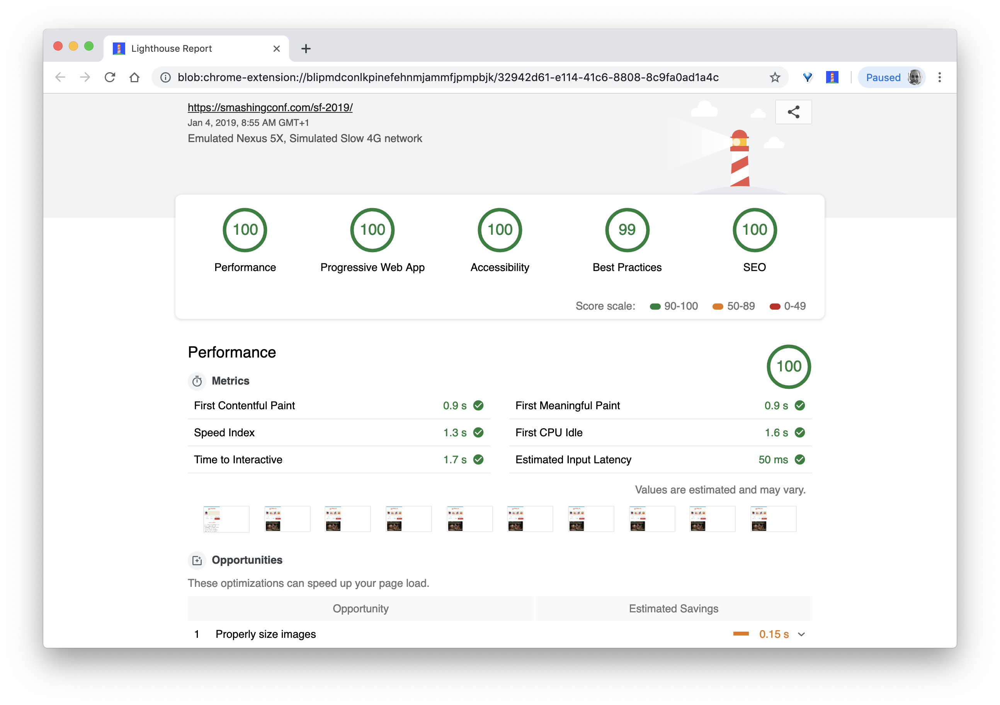

>Lighthouse是集成在DevTools中的一个性能审计工具

### 05 分别建立“干净”和“客户”配置文件用于测试

在监控工具中运行测试时，通常的策略是关闭杀毒软件和占用CPU的后台任务，清除后台带宽传输，使用干净的用户配置文件进行测试，并且不使用浏览器扩展，以避免出现不正确的结果([Firefox](https://developer.mozilla.org/en-US/docs/Mozilla/Firefox/Multiple_profiles)、[Chrome](https://support.google.com/chrome/answer/2364824?hl=en&co=GENIE.Platform=Desktop))。

此外，最好再研究一下客户经常使用的扩展，并使用专用的“客户”配置文件进行测试。实际上，某些扩展可能会对您的应用程序产生[明显的性能影响](https://twitter.com/denar90_/statuses/1065712688037277696)（[研究](https://www.debugbear.com/blog/measuring-the-performance-impact-of-chrome-extensions)），并且，如果您的用户经常使用它们，则可能需要先考虑一下。仅仅只用“干净”配置文件进行测试可能会导致结果过于乐观，而在用户实际体验的时候表现很糟。

### 06 与您的同事分享性能文化

确保团队的每个成员都熟悉性能文化，以免造成误解。每个决策-无论是设计，营销还是介于两者之间的任何决策-都会影响性能。在整个团队中分配责任和所有权将在以后简化以性能为中心的决策，根据性能预算和早期定义的优先级来权衡设计决策。

## 设定现实的目标

### 07 响应时间100ms，每秒60帧

为了让交互感觉流畅，页面响应用户的输入动作最好小于100ms。如果超过这个时间，用户就会觉得这个页面很迟钝。Rails是一个以用户为中心的性能模型，它为您提供了健康页面的目标：为了达到<100毫秒的响应时间，页面必须每隔<50毫秒将控制权交还给主线程。[输入延迟估算](https://developers.google.com/web/tools/lighthouse/audits/estimated-input-latency)可以告诉我们是否达到该阈值，理想情况下，它应该低于50ms。对于像动画这样的敏感点，最好在你执行动画的时候什么都不做。

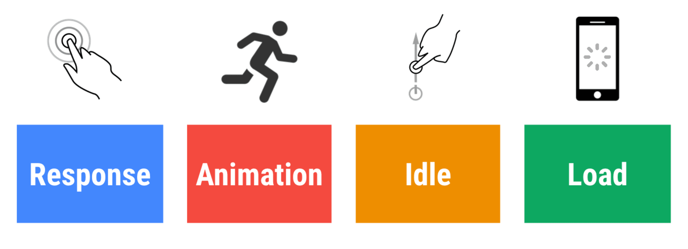

>[RAIL](https://developers.google.com/web/fundamentals/performance/rail), 一个以用户为中心的性能模型

另外，动画的每一帧都应在16毫秒内完成，从而达到每秒60帧（1秒÷60 = 16.6毫秒）- 最好在10毫秒以内。由于浏览器需要时间才能在屏幕上绘制新的帧，因此您的代码应在16.6毫秒之前完成执行。有关120fps的目标（例如iPad Pro的屏幕以120Hz运行），Surma提供了一些[120fps的渲染性能解决方案](https://dassur.ma/things/120fps/)，但这可能有点超前了，不是我们目前追求的目标。

对性能预期持悲观态度，[对界面设计持乐观态度](be optimistic in interface design)，[合理利用浏览器空闲时间](https://philipwalton.com/articles/idle-until-urgent/)(关注[idlize](https://github.com/GoogleChromeLabs/idlize)和[idle-until-urgent](https://github.com/TehShrike/idle-until-urgent))。当然，上面说的这些目标适用于衡量运行时性能，而不是加载性能。

### 08 3G环境下 FID < 100ms, TTI < 5s, Speed Index < 3s, 关键文件大小 < 170KB (gzip压缩后)

虽上述指标可能很难实现，但一个好的最终目标是[速度指数（Speed Index）](https://web.dev/speed-index/)低于3s，[可互动时间(TTI)低于5s](https://www.youtube.com/watch?v=_srJ7eHS3IM&feature=youtu.be&t=6m21s)，对于二次访问，TTI目标是低于2s(一般需要利用Service Works的离线缓存才能实现)。最大内容绘制时间(LCP)的目标是1s以下，需要最大限度地减少总阻塞时间和累计布局的变动。可接受的首次输入延迟(在LightHouse中是最大的潜在首次输入延迟)要低于130-100ms。如上所述，我们正在考虑的基准是200美元的Android手机(例如Moto G4)，在低速3G网络上，以400ms RTT和400kbps的网络配置进行模拟测试。

通过网络中快速展示页面，有有两个主要限制因素。一方面，由于[TCP慢启动](https://hpbn.co/building-blocks-of-tcp/#slow-start)，我们受到**网络传递限制**: HTML的前14KB（10个TCP数据包，每个1460字节，大约14.25 KB，[可以大概这样估计](https://www.tunetheweb.com/blog/critical-resources-and-the-first-14kb/)）是最关键的有效传输块，并且是内容中唯一可以在第一次网络往返就传输完成的部分（ 加上移动网络唤醒时间的原因，这就是您在RTT为400ms网络的环境下在1s内能获得的最多内容）。

（**注**：由于TCP通常无法充分利用网络连接，因此Google开发了[TCP瓶颈带宽和RRT（BBR）](https://cloud.google.com/blog/products/gcp/tcp-bbr-congestion-control-comes-to-gcp-your-internet-just-got-faster)，这是一种较新的为现代网络设计的[TCP延迟控制和TCP流控制的算法](https://medium.com/google-cloud/tcp-bbr-magic-dust-for-network-performance-57a5f1ccf437)。在慢网络能够根据实际情况阻塞请求，而不是像TCP那样造成数据包丢失，[它明显更快](https://aws.amazon.com/blogs/networking-and-content-delivery/tcp-bbr-congestion-control-with-amazon-cloudfront/)，具有更高的吞吐量和更低的延迟-[算法的工作方式也不尽相同](https://blog.apnic.net/2017/05/09/bbr-new-kid-tcp-block/)。尽早确定静态资源的优先级仍然很重要，但14 KB可能与BBR无关 （谢谢Victor, Barry！）

另一方面，由于JavaScript解析需要时间，我们在内存和CPU方面存在**硬件限制**（将在后面详细讨论）。为了实现上面所述的目标，我们必须考虑JavaScript关键文件的大小预算。关于该预算应该是多少（这在很大程度上取决于您的项目的性质）有不同的看法，但是压缩到170KB JavaScript的文件已经需要花费了1s才能在普通手机上进行解析和编译。假设170KB的文件在解压缩时扩展到原来的3倍（0.7MB），那在Moto G4 / G5 Plus上这类机型上就已经很大达到“体面的”用户体验了。

如果你想瞄准东南亚、非洲或印度等增长中的市场，你必须考虑一组非常不同的限制因素。Addy Osmani介绍了[主要的手机限制](https://dev.to/addyosmani/loading-web-pages-fast-on-a-20-feature-phone-8h6)，例如几乎没有低成本、高质量的设备、无法获得高质量的网络和较贵的流量费用，以及针对环境的PRPL-30性能预算和开发指南。

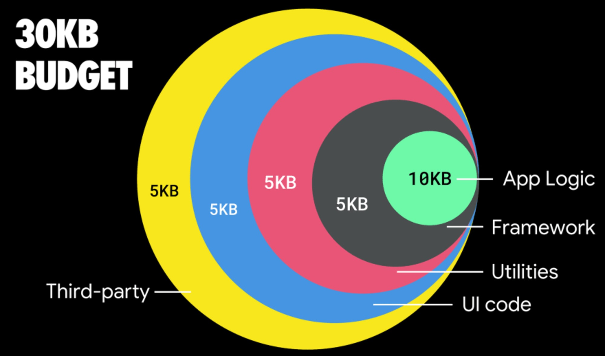

>[根据Addy Osmani所述](https://dev.to/addyosmani/loading-web-pages-fast-on-a-20-feature-phone-8h6)，对于延迟加载的路由中的JS，建议的大小应 <35 KB

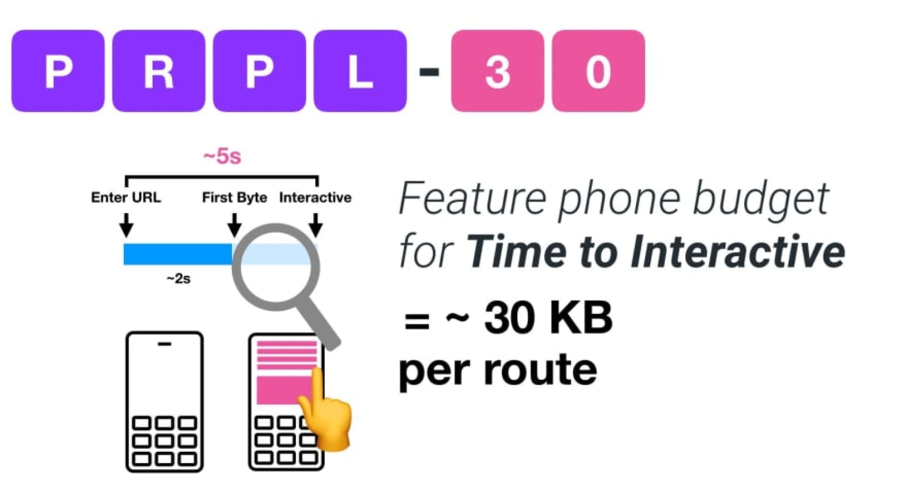

>Addy Osmani建议，如果目标是智能手机，就采用PRPL-30性能预算(30KB gzipped+压缩后的初始化JS包)

事实上，谷歌的Alex Russel建议以130～170KB（gzipped后）作为一个合理的包大小上限。然而在现实世界中，大多数产品甚至都超过很多：现在JS包的中值大小约为417KB，与2015年初相比增长了42%。在中等收入人群的移动设备上，这将带来15～25秒的可交互时间（TTI）。

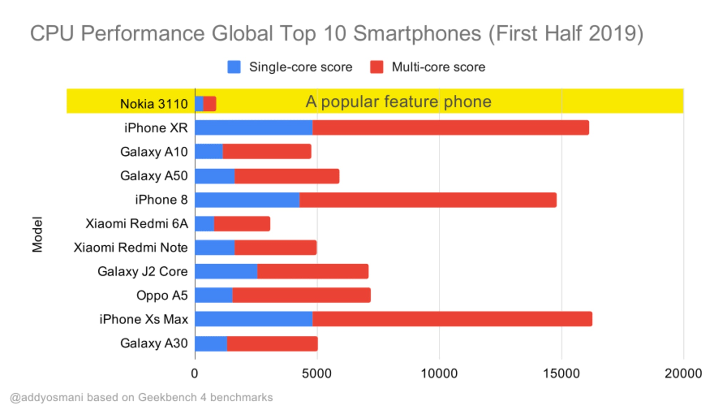

>2019年全球销量最高智能手机的Geekbench CPU性能基准。JavaScript是强调单核性能(请记住，与Web平台的其余部分相比，它本质上更像是单线程的)，并且受CPU的限制。摘自Addy的文章[《在20美元的功能手机上快速加载网页》](https://dev.to/addyosmani/loading-web-pages-fast-on-a-20-feature-phone-8h6)

当然，JS包大小的最大值限制不是绝对的，我们可以超出上面说的JS包大小预算。我们可以根据浏览器主线程的活动(例如：开始渲染之前的绘制时间)设置性能预算，或者[跟踪前端对CPU的占用量](https://calendar.perfplanet.com/2017/tracking-cpu-with-long-tasks-api/)。[Calibre](https://calibreapp.com/)、[SpeedCurve](https://speedcurve.com/)和[Bundlesize](https://github.com/siddharthkp/bundlesize)等工具可以帮助您控制预算，并且可以集成到您的构建流程中。

最后，性能预算可能不应该是一个固定值。[根据网络连接的不同，性能预算应该有所调整](https://twitter.com/katiehempenius/status/1075478356311924737)。但是要记住，在慢网速下，无论如何使用，每个包大小都非常“昂贵”（占用宝贵的带宽）。

**注**：随着HTTP/2的广泛应用、即将到来的5G、快速发展的手机硬件和蓬勃发展的SPA的时代，设定如此僵化的预算听起来可能有些奇怪。然而，考虑我们面对的网络和硬件的不可预测性质时，这些性能预算限制听起来又确实是合理的，包括从拥堵的网络到缓慢发展的基础设施，到数据上限、代理浏览器、省流量模式和复杂的漫游费用。

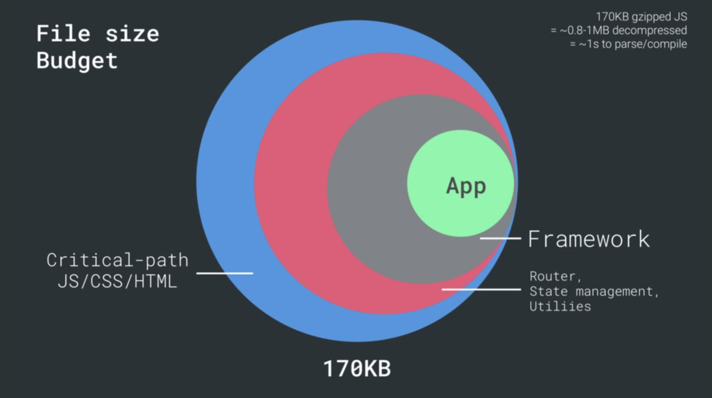

>来自Addy Osmani的[《默认快速:现代加载最佳实践》](https://speakerdeck.com/addyosmani/fast-by-default-modern-loading-best-practices)(幻灯片19页)

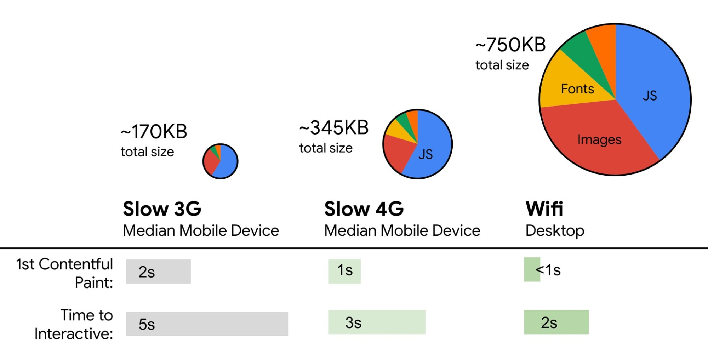

>性能预算应根据一般的移动设备的网络条件进行调整(图片来源：Katie Hempenius)

## 定义环境

### 09 选择并设置构建工具

[不要过于关注那些被认为很酷的工具](https://24ways.org/2017/all-that-glisters/)。坚持在您的开发流程中进行构建优化，无论是Grunt、Gulp、Webpack、Parcel还是这些工具的组合。只要获得了想要的结果，并且维护构建过程没有问题，那就足够了。

在众多构建工具中，Rollup对开发者的吸引力越来越大，但Webpack似乎是最成熟的一个，它提供了数百个插件来优化构建的大小。尽管刚开始使用Webpack是很困难的。如但果你想掌握它，这里有一些很棒的资源：

+ [Webpack文档](https://webpack.js.org/concepts/) - 显然这是一个很好的起点，Raja Rao编写的[Webpack代码混淆](https://medium.com/@rajaraodv/webpack-the-confusing-parts-58712f8fcad9)和Andrew Welch编写的[Webpack配置注释](An Annotated Webpack Config)都是了解webpack一个很好的起点

+ Sean Larkin发布了1个关于Webpack的免费课程: [webpack核心概念](https://webpack.academy/p/the-core-concepts)。Jeffrey Way也发布了一个关于Webpack的非常棒的免费课程：[所有人都必须了解的webpack](https://laracasts.com/series/webpack-for-everyone)。这两个对每个想深入研究Webpack的开发者都很友好

+ [webpack基础知识](https://frontendmasters.com/courses/webpack-fundamentals/)是1个非常全面的4小时课程，由Sean Larkin在FrontendMasters上发布

+ 如果您对Webpack已经比较熟悉了，那么可以试试阅读Rowan Oulton发布的[使用Webpack改善建筑性能的现场指南](https://slack.engineering/keep-webpack-fast-a-field-guide-for-better-build-performance-f56a5995e8f1)，和BenediktRötsch进行的[有关将Webpack捆绑压缩的研究](https://www.contentful.com/blog/2017/10/27/put-your-webpack-bundle-on-a-diet-part-3/)

+ [Webpack示例](https://github.com/webpack/webpack/tree/master/examples)有着数百个现成的Webpack配置，并按照主题和用途分类。另外:还有一个[Webpack配置生成器](https://webpack.jakoblind.no/)，可以生成一个通用的配置文件

+ [awesome-webpack](https://github.com/webpack-contrib/awesome-webpack)是优秀的Webpack资源，库和工具的集合，有文章，视频，课程，书籍和示例等，包括在Angular，React中的最佳实践，当然也包括和框架无关的webpack资源

### 10 默认使用渐进式增强

尽管这个概念已经提出了这么多年，将[渐进式增强](https://www.aaron-gustafson.com/notebook/insert-clickbait-headline-about-progressive-enhancement-here/)作为基础原则来指导前端体系结构和部署仍然是一个不错的选择。首先设计和构建基础和核心体验，然后使用强大的浏览器高级特性来增强界面，从而获得[弹性式](https://resilientwebdesign.com/)的用户体验。如果你的网站在低性能设备、网速慢、屏幕不好的环境下都能流畅地运行，那么在速度快的机器上它就会运行更快表现更佳。

实际上，通过[自适应服务模块](https://www.youtube.com/watch?v=puUPpVrIRkc&t=488s)，我们可以同时为低端设备提供“精简”的核心体验，而为高端设备提供更复杂的功能。渐进式增强这种模式短期内应该不会消失。

### 11 选择一个良好的性能基准

由于有非常多的未知因素影响加载性能-网络、负载均衡、缓存覆盖、第三方脚本、解析器阻塞模式、磁盘I/O、IPC延迟、安装的扩展、防病毒软件和防火墙、后台CPU任务、硬件和内存限制、二级/三级缓存的差异、RTTS -- 因此[JavaScript的体验成本非常高](https://v8.dev/blog/cost-of-javascript-2019)，仅次于默认情况下阻止页面呈现的Web字体和经常消耗太多内存的图像。随着[性能瓶颈从服务器转移到客户端](https://calendar.perfplanet.com/2017/tracking-cpu-with-long-tasks-api/)，作为开发人员，我们必须更详细地考虑所有这些未知因素。

上面提到的170KB的预算已经包含关键路径HTML/CSS/JavaScript、路由器、状态管理、实用程序、框架和应用程序逻辑，所以我们必须[彻底检查我们选择的框架的网络传输成本、解析/编译时间和运行时成本](https://www.twitter.com/kristoferbaxter/status/908144931125858304)。幸运的是在过去的几年里，[浏览器在解析和编译脚本的速度方面有了巨大的进步](https://v8.dev/blog/cost-of-javascript-2019)。然而，JavaScript的执行仍然是主要的性能瓶颈，因此我们必须密切关注脚本执行时间和网络传输可能会产生的任何影响。

正如Seb Markbège所[指出](https://twitter.com/sebmarkbage/status/829733454119989248)的，衡量框架启动成本的一个好方法是先渲染试图，然后删除视图再二次渲染，这样就可以知道框架绘制的成本。因此首次渲染视图之前往往需要预热一堆延迟编译的代码，更大DOM树在绘制时受益更多。二次渲染则是模拟页面上的代码复用度是如何随着页面复杂度的增加而影响性能特征。

### 12 评估框架和依赖关系

现在，[不是每个web应用都需要前端框架](https://twitter.com/jaffathecake/status/923805333268639744)，[在单页应用程序也不是每个页面都需要加载框架](not every page of a single-page-application needs to load a framework)。在Netflix的场景中，“从客户端删除React，一些第三方库和相应的应用程序代码可以将JavaScript的总量减少200KB以上，从而使Netflix首页登录的[可互动时间减少了50％以上](https://news.ycombinator.com/item?id=15567657)。” 然后，该团队利用用户在登录页面上花费的时间来预取React，这样做在用户可能访问的后续页面中就不用继续加载React了（[有关详细信息，请继续阅读](https://jakearchibald.com/2017/netflix-and-react/)）。

可能大家都知道，但还是值得一提：确实有一些项目可以[从完全删除现有框架中受益](https://twitter.com/jaffathecake/status/925320026411950080)。选择框架后，您将至少使用几年，因此，如果需要使用框架，请确保您的选择是[明智的](https://www.youtube.com/watch?v=6I_GwgoGm1w)，并经过[深思熟虑](https://medium.com/@ZombieCodeKill/choosing-a-javascript-framework-535745d0ab90#.2op7rjakk)。

Inian Parameshwaran[评估了最流行的前50个框架的性能](https://youtu.be/wVY3-acLIoI?t=699)（用[First Contentful Paint](https://developers.google.com/web/tools/lighthouse/audits/first-contentful-paint)评估，即从导航到浏览器首次渲染DOM内容的时间）。Inian发现，Vue和Preact是总体来说最快的框架-在台式机和移动设备上都是如此，其次是React（[幻灯片](https://drive.google.com/file/d/1CoCQP7qyvkSQ4VG9L_PTWD5AF9wF28XT/view)）。可以检查候选框架和建议的体系结构，并研究其中大多数解决方案的性能，例如使用服务器端渲染或客户端渲染，或者结合两者。

基准性能成本很重要。根据[Ankur Sethi的研究](https://blog.uncommon.is/the-baseline-costs-of-javascript-frameworks-f768e2865d4a)，“在印度，无论你如何优化，React应用程序在普通手机上的加载速度永远不会比1.1s快，Angular应用程序总是需要2.7s才能完成启动，Vue应用程序的用户则需要等待1s才能开始使用它。” 当然，您可能并没有将印度作为您的主要市场，但是使用次优网络条件访问您的web网站的用户将拥有类似的体验。使用框架可能会降低用户体验，但您的团队也获得了可维护性和开发人员效率。因此使用框架需要经过深思熟虑。

您可以在Sacha Greif的[12分制评分系统](https://medium.freecodecamp.org/the-12-things-you-need-to-consider-when-evaluating-any-new-javascript-library-3908c4ed3f49)上评估一个框架(或任何JavaScript库)包括：探索特性、可访问性、稳定性、性能、包生态系统、社区、学习曲线、文档、工具、跟踪记录、团队、兼容性、安全性等。考虑到整体耗时较大，在选择选项之前至少考虑总的大小成本+初始解析时间是个好主意；[Preact](https://github.com/developit/preact)、[Inferno](https://github.com/infernojs/inferno)、[Vue](https://vuejs.org/)、[Svelte](https://svelte.technology/)或[Polmer](https://github.com/Polymer/polymer)等轻量级框架可以很好地完成工作。基线的大小将定义应用程序代码的约束。

有许多工具可以帮助您就依赖项和可行替代方案的影响做出明智的决策：

+ [webpack-bundle-analyzer](https://www.npmjs.com/package/webpack-bundle-analyzer)
+ [Source Map Explorer](https://github.com/danvk/source-map-explorer)
+ [Bundle Buddy](https://github.com/samccone/bundle-buddy)
+ [Bundlephobia](https://bundlephobia.com/)
+ [Webpack size-plugin](https://github.com/GoogleChromeLabs/size-plugin)
+ [Import Cost for Visual Code](https://marketplace.visualstudio.com/items?itemName=wix.vscode-import-cost)

一个好的开端是为您的web应用程序选择一个好的默认种子工程。[Gatsby](http://gatsbyjs.org/)（React），[Vuepress](https://vuepress.vuejs.org/)（Vue），[Preact CLI](https://github.com/developit/preact-cli)和[PWA Starter Kit](https://github.com/Polymer/pwa-starter-kit)针对不同框架提供了合理的默认种子，可以在普通移动开发中快速开箱即用。 另外，请查看[web.dev特定于针对React和Angular框架的性能指南](https://web.dev/learn/#frameworks)，该指南应该在今年晚些时候进行扩展（感谢Phillip！）。

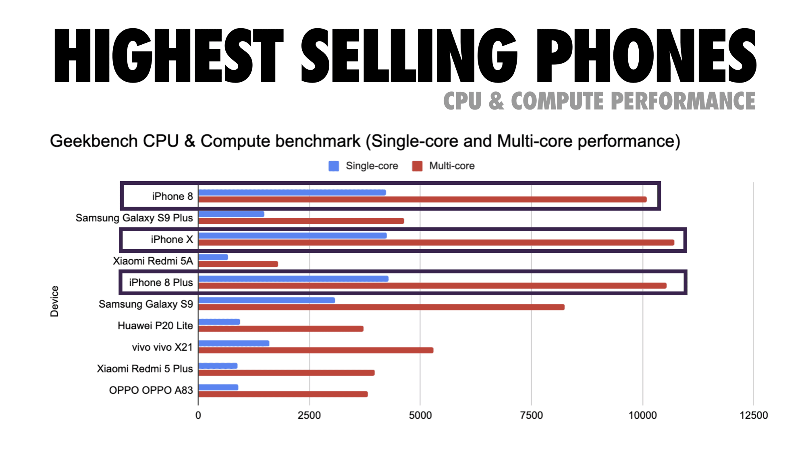

>畅销手机的CPU和计算性能（图片来源：Addy Osmani）

### 13 考虑使用PRPL模式和App Shell架构

不同的框架对性能有不同的影响，需要不同的优化策略，因此您必须清楚地了解您将依赖的框架的所有细节。在构建Web应用程序时，建议研究[PRPL模式](https://developers.google.com/web/fundamentals/performance/prpl-pattern/)和[App Shell架构](https://developers.google.com/web/updates/2015/11/app-shell)。这个理由非常简单：只推送使页面初始化并可交互所需要的最小代码（Push），以便快速呈现初始路由页面（Render），然后使用Service Worker来缓存和预缓存后续资源（Pre-Caching），再以异步方式延迟加载所需的路由资源（Lazy-Load）。

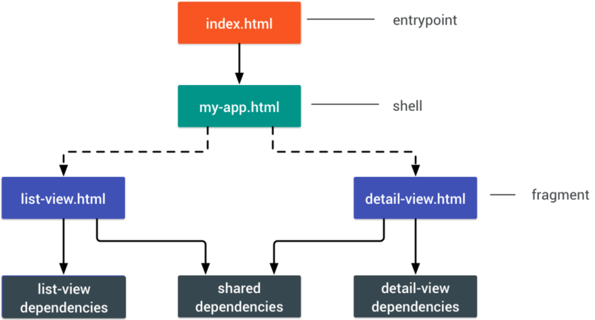

>PRPL代表推送关键资源（Pushing critical resource），渲染初始路由（Rendering initial route），预缓存剩余路由（Pre-caching remaining routes）和按需延迟加载剩余路由（Lazy-loading remaining routes on demand）

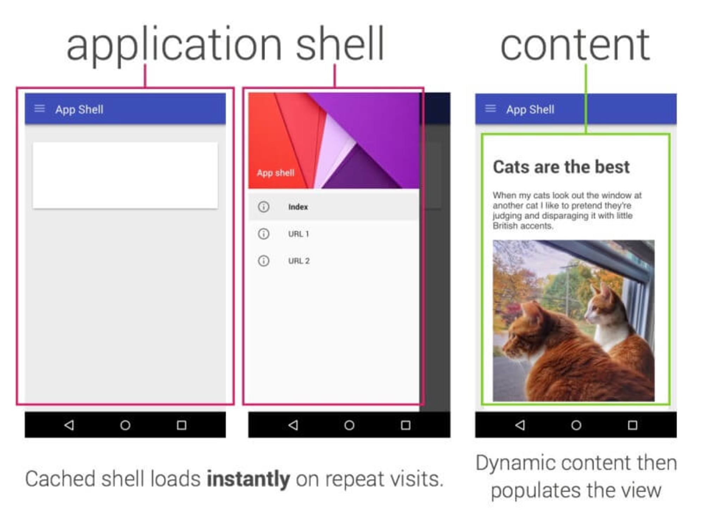

>App Shell是支持展示用户界面的最小HTML、CSS和JavaScript

### 14 是否对API的性能进行了优化？

API是指应用程序通过所谓的*socket*向内部和第三方应用程序交换数据的通信通道。在[设计和开发API时](https://www.smashingmagazine.com/2012/10/designing-javascript-apis-usability/)，我们需要一个合理的协议来实现服务器与第三方请求之间的通信。[Restful API](https://www.smashingmagazine.com/2018/01/understanding-using-rest-api/)（[REST](http://web.archive.org/web/20130116005443/http://tomayko.com/writings/rest-to-my-wife)）是一种广泛验证有效的选择：它定义了一组约束，开发人员可以遵循这些约束以使内容以高性能，可靠和可伸缩的方式进行访问。符合REST约束定义的Web服务称为*RESTful Web服务*。

与普通的HTTP请求一样，当从API检索数据时，服务器响应中的任何延迟都将传播到最终用户，从而影响渲染。当资源想要从API检索某些数据时，它将需要从相应的端点请求数据。渲染来自多个资源的数据的组件，例如在每个评论中包含评论和作者照片的文章，可能需要多次往返到服务器来获取所有数据，然后才能渲染。此外，通过REST返回的数据量通常超过渲染该组件所需的数据量。

如果许多资源都需要来自某个API的数据，则该API可能会成为性能瓶颈。[GraphQL](https://graphql.org/)为这些问题提供了高性能的解决方案。本身，GraphQL是API的一种查询语言，并且是服务器端运行时的，用于通过使用为数据定义的类型系统执行查询。与REST不同，GraphQL可以在单个请求中检索所有数据，并且只响应所需的内容，而不会像REST通常那样过度或不足地获取数据。

此外，因为GraphQL使用模式（schema，定义数据结构的元数据)，所以它可以提前将数据组织成所需的结构，因此[使用GraphQL，我们可以删除用于处理状态和数据结果的JavaScript代码](https://medium.com/@wmdmark/how-graphql-replaces-redux-3fff8289221d)，从而产生在客户端上运行更快更干净的应用程序代码。

如果您想开始使用GraphQL，Eric Baer在Smashing Magazine上发表了两篇精彩的文章：[GraphQL入门：为什么我们需要一种新型API](https://www.smashingmagazine.com/2018/01/graphql-primer-new-api-part-1/)和[GraphQL入门：API设计的发展](https://www.smashingmagazine.com/2018/01/graphql-primer-new-api-part-2/)（感谢Leonardo提醒！）。

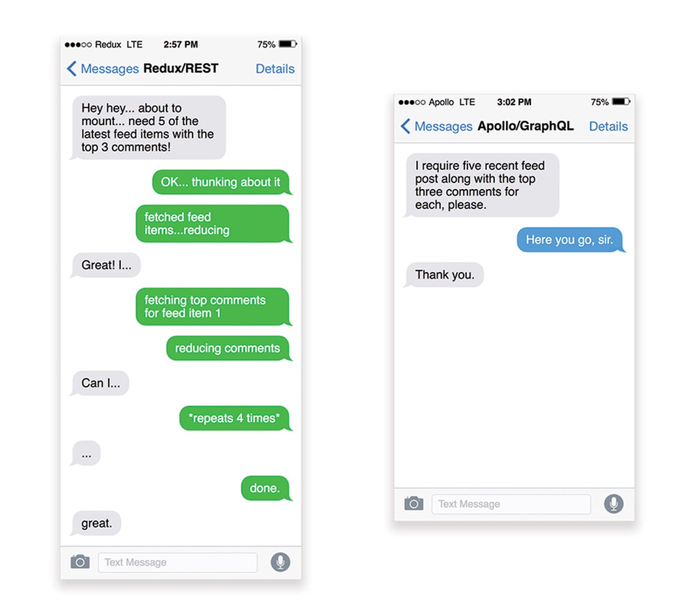

>REST和GraphQL之间的区别: 通过左侧的Redux+REST的模拟对话和右侧的Apollo+GraphQL的模拟对话来说明（图片来源：Hacker Noon）

### 15 使用AMP还是Instant Articles？

根据您团队的优先级和战略，您可能需要考虑使用Google的[AMP](https://www.ampproject.org/)或Facebook的[Instant Articles](https://instantarticles.fb.com/)或Apple的[Apple News](https://www.apple.com/news/)。 没有它们您也可以实现良好的性能，但是AMP确实提供了具有免费内容交付网络（CDN）的可靠性能框架，而Instant Articles可以提高您在Facebook上的可见性和性能。

这些技术为用户带来的明显好处是：基本可以保证性能，因此有时他们甚至更喜欢AMP/Apple News/Instant Pages的链接，而不是“常规”、可能比较臃肿的页面。对于处理大量第三方内容的内容繁重的网站，这些技术可能会明显地降低渲染耗时。

[这些并不是没用](https://timkadlec.com/remembers/2018-03-19-how-fast-is-amp-really/)。例如，根据Tim Kadlec的说法：“AMP文档往往比它们的同行更快，但这并不一定意味着这个页面性能更好。从性能的角度来看，AMP并没有太大的不用”。

对网站所有者来说，好处是显而易见的：这些格式在他们各自的平台上都更容易被曝光，并能[在搜索引擎中提升排名](https://ethanmarcotte.com/wrote/ampersand/)。您也可以通过AMP作为PWA的数据源，来构建[渐进式Web AMP](https://www.smashingmagazine.com/2016/12/progressive-web-amps/)。不利的一面是什么？ 显然，AMP这类技术类似围墙的花园，使得开发人员需要开发和维护针对它们的单独版本，例如Apple的Instant Articles[没有实际的URL](https://www.w3.org/blog/TAG/2017/07/27/distributed-and-syndicated-content-whats-wrong-with-this-picture/)，我们在代码中就要单独处理这种情况(感谢Addy，Jeremy！)。

### 16 合理选择CDN

根据您拥有多少动态数据，您可以将内容的某些部分“外包”给[静态站点生成器](https://www.staticgen.com/)，将其推送到CDN并从中提供静态版本，从而避免数据库请求。您甚至可以选择基于CDN的[静态托管平台](https://www.smashingmagazine.com/2015/11/modern-static-website-generators-next-big-thing/)，使用交互式组件作为增强功能丰富您的页面([JAMStack](https://jamstack.org/))。事实上，其中一些生成器(比如React生态的[Gatsby](https://www.gatsbyjs.org/blog/2017-09-13-why-is-gatsby-so-fast/))实际上就是个[网站编译器](https://tomdale.net/2017/09/compilers-are-the-new-frameworks/)，它提供了许多开箱即用的自动化优化。随着编译器不断地为编译添加优化，编译后的输出会越来越小，越来越快。

请注意，CDN也可以提供动态内容。因此，不必将CDN的应用限制在静态资源。仔细检查您的CDN是否支持执行压缩和转换（例如，在格式方面进行图像优化，压缩和调整大小），[对servers worker的支持](https://www.filamentgroup.com/lab/servers-workers.html)，页面片段缓存，将它们在CDN层面组合页面的静态和动态部分（距离用户最近的服务器）和其他支持的特性。此外，请检查您的CDN[是否也支持HTTP over QUIC（HTTP/3）](https://blog.cloudflare.com/the-quicening/)。

注意：根据Patrick Meenan和Andy Davies的研究，[设置HTTP/2优先在许多CDN上实际上是无效的](https://github.com/andydavies/http2-prioritization-issues#cdns--cloud-hosting-services)，因此在选择CDN时要小心。帕特里克（Patrick）在他最近的[HTTP/2优先](https://youtu.be/sgjxuhFQktE?t=2626)演讲中有更多细节（感谢Barry！）。

## 资源优化

### 17 使用Brotli进行纯文本压缩

2015年，Google[推出了](https://opensource.googleblog.com/2015/09/introducing-brotli-new-compression.html)[Brotli](https://github.com/google/brotli)，这是一种全新的开源无损数据格式，[并被现在所有现代浏览器支持](http://caniuse.com/#search=brotli)。实际上，Brotli似乎比Gzip和Deflate[更有效](https://quixdb.github.io/squash-benchmark/#results-table)[得多](https://paulcalvano.com/index.php/2018/07/25/brotli-compression-how-much-will-it-reduce-your-content/)。取决于您的设置，压缩可能会（非常）缓慢，但是这样慢的压缩速度最终也会带来较高的压缩率。不管怎样，它都能快速解压缩。这篇文章可以[估算站点使用Brotli压缩可以节省的大小](https://tools.paulcalvano.com/compression.php)。

问题在于，使用Brotli压缩所有资源非常耗费计算资源和时间。因此，仅由于其产生的成本开销，许多服务器就无法使用它。实际上，在最高压缩级别下，Brotli是如此之慢，以至于服务器等待动态资源资产时，服务器开始发送响应所花费的时间会抵消文件大小减少带来的任何潜在收益。但是，对于静态资源压缩，应该[首选更高压缩比的压缩设置](https://css-tricks.com/brotli-static-compression/)。

如果您可以避开动态压缩静态资产的成本，Brotli就是值得的。Brotli可用于任何纯文本的内容-HTML，CSS，SVG，JavaScript等。

策略？ 使用最高压缩比配置的[Brotli+Gzip预压缩静态资源](https://css-tricks.com/brotli-static-compression/)，并使用Brotli配置3～5级压缩比来快速压缩（动态）HTML。确保服务器正确处理Brotli或gzip的内容协商头。

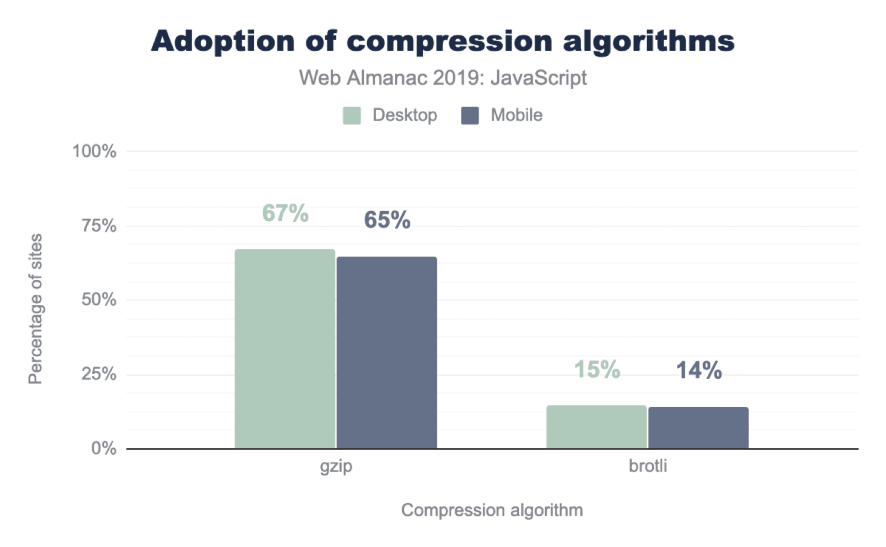

>无论是在桌面还是移动设备上，有大约15%使用Brotli压缩。使用gzip压缩则大约是65%。其余部分完全没有压缩。(图像来源: [Web年鉴:压缩](https://almanac.httparchive.org/en/2019/compression))

### 18 使用响应式图像和WebP

尽可能使用具有`srcset`，`sizes`和`<picture>`元素的[响应式图像](https://www.smashingmagazine.com/2014/05/responsive-images-done-right-guide-picture-srcset/)。在使用它的同时，还可以通过`<picture>`元素和JPEG兜底（请参阅Andreas Bovens的[代码片段](https://dev.opera.com/articles/responsive-images/#different-image-types-use-case)）来使用[webP格式](https://www.smashingmagazine.com/2015/10/webp-images-and-performance/)（除Safari和iOS Safari外，所有现代浏览器均支持）。或使用内容协商（使用Accept标头）。Ire Aderinokun有一个非常详细的[教程](https://bitsofco.de/why-and-how-to-use-webp-images-today/)，将图像转换为WebP。

Sketch内置支持WebP，而Photoshop可以使用的[WebP插件](http://telegraphics.com.au/sw/product/WebPFormat#webpformat)从Photoshop导出WebP图像。[也有其他选项可用](https://developers.google.com/speed/webp/docs/using)，如果您使用的是WordPress或Joomla，也可以使用扩展来帮助您轻松实现对WebP的支持，例如WordPress的[Optimus](https://wordpress.org/plugins/optimus/)和[Cache Enabler](https://wordpress.org/plugins/cache-enabler/)以及[Joomla自己支持的扩展](https://extensions.joomla.org/extension/webp/)（通过Cody Arsenault）。

值得注意的是，虽然WebP图像文件大小与[同等的Guetzli和Zopfli相比](https://www.ctrl.blog/entry/webp-vs-guetzli-zopfli)，该格式不支持[像JPEG那样的渐进式渲染](https://youtu.be/jTXhYj2aCDU?t=630)，这就是为什么用户使用好的JPEG可能会更快地看到实际图像，尽管WebP图像的网络加载速度可能会更快。使用JPEG，我们可以用一半甚至四分之一的时间就提供给“像样的”用户体验，并在稍后加载其余的数据，而不是像WebP那样只有半空的图像。您的决定将取决于您想要的是什么：使用WebP，您将减少图像大小，而使用JPEG，您将提高图像的可感知性。

在Smashing Magazine上，我们使用后缀`-opt`作为图像名称-例如`brotli-compression-opt.png`； 每当图像包含该后缀时，团队中的每个人都知道该图像已经过优化。并且-不需要再加后缀了！-Jeremy Wagner甚至在[Smashing book上出版了一本《WebP》](https://www.smashingmagazine.com/ebooks/the-webp-manual/)。

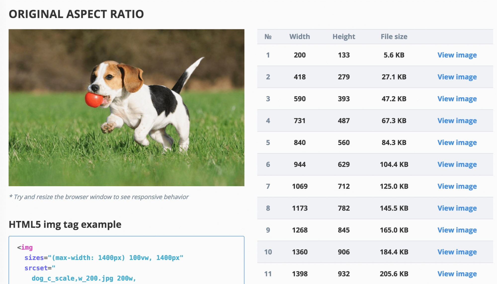

>[响应式图像断点生成器](http://www.responsivebreakpoints.com/)可自动执行图像适配和标记生成

### 19 图像是否经过适当优化？

当您在落地页上时，快速加载特定图像非常关键，请确保JPEG是渐进式的，并使用[mozJPEG](https://github.com/mozilla/mozjpeg)压缩（通过操纵扫描级别来缩短图像初始化渲染的时间），或者看看[Guetzli](https://github.com/google/guetzli)，这是Google的新型开源编码器，专注于用户感知性能，并利用了Zopfli和WebP的经验。[唯一的缺点](https://medium.com/@fox/talk-the-state-of-the-web-3e12f8e413b3)是：处理时间慢（每百万像素一分钟的CPU）。 对于PNG，我们可以使用Pingo，对于SVG，我们可以使用[SVGO](https://www.npmjs.com/package/svgo)或[SVGOMG](https://jakearchibald.github.io/svgomg/)。 而且，如果您需要从网站上快速预览和复制或下载所有SVG资源，[svg-grabber](https://chrome.google.com/webstore/detail/svg-grabber-get-all-the-s/ndakggdliegnegeclmfgodmgemdokdmg)也可以为您做到这一点。

每一篇图像优化文章都会说的，但是又特别重要的一点：矢量资源整洁和紧密。确保清理未使用的资源，删除不必要的元数据，并减少图稿中路径点的数量（从而减少SVG代码）。（谢谢Jeremy！）

但是，还有更多高级的方案。你可以：

+ 使用[Squoosh](https://squoosh.app/)压缩、调整大小和处理图像，以获得最佳的压缩级别（有损或无损）
+ 使用[响应式图像断点生成器](http://www.responsivebreakpoints.com/)或[Cloudinary](Cloudinary)或[Imgix](https://www.imgix.com/)等服务来自动进行图像优化。同样，在大多数情况下，仅使用`srcset`和`size`将会获得显着的好处
+ 检查响应式标记的效率，可以使用[Imaging-heap](https://github.com/filamentgroup/imaging-heap)，这是一个命令行工具，可以测量视口大小和设备像素比率之间的效率
+ 对图片和Iframe进行懒加载，可以使用[混合懒加载](https://www.smashingmagazine.com/2019/05/hybrid-lazy-loading-progressive-migration-native/)、本地懒加载，或[懒加载](https://github.com/verlok/lazyload)库，它检测通过用户交互触发的可见性更改来实现懒加载（使用IntersectionObserver，我们将在后面进行探讨）
+ 对于屏幕外图像，我们可以先显示一个占位符，然后当图像出现在视口中时，使用IntersectionObserver触发网络调用，以将图像下载到后台。然后，我们可以[推迟渲染直到调用img.decode（）完成解码](https://youtu.be/YJGCZCaIZkQ?t=570)；如果[Image Decode API](https://medium.com/dailyjs/image-loading-with-image-decode-b03652e7d2d2)不可用，就直接下载图像。渲染图像时，我们可以使用淡入动画。 Katie Hempenius和Addy Osmani在他们的[性能提升：网络性能优化建议和技巧](https://youtu.be/YJGCZCaIZkQ?t=436)文章中分享了更多这方面的观点
+ 您可以[配置在“Pull Request”中自动图像压缩](https://github.com/marketplace/actions/image-actions)，因此任何图像都会在构建时完成压缩。这个Github Actions会对PNG和JPG使用mozjpeg和libvips进行压缩
+ 请注意默认情况下加载但可能永远都不会渲染的图像，例如网页中的“轮播图”，“手风琴”和“图像画廊”
+ [考虑使用“Sizes”属性更换请求的图像](https://www.filamentgroup.com/lab/sizes-swap/)，通过根据媒体查询来确定不同的图像显示尺寸。例如在“放大镜”组件中，通过设置`sizes`来触发替换图像资源
+ 每次上线前Review[页面中图像下载过程是否又不同](https://csswizardry.com/2018/06/image-inconsistencies-how-and-when-browsers-download-images/)，以防止意外下载不需要的前景和背景图像
+ 有时仅靠优化图像并不能解决问题。 为了缩短开始[渲染关键图像所需](https://calendar.perfplanet.com/2019/the-ugly-truth-about-optimising-beautiful-images/)的时间，请延迟加载不太重要的图像，并再关键图像渲染完成后再加载任何异步脚本
+ 如果要优化内部存储，可以使用Dropbox新的[Lepton格式](https://github.com/dropbox/lepton)，它的JPEG无损压缩率平均可以达到22％
+ 请注意CSS中的[aspect-ratio属性](https://drafts.csswg.org/css-sizing-4/#ratios)和[internalsize属性](https://github.com/ojanvafai/intrinsicsize-attribute)，这将允许我们设置图像的纵横比和尺寸，因此浏览器可以提前保留预定义的布局槽，这样在页面加载期间就可以[避免出现布局跳跃](https://24ways.org/2018/jank-free-image-loads/)
+ 如果您在技术上喜欢冒险，则可以使用[Edge worker](https://youtu.be/jTXhYj2aCDU?t=854)（CDN上的实时过滤器）对HTTP/2流进行切割和重排，以便更快地通过网络发送图像。Edge Worker使用的JavaScript流使用可以控制的块（它们是在CDN边缘上运行的JavaScript，可以修改流响应），因此您可以控制图像的传递。对于service worker，这时间点太晚了，因为您无法控制线路上的内容，但可以与Edge Worker一起使用。 因此在为特定的落地页中，您可以逐步在的静态JPEG上使用它们以节省传输大小

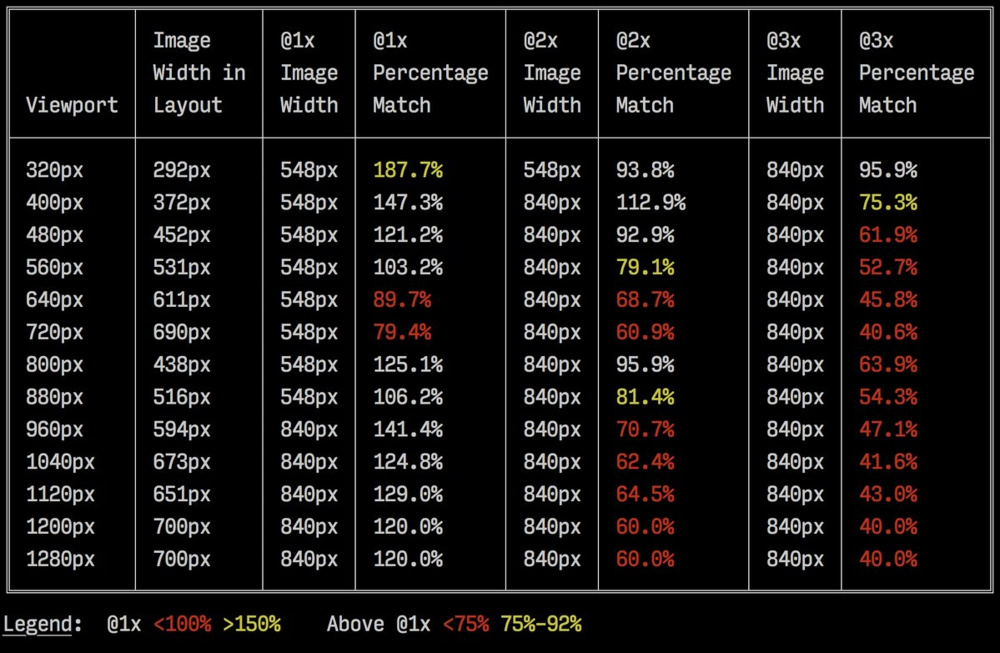

>通过[imaging-heap](https://github.com/filamentgroup/imaging-heap)输出的样本，这是一种命令行工具，可测量跨视口大小和设备像素比率的效率（[图片来源](https://pbs.twimg.com/media/DY1XZ28VwAAwjd8.jpg)）

随着客户提示的应用，响应式图像的未来可能会发生巨大变化。客户端提示指的是HTTP请求标头字段，例如 `DPR`, `Viewport-Width`, `Width`, `Save-Data`, `Accept`（指定图像格式首选项）等。他们会将用户浏览器，屏幕，连接等的详细信息通知服务器。因此，服务器可以决定如何用适当大小的图像填充布局，并仅以所需格式提供这些图像。通过客户端提示，我们将资源选择从HTML标记移到了客户端和服务器之间的请求-响应协商中。

正如Ilya Grigorik所指出的那样，客户的提示令响应式图像的应用更加完整-它们不是响应式图像的替代方案。“`<picture>`元素在HTML标记中提供了必要的艺术方向控制。客户端提示在结果图像请求上提供注释，从而实现资源选择自动化。ServiceWorker在客户端上提供完整的请求和响应管理功能。” 例如，服务人员可以向请求添加新的客户端提示标头值，重写URL并将图像请求指向CDN，根据连接性和用户首选项调整响应，等等。它不仅适用于图像资源，而且适用几乎所有其他类型的请求。

对于支持客户端提示的客户端，测试结果可以[为图像节省了42％的字节](https://twitter.com/igrigorik/status/1032657105998700544)，70％以上测试结果少了1MB +的字节。在Smashing Magazine上，我们也可以测试得到[19-32％的改善](https://www.smashingmagazine.com/2016/01/leaner-responsive-images-client-hints/)。不幸的是，客户端提示还必须[获得一些浏览器支持](http://caniuse.com/#search=client-hints)，比如[Firefox](https://bugzilla.mozilla.org/show_bug.cgi?id=935216)仍在考虑中。但是，如果同时为客户端提示提供正常的响应图像标记和`<meta>`标签，则浏览器将评估响应图像标记，并使用客户端提示的HTTP标头返回适当的图像资源。

还不够好？ 另外，您还可以使用[多背景图像技术](http://csswizardry.com/2016/10/improving-perceived-performance-with-multiple-background-images/)来提高图像的感知性能。请记住，[调整对比度](https://css-tricks.com/contrast-swap-technique-improved-image-performance-css-filters/)和模糊不必要的细节（或消除颜色）也可以减小文件大小。嗯，如果您需要放大一张小照片而不损失画质吗？ 考虑使用[Letsenhance.io](https://letsenhance.io/)。

到目前为止，这些优化仅涉及基础知识。Addy Osmani已发布了[有关图像优化的非常详细的指南](https://images.guide/)，该指南非常深入地介绍了图像压缩和颜色管理的细节。例如，您可以使图像的不必要部分模糊（通过应用高斯模糊滤镜）以减小文件大小，最终您甚至可以删除颜色或将图片变成黑白以进一步减小大小。对于背景图像，在Photoshop中以0到10％的质量导出图片也是绝对可以接受的。此外，[不要在web开发中使用JPEG-XR](https://calendar.perfplanet.com/2018/dont-use-jpeg-xr-on-the-web/)-“使用CPU上对JPEG-XRs进行解码的处理将影响渲染性能，增加的耗时可能使字节大小节省的优化无效，甚至超过其大小节省的积极影响，尤其是在SPA的web应用中”。

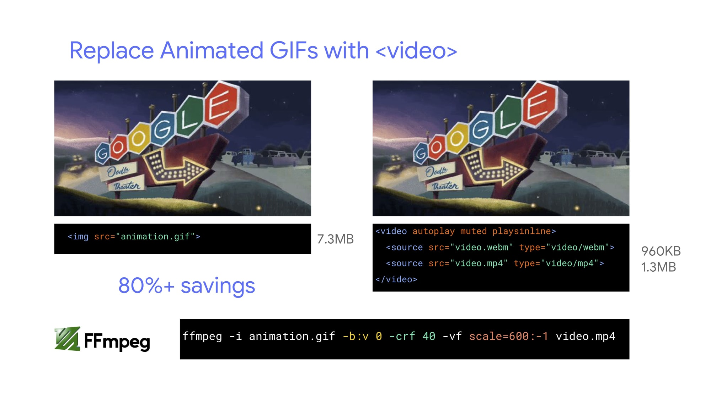

>Addy Osmani建议用循环播放的内联视频替换动画GIF，文件大小差异明显（节省80％）

### 20 视频是否经过适当优化？

到目前为止，我们已经讨论完了图像，但是我们避开了有关优化GIF的事情。坦白说，与其加载会影响渲染性能和带宽的沉重动画GIF，不如改用动画WebP（将GIF用作兜底），或将其全部替换为循环的HTML5视频，这是一个好主意。是的，与图像不同，浏览器不会预加载`<video>`内容，但HTML5视频往往比GIF更轻，更小。没有选择吗？ 好吧，至少我们可以使用[有损GIF](https://kornel.ski/lossygif)，[gifsicle](https://github.com/kohler/gifsicle)或[giflossy](https://github.com/pornel/giflossy)对gif进行有损压缩以减小图像大小。

测试表明，与gif相比，在`img`标签内联视频的显示速度快20倍，解码速度快7倍，而且文件大小非常小。

好消息是，视频格式多年来一直在不断发展。长期以来，我们一直希望WebM成为统一所有的格式，而WebP（基本上是WebM视频容器内部的一个静止图像）将替代过时的图像格式。但是，尽管这些年WebP和WebM已经获得了不错的支持，但并没有实现重大突破。

2018年，开源媒体联盟发布了一种新的有前途的视频格式，称为AV1。 AV1的压缩与H.265编解码器（H.264的演进）相似，但与后者不同，AV1是免费的。H.265许可证的价格迫使浏览器供应商改为使用性能相同的AV1：（就像H.265一样）AV1压缩的效果是WebM的两倍。

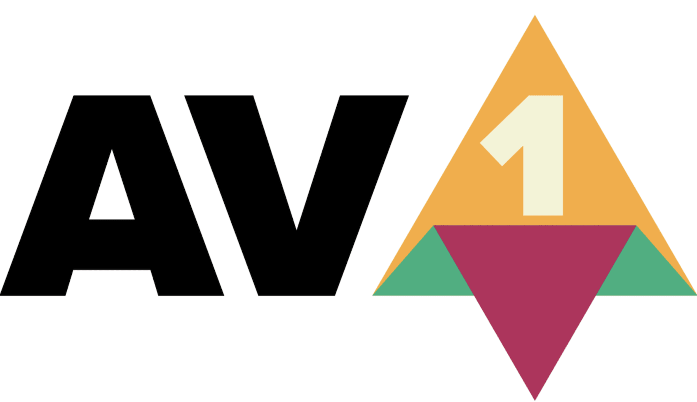

>AV1很有可能成为网络视频的最终标准（图片来源：[Wikimedia.org](https://upload.wikimedia.org/wikipedia/commons/thumb/8/84/AV1_logo_2018.svg/2560px-AV1_logo_2018.svg.png)）

实际上，Apple当前使用的是[HEIF](https://caniuse.com/#search=heif)和[HEVC(H.265)](https://caniuse.com/#search=hevc)，并且最新iOS上的所有照片和视频均以这些格式保存，而不是JPEG。虽然HEIF和HEVC（H.265）还不可以正确显示在web网页上（或许您读这篇文章的候可能已经不是这样了？），但AV1已经可以 -- 并且[正在不断获得浏览器支持](https://caniuse.com/#feat=av1)。因此，在所有`<video>`标签中添加`AV1`资源是合理的，因为似乎所有浏览器供应商都在使用。

目前，使用最广泛且受支持的编码是H.264，由MP4文件提供，因此在提供文件之前，请确保您的MP4经过[多遍编码处理](https://medium.com/@borisschapira/optimize-your-mp4-video-for-better-performance-dareboost-blog-fb2f3f3dce77)，并用[frei0r iirblur效果](https://yalantis.com/blog/experiments-with-ffmpeg-filters-and-frei0r-plugin-effects/)模糊处理（如果适用的话），并且在服务器[接受字节服务](https://medium.com/@borisschapira/optimize-your-mp4-video-for-better-performance-dareboost-blog-fb2f3f3dce77)时，将[atom元数据移动](http://www.adobe.com/devnet/video/articles/mp4_movie_atom.html)到文件的头部。 Boris Schapira提供了[FFmpeg的准确说明](https://medium.com/@borisschapira/optimize-your-mp4-video-for-better-performance-dareboost-blog-fb2f3f3dce77)，以最大限度地优化视频。当然，提供WebM格式作为替代方案也会有所帮助。

是否需要开始更快地渲染视频，但是视频文件仍然太大？例如，当您在目标网页上有大型背景视频时如何优化？常用的技术是先将第一帧显示为静止图像，或显示经过优化的短循环段，将其作为为视频的一部分，然后等视频有足够的缓冲，再开始播放实际的视频。Doug Sillars撰写的[详细的背景视频性能优化指南](https://calendar.perfplanet.com/2019/performance-tips-for-background-video/)，在这种情况下可能会有所帮助。（谢谢，Guy Podjarny！）。

视频播放性能本身就是一个很长很庞大的故事，如果您想深入了解它，请查看Doug Sillars另一系列文章，[有关当前视频](https://www.smashingmagazine.com/2018/10/video-playback-on-the-web-part-1/)和[视频交付最佳做法](https://www.smashingmagazine.com/2018/10/video-playback-on-the-web-part-2/)的内容，其中包括有关视频交付指标的详细信息，视频预加载，压缩和流式传输等等内容。

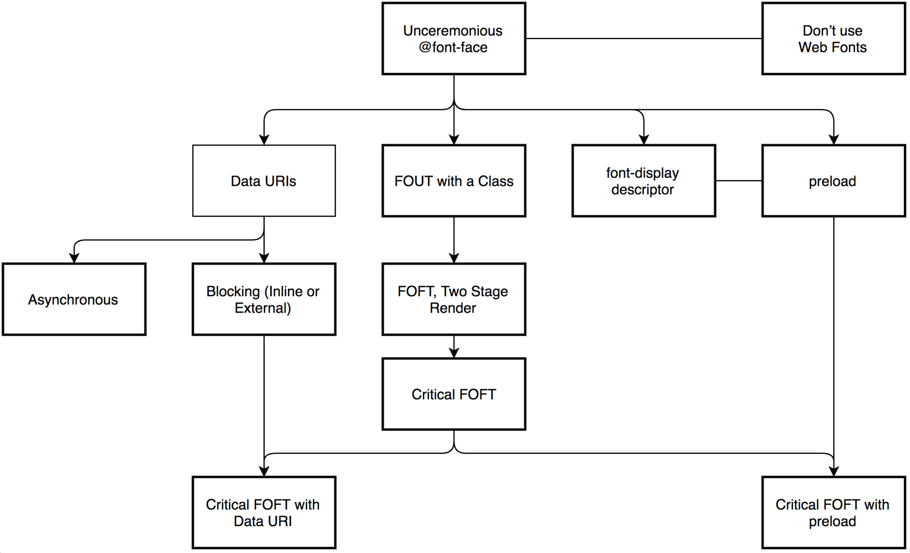

>Zach Leatherman的[字体加载策略综合指南](https://www.zachleat.com/web/comprehensive-webfonts/)提供了十几种更好的Web字体交付方案

### 21 网络字体是否经过优化？

首先要问的一个问题是，您是否可以摆脱使用[UI系统字体](https://www.smashingmagazine.com/2015/11/using-system-ui-fonts-practical-guide/)的麻烦？[再次检查它们在各种平台上的显示是否正确](http://fontfamily.io/Roboto,Segoe_UI,TImes,Helvetica,sans-serif)。如果不是这种情况，您提供的网络字体很有可能会包含字形以及未使用的额外功能和粗细。您可以用字体代工厂将Web字体转换成较小的子集，或者如果您使用的是开源字体，则可以使用[Glyphhanger](https://www.afasterweb.com/2018/03/09/subsetting-fonts-with-glyphhanger/)或[Fontsquirrel](https://www.fontsquirrel.com/tools/webfont-generator)对它们进行子集化。您甚至可以使用PeterMüller的[subfont](https://github.com/Munter/subfont#readme)来自动完成整个字体子集化的工作流程，subfont是一个命令行工具，可以静态分析您的页面以生成最佳的Web字体子集，然后将其注入到您的页面中。

WOFF2的浏览器支持非常好，您可以将WOFF作为不支持WOFF2的浏览器的兜底字体 - 也可以用系统字体兜底，以便更好地支持旧版浏览器。Web字体加载有很多很多的选择，您可以从Zach Leatherman的[“字体加载策略综合指南”](https://www.zachleat.com/web/comprehensive-webfonts/)中选择一种策略（这个代码片段也可以作为[web字体加载方法使用](https://github.com/zachleat/web-font-loading-recipes)）。

目前可以使用的更好的选择是：[预加载关键FOFT](https://www.zachleat.com/web/comprehensive-webfonts/#critical-foft-preload)和[“折衷”技术](https://www.zachleat.com/web/the-compromise/)。他们两个都分两阶段渲染来逐步交付Web字体-首先需要一个小的超级子集，以便使用Web字体快速准确地渲染页面，然后加载异步家族的其余部分。所不同的是，只有在不支[字体加载事件](https://www.igvita.com/2014/01/31/optimizing-web-font-rendering-performance/#font-load-events)的场景中，“折衷”技术才会异步加载polyfill，因此默认情况下您无需加载polyfill。需要快速达到目标吗？ Zach Leatherman提供了[23分钟的快速教程和案例研究](https://www.zachleat.com/web/23-minutes/)，可以使您的字体的处理井井有条。

通常情况下，使用`preload`资源提示来预加载字体是一个好主意，但是在您的页面中标记中，predload字体需要放在关键CSS和JavaScript的链接之后。对于`preload`，[优先级经常令人困惑](https://andydavies.me/blog/2019/02/12/preloading-fonts-and-the-puzzle-of-priorities/)，因此请考虑在外部脚本阻塞之前将`rel=" preload"`元素注入到DOM中。根据Andy Davies的说法，“使用脚本注入的资源将在浏览器中隐藏，直到脚本执行为止，我们可以使用此行为来延迟浏览器发现`preload`元素。” 否则，字体加载将在第一次渲染时就耗费您的时间。

[有选择性地](https://youtu.be/FbguhX3n3Uc?t=1637)选择最重要的文件是一个好主意，例如，那些对渲染至关重要的文件，或者那些可以帮助页面提升可见性的和避免破坏性文本重排的文件。一般来说，Zach建议**预加载每个系列的一到两种字体**-如果字体不那么关键，推迟一些字体加载时机也是有意义的。

在`@font-face`规则中定义`font family`时，使用`local()`值(按名称引用本地字体)已经是非常普遍的做法了：

```css
/* Warning! Probably not a good idea! */
@font-face {
  font-family: Open Sans;
  src: local('Open Sans Regular'),
       local('OpenSans-Regular'),
       url('opensans.woff2') format ('woff2'),
       url('opensans.woff') format('woff');
}
```

这个方案是合理的：因为一些流行的开源字体，如Open Sans，会预装在一些驱动程序或应用程序中，所以如果字体是本地可用的，浏览器就可以立即显示本地字体，而不需要下载网页字体。但是，正如[Bram Stein所指出的](https://www.bramstein.com/writing/web-font-anti-patterns-local-fonts.html)，“尽管一种本地字体与一种网络字体的名称相同，但它很可能本质上不是同一种字体。许多网络字体与它们的‘桌面’版本不同。文本可能是不同的，一些字符也可能会退回到其他字体，Open-Type特色可能会被遗漏，或者行高可能会有所不同。”

另外，随着字体随着时间的推移而发展，本地安装的版本也可能与网络字体大不相同，字符看起来也大不相同。 因此，根据Bram的说法，**最好不要在`@font-face`规则中混合本地安装的字体和网络字体**。

没有人喜欢等待内容显示。因此我们可以使用font-display这个CSS描述符来控制字体的加载行为并使内容立即（`font-display: optional`）或几乎立即（`font-display: swap`）可读 但是，如果要[避免文本重排](https://www.zachleat.com/web/font-display-reflow/)，我们仍然需要使用字体加载API，特别是在对文本重绘进行分组时或者在使用第三方代理的时候。除非您可以[将Google Fonts与Cloudflare Workers](https://blog.cloudflare.com/fast-google-fonts-with-cloudflare-workers/)一起使用，那就不用考虑使用字体加载API了。

论及Google Fonts：尽管它[最近增加了对字体显示的支持](https://css-tricks.com/google-fonts-and-font-display/)，但还是建议大家考虑使用[google-webfonts-helper](https://google-webfonts-helper.herokuapp.com/fonts)，这是一种轻松自如地托管Google Fonts的方案。如果可以的话，请始终[自行托管字体](https://speakerdeck.com/addyosmani/web-performance-made-easy?slide=55)以实现对字体行为最大程度的控制。

通常，如果您使用`font-display: optional`，则同时使用`preload`可能不是一个好主意，因为它将提前触发该Web字体请求（如果此时您需要获取其他关键路径资源，则该字体加载会导致网络拥塞）。使用`preconnect`可以更快地进行跨域字体请求，但请谨慎使用预加载，因为从不同源预加载字体会引发网络争用。所有这些技术都在Zach的[Web字体加载食谱](https://github.com/zachleat/web-font-loading-recipes)中进行了介绍。

如果用户启用了辅助功能首选项中的[减少动效](https://webkit.org/blog/7551/responsive-design-for-motion/)或省流量模式(请参阅[Save-Data头](https://developers.google.com/web/fundamentals/performance/optimizing-content-efficiency/save-data/))，那么选择延迟Web字体加载(或至少第二阶段才渲染)可能是个好主意。或者当用户碰巧具有慢速连接时(通过[Network_Information_API](https://developer.mozilla.org/en-US/docs/Web/API/Network_Information_API)检测)也是如此。最后，如果用户选择了省流量模式，我们还可以使用[`Preferences-Reduced-Data`](https://github.com/w3c/csswg-drafts/issues/2370) CSS媒体查询来清除字体声明。如果来自客户端HTTP扩展中的Save-Data请求标头是`on/off`，则省流量模式的媒体查询的结果在大多数情况下都是公开的，可以在CSS中使用。虽然还不完全是。

要测量Web字体加载性能，请考虑[所有文本可见时间](https://noti.st/zachleat/KNaZEg/the-five-whys-of-web-font-loading-performance#s5IYiho)(所有字体均已加载且所有内容均以Web字体显示的时刻)、[变为真实斜体的时间](https://vimeo.com/336091879#t=1550s)以及首次渲染后的[Web字体回流数](https://noti.st/zachleat/KNaZEg/the-five-whys-of-web-font-loading-performance#sJw0KSc)。显然，这两个指标越低，性能就越好。需要注意的是，[可变字体](https://alistapart.com/blog/post/variable-fonts-for-responsive-design)可能需要[更重视性能影响](https://youtu.be/FbguhX3n3Uc?t=2161)。它们为设计者提供了更广阔的排版选择设计空间，但这是以一系列单个的串行请求为代价的，而不是将多个单独的文件并行请求。单个请求可能会很慢，从而阻塞页面上内容的渲染。因此，设置字体子集并将其拆分成字符集仍然很重要。不过，好的一面是，有了可变字体，默认情况下我们将只有一次回流，因此不需要JavaScript来对重绘进行分组。

那么，怎样才能制定一个**防弹（安全）的网络字体加载策略**呢？将字体子集化并在第二阶段渲染做好准备，使用`font-display`描述符声明它们，使用字体加载API对重绘进行分组，并将字体存储在持久的service worker缓存中。第一次访问时，在阻塞的外部脚本之前插入脚本预加载字体。如有必要，您可以退回到Bram Stein的[Font Face Observer](https://github.com/bramstein/fontfaceobserver)。如果您对测量字体加载的性能感兴趣，Andreas Marschke研究的文章可以看看：[使用Font API和UserTiming API来跟踪性能](https://www.andreas-marschke.name/posts/2017/12/29/Fonts-API-UserTiming-Boomerang.html)。

最后，不要忘了使用[unicode range](https://www.nccgroup.trust/uk/about-us/newsroom-and-events/blogs/2015/august/how-to-subset-fonts-with-unicode-range/)，它可以将大字体分解成小的语言专用字体，并使用Monica Dinculescu的[font-style-matcher](https://meowni.ca/font-style-matcher/)来最小化布局中由于兜底字体和Web字体之间的大小差异而造成的不和谐变化。

网页字体处理的未来如何？随着渐进式字体的发展，我们最终或许能够实现：“在任何给定的页面上只下载所需的字体部分，并且对于对该字体的后续请求，根据后续页面查看所需的附加字形集来动态地‘修补’原始下载”，就像Jason Pamental所说的。这里有个类似这种[增量传输方案的演示](https://fonts.gstatic.com/experimental/incxfer_demo)，并且正在不断完善中。
